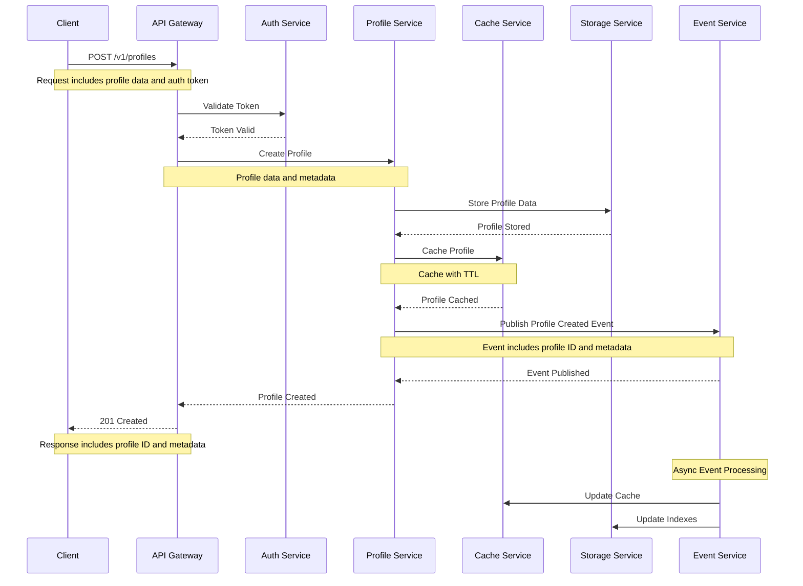
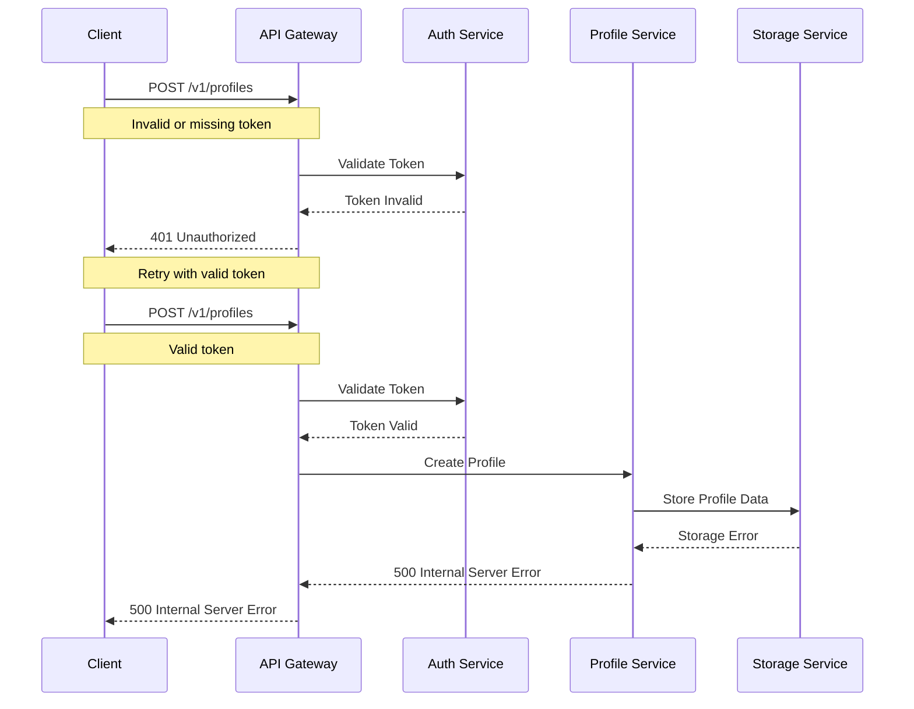

# Profile Creation Flow

This diagram illustrates the sequence of interactions between services during profile creation.

## Sequence Diagram

## Description

This sequence diagram shows the complete flow of profile creation:

1. **Initial Request**

   - Client sends profile creation request to API Gateway
   - Request includes profile data and authentication token

2. **Authentication**

   - API Gateway validates the token with Auth Service
   - Proceeds only if token is valid

3. **Profile Creation**

   - Profile Service handles the creation request
   - Coordinates with Storage and Cache services

4. **Data Storage**

   - Profile data is stored in persistent storage
   - Profile is cached for quick access

5. **Event Publishing**

   - Profile creation event is published
   - Other services can react to the event

6. **Response**

   - Success response is sent back to client
   - Includes profile ID and metadata

7. **Async Processing**
   - Event Service triggers additional processing
   - Updates cache and storage indexes

## Error Handling

## Notes

- All services implement retry mechanisms for transient failures
- Circuit breakers are in place to prevent cascading failures
- Events are published with at-least-once delivery guarantee
- Cache operations are performed with best-effort strategy
- Storage operations are performed with strong consistency
- All sensitive data is encrypted in transit and at rest
