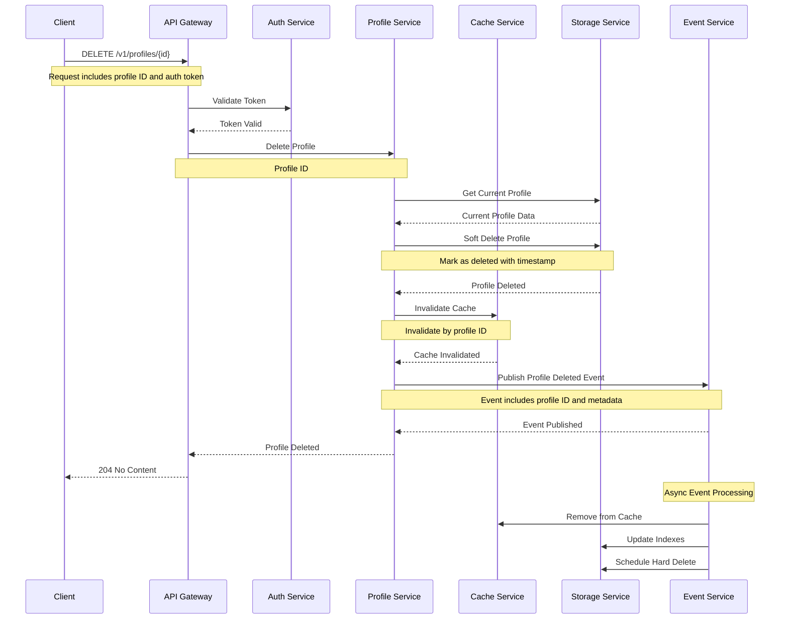
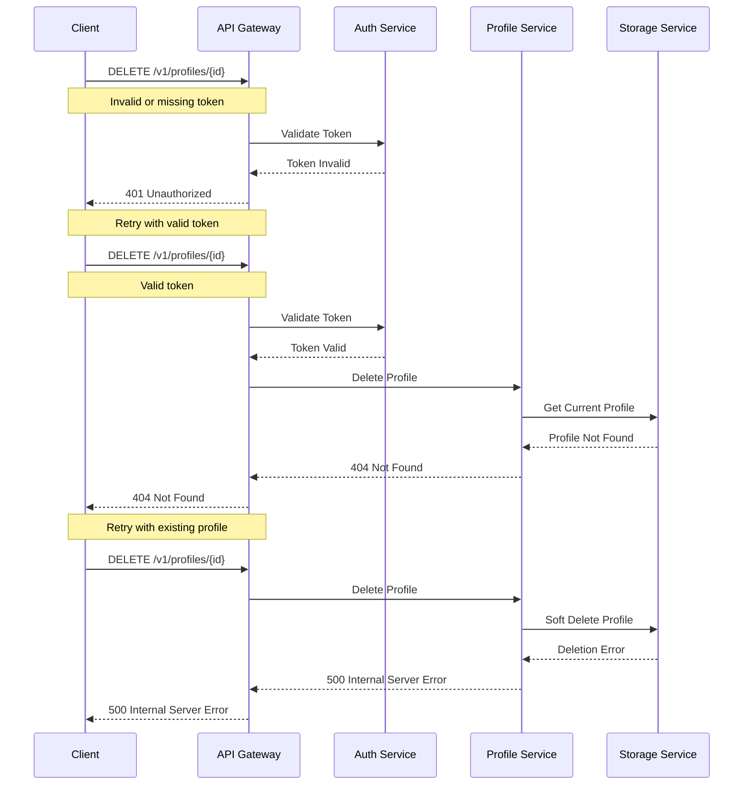

# Profile Deletion Flow

This diagram illustrates the sequence of interactions between services during profile deletion.

## Sequence Diagram

## Description

This sequence diagram shows the complete flow of profile deletion:

1. **Initial Request**

   - Client sends profile deletion request to API Gateway
   - Request includes profile ID and authentication token

2. **Authentication**

   - API Gateway validates the token with Auth Service
   - Proceeds only if token is valid

3. **Profile Deletion**

   - Profile Service retrieves current profile data
   - Performs soft deletion in storage
   - Coordinates with Cache service

4. **Data Storage**

   - Profile is marked as deleted in storage
   - Cache is invalidated

5. **Event Publishing**

   - Profile deletion event is published
   - Other services can react to the event

6. **Response**

   - Success response is sent back to client
   - No content returned (204)

7. **Async Processing**
   - Event Service triggers additional processing
   - Removes from cache
   - Updates storage indexes
   - Schedules hard deletion

## Error Handling

## Notes

- Soft deletion is used to maintain data history
- Hard deletion is scheduled for later execution
- Cache invalidation is performed immediately
- Events are published with at-least-once delivery guarantee
- All services implement retry mechanisms for transient failures
- Circuit breakers are in place to prevent cascading failures
- Cache operations are performed with best-effort strategy
- Storage operations are performed with strong consistency
- All sensitive data is encrypted in transit and at rest
- Deleted profiles are retained for audit purposes
- Hard deletion is performed after retention period
