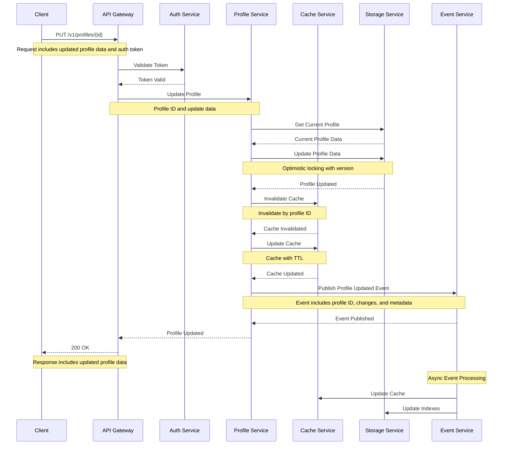
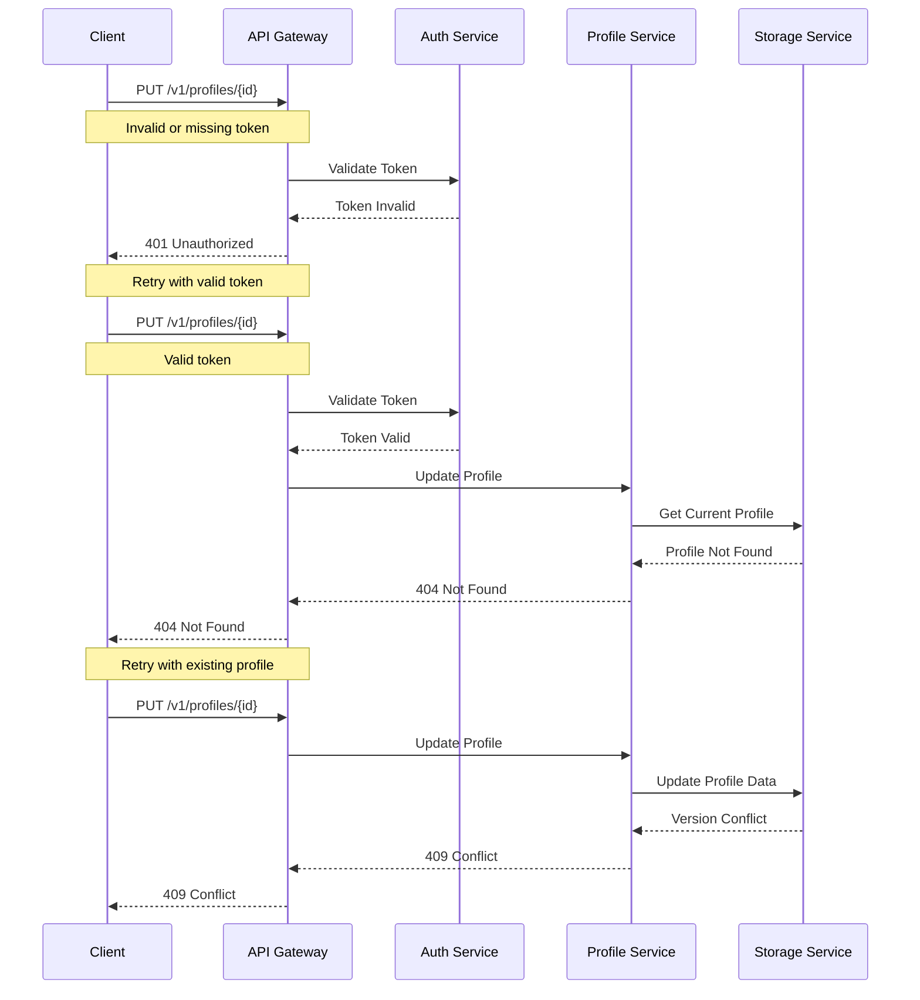

# Profile Update Flow

This diagram illustrates the sequence of interactions between services during profile updates.

## Sequence Diagram

## Description

This sequence diagram shows the complete flow of profile updates:

1. **Initial Request**

   - Client sends profile update request to API Gateway
   - Request includes profile ID, update data, and authentication token

2. **Authentication**

   - API Gateway validates the token with Auth Service
   - Proceeds only if token is valid

3. **Profile Update**

   - Profile Service retrieves current profile data
   - Applies updates with optimistic locking
   - Coordinates with Storage and Cache services

4. **Data Storage**

   - Profile data is updated in persistent storage
   - Cache is invalidated and updated

5. **Event Publishing**

   - Profile update event is published
   - Other services can react to the event

6. **Response**

   - Success response is sent back to client
   - Includes updated profile data

7. **Async Processing**
   - Event Service triggers additional processing
   - Updates cache and storage indexes

## Error Handling

## Notes

- Optimistic locking is used to prevent concurrent updates
- Cache invalidation is performed before update to prevent stale data
- Events include both old and new profile data for change tracking
- All services implement retry mechanisms for transient failures
- Circuit breakers are in place to prevent cascading failures
- Events are published with at-least-once delivery guarantee
- Cache operations are performed with best-effort strategy
- Storage operations are performed with strong consistency
- All sensitive data is encrypted in transit and at rest
