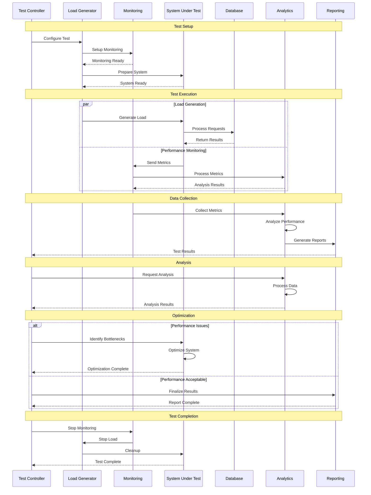

# Performance Testing Flow

## Overview

This diagram illustrates the sequence of actions and interactions between different components during performance testing in the Profile Service Microservices.

## Sequence Diagram

## Components Description

### 1. Test Setup

- **Test Controller**: Manages test execution
- **Load Generator**: Creates test load
- **Monitoring**: Tracks system performance
- **System Under Test**: Target system for testing

### 2. Test Execution

- **Load Generation**:
  - Request simulation
  - Load patterns
  - User scenarios
- **Performance Monitoring**:
  - Metric collection
  - Real-time analysis
  - System health

### 3. Data Collection

- **Metrics Collection**:
  - Performance data
  - System metrics
  - Resource usage
- **Analysis**:
  - Data processing
  - Pattern recognition
  - Performance trends

### 4. Analysis

- **Performance Analysis**:
  - Bottleneck identification
  - Resource utilization
  - Response times
  - Throughput analysis

### 5. Optimization

- **Issue Resolution**:
  - System optimization
  - Resource adjustment
  - Configuration tuning
- **Result Validation**:
  - Performance verification
  - System stability
  - Resource efficiency

### 6. Test Completion

- **Cleanup**:
  - Resource release
  - System restoration
  - Data cleanup
- **Reporting**:
  - Test results
  - Performance metrics
  - Recommendations

## Implementation Notes

### Best Practices

1. **Test Planning**

   - Clear objectives
   - Realistic scenarios
   - Resource allocation
   - Timeline planning

2. **Test Execution**

   - Controlled environment
   - Consistent conditions
   - Proper monitoring
   - Data collection

3. **Analysis**
   - Comprehensive metrics
   - Root cause analysis
   - Trend analysis
   - Performance patterns

### Considerations

1. **Test Environment**

   - Environment isolation
   - Resource allocation
   - Network conditions
   - Data management

2. **Performance Metrics**

   - Response times
   - Throughput
   - Resource usage
   - Error rates

3. **System Impact**
   - Resource consumption
   - System stability
   - Data integrity
   - Service availability

## Monitoring

### Metrics

- Response times
- Throughput rates
- Error rates
- Resource usage
- System health

### Alerts

- Performance thresholds
- Error thresholds
- Resource thresholds
- System alerts
- Test alerts

### Logging

- Test execution logs
- Performance logs
- Error logs
- System logs
- Analysis logs

## Related Documentation

- [Testing Strategy](../deployment/testing/strategy.md)
- [Performance Architecture](../deployment/testing/performance.md)
- [Monitoring Strategy](../deployment/monitoring/strategy.md)
- [System Architecture](../deployment/architecture.md)
