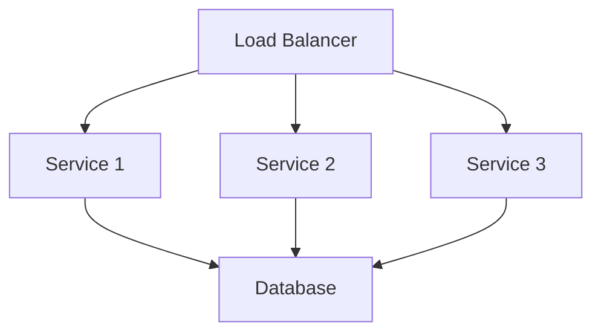
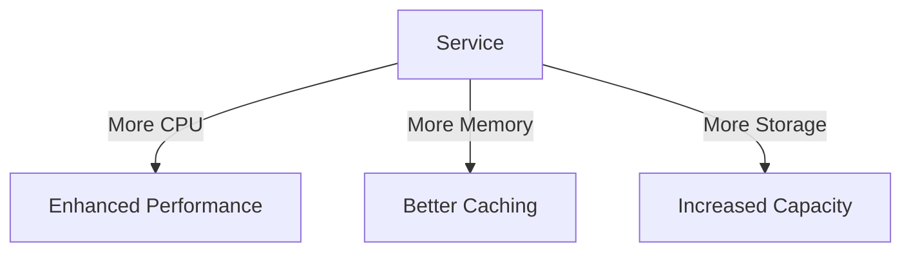

# Scaling Guide

-> IMPORTANT: Never add fictional dates, version numbers, or metrics. Only include real, verified information. If information is not available, mark it as "To be determined" or remove the section.

## Primary Purpose and Main Goals

### Primary Purpose

This guide provides comprehensive instructions for scaling the Profile Service Microservices, ensuring optimal performance and resource utilization while maintaining system reliability.

### Main Goals

1. Optimize resource utilization
2. Maintain system performance
3. Enable automatic scaling
4. Ensure cost efficiency
5. Facilitate capacity planning

## Scaling Strategies

### 1. Horizontal Scaling



#### Configuration

```yaml
# horizontal-scaling.yaml
apiVersion: autoscaling/v2
kind: HorizontalPodAutoscaler
metadata:
  name: profile-service
spec:
  scaleTargetRef:
    apiVersion: apps/v1
    kind: Deployment
    name: profile-service
  minReplicas: 3
  maxReplicas: 10
  metrics:
    - type: Resource
      resource:
        name: cpu
        target:
          type: Utilization
          averageUtilization: 70
    - type: Resource
      resource:
        name: memory
        target:
          type: Utilization
          averageUtilization: 80
```

### 2. Vertical Scaling



#### Configuration

```yaml
# vertical-scaling.yaml
apiVersion: apps/v1
kind: Deployment
metadata:
  name: profile-service
spec:
  template:
    spec:
      containers:
        - name: profile-service
          resources:
            requests:
              cpu: "500m"
              memory: "512Mi"
            limits:
              cpu: "1000m"
              memory: "1Gi"
```

## Load Balancing

### 1. Service Load Balancing

```yaml
# service-lb.yaml
apiVersion: v1
kind: Service
metadata:
  name: profile-service
spec:
  type: LoadBalancer
  ports:
    - port: 80
      targetPort: 8080
  selector:
    app: profile-service
```

### 2. Ingress Load Balancing

```yaml
# ingress-lb.yaml
apiVersion: networking.k8s.io/v1
kind: Ingress
metadata:
  name: profile-service
  annotations:
    nginx.ingress.kubernetes.io/load-balance: "round_robin"
    nginx.ingress.kubernetes.io/upstream-hash-by: "ip_hash"
spec:
  rules:
    - host: api.profile-service.com
      http:
        paths:
          - path: /
            pathType: Prefix
            backend:
              service:
                name: profile-service
                port:
                  number: 80
```

## Resource Optimization

### 1. CPU Optimization

```yaml
# cpu-optimization.yaml
apiVersion: apps/v1
kind: Deployment
metadata:
  name: profile-service
spec:
  template:
    spec:
      containers:
        - name: profile-service
          resources:
            requests:
              cpu: "200m"
            limits:
              cpu: "500m"
          env:
            - name: GOMAXPROCS
              value: "2"
```

### 2. Memory Optimization

```yaml
# memory-optimization.yaml
apiVersion: apps/v1
kind: Deployment
metadata:
  name: profile-service
spec:
  template:
    spec:
      containers:
        - name: profile-service
          resources:
            requests:
              memory: "256Mi"
            limits:
              memory: "512Mi"
          env:
            - name: GOGC
              value: "50"
```

## Scaling Triggers

### 1. CPU-Based Scaling

```yaml
# cpu-scaling.yaml
apiVersion: autoscaling/v2
kind: HorizontalPodAutoscaler
metadata:
  name: profile-service-cpu
spec:
  metrics:
    - type: Resource
      resource:
        name: cpu
        target:
          type: Utilization
          averageUtilization: 70
```

### 2. Memory-Based Scaling

```yaml
# memory-scaling.yaml
apiVersion: autoscaling/v2
kind: HorizontalPodAutoscaler
metadata:
  name: profile-service-memory
spec:
  metrics:
    - type: Resource
      resource:
        name: memory
        target:
          type: Utilization
          averageUtilization: 80
```

### 3. Custom Metrics Scaling

```yaml
# custom-metrics.yaml
apiVersion: autoscaling/v2
kind: HorizontalPodAutoscaler
metadata:
  name: profile-service-custom
spec:
  metrics:
    - type: Object
      object:
        metric:
          name: requests_per_second
        describedObject:
          apiVersion: v1
          kind: Service
          name: profile-service
        target:
          type: Value
          value: 1000
```

## Scaling Best Practices

### 1. Resource Planning

- Monitor resource usage
- Set appropriate limits
- Plan for growth
- Consider costs

### 2. Performance Optimization

- Use caching effectively
- Optimize database queries
- Implement connection pooling
- Enable compression

### 3. Monitoring and Alerts

```yaml
# scaling-alerts.yaml
apiVersion: monitoring.coreos.com/v1
kind: PrometheusRule
metadata:
  name: scaling-alerts
spec:
  groups:
    - name: scaling
      rules:
        - alert: HighResourceUsage
          expr: |
            container_memory_usage_bytes > 0.8 * container_spec_memory_limit_bytes
            or
            container_cpu_usage_seconds_total > 0.8 * container_spec_cpu_quota
          for: 5m
          labels:
            severity: warning
```

## Scaling Considerations

### 1. Database Scaling

- Read replicas
- Connection pooling
- Query optimization
- Data partitioning

### 2. Cache Scaling

- Distributed caching
- Cache invalidation
- Memory management
- Cache warming

### 3. Queue Scaling

- Message batching
- Consumer scaling
- Dead letter queues
- Retry policies

## Notes

- Regular performance reviews
- Resource monitoring
- Cost optimization
- Capacity planning
- Documentation updates

## Version History

### Current Version

- Version: To be determined
- Date: To be determined
- Changes:
  - Initial scaling guide
  - Scaling strategies documented
  - Resource optimization outlined
  - Best practices defined
