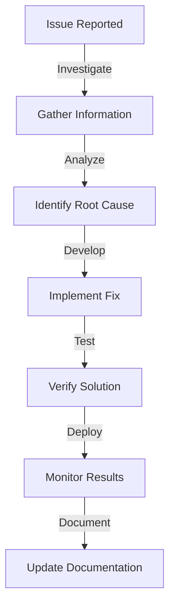

# Debugging Guide

-> IMPORTANT: Never add fictional dates, version numbers, or metrics. Only include real, verified information. If information is not available, mark it as "To be determined" or remove the section.

## Primary Purpose and Main Goals

### Primary Purpose

This guide provides comprehensive debugging strategies, tools, and best practices for the Profile Service Microservices project, helping developers effectively identify and resolve issues.

### Main Goals

1. Standardize debugging practices
2. Provide debugging tools
3. Document common issues
4. Share debugging techniques
5. Improve issue resolution

## Debugging Tools

### 1. Go Debugging

#### Delve

```bash
# Install Delve
go install github.com/go-delve/delve/cmd/dlv@latest

# Start debugging
dlv debug ./cmd/api/main.go

# Common commands
break main.main    # Set breakpoint
continue          # Continue execution
next             # Step over
step             # Step into
print variable   # Print variable value
```

#### VS Code Debugging

```json
{
  "version": "0.2.0",
  "configurations": [
    {
      "name": "Debug API",
      "type": "go",
      "request": "launch",
      "mode": "debug",
      "program": "${workspaceFolder}/cmd/api/main.go",
      "env": {
        "ENV": "development"
      }
    }
  ]
}
```

### 2. JavaScript/TypeScript Debugging

#### Node.js Debugging

```bash
# Start with inspector
node --inspect app.js

# Debug with Chrome DevTools
chrome://inspect
```

#### VS Code Configuration

```json
{
  "version": "0.2.0",
  "configurations": [
    {
      "type": "node",
      "request": "launch",
      "name": "Debug API",
      "skipFiles": ["<node_internals>/**"],
      "program": "${workspaceFolder}/src/index.js"
    }
  ]
}
```

## Common Issues and Solutions

### 1. API Issues

#### Connection Problems

```bash
# Check service health
curl -v http://localhost:8080/health

# Check logs
kubectl logs -f deployment/api-service

# Check network
kubectl get services
kubectl describe service api-service
```

#### Performance Issues

```bash
# Profile CPU
go tool pprof http://localhost:8080/debug/pprof/profile

# Profile Memory
go tool pprof http://localhost:8080/debug/pprof/heap

# Trace
go tool trace trace.out
```

### 2. Database Issues

#### Connection Problems

```bash
# Check database connection
psql -h localhost -U postgres -d profile_db

# Check connection pool
SELECT * FROM pg_stat_activity;

# Check locks
SELECT * FROM pg_locks;
```

#### Performance Issues

```sql
-- Check slow queries
SELECT * FROM pg_stat_statements
ORDER BY total_time DESC
LIMIT 10;

-- Check table statistics
SELECT * FROM pg_stat_user_tables;
```

## Debugging Strategies

### 1. Logging

#### Structured Logging

```go
// Go example
logger.Info("Processing request",
    "request_id", requestID,
    "user_id", userID,
    "action", action)

// JavaScript example
logger.info({
    message: "Processing request",
    requestId,
    userId,
    action
})
```

#### Log Levels

- ERROR: System errors
- WARN: Warning conditions
- INFO: General information
- DEBUG: Detailed information
- TRACE: Very detailed information

### 2. Tracing

#### Distributed Tracing

```go
// Start span
span, ctx := tracer.Start(ctx, "operation_name")
defer span.End()

// Add attributes
span.SetAttributes(
    attribute.String("key", "value"),
    attribute.Int("count", 42),
)
```

#### Trace Analysis

```bash
# View traces
jaeger-ui

# Export traces
curl http://localhost:16686/api/traces
```

## Performance Debugging

### 1. CPU Profiling

```bash
# Go CPU profile
go tool pprof -http=:8080 cpu.prof

# Node.js CPU profile
node --prof app.js
node --prof-process isolate-0xnnnnnnnnnnnn-v8.log > processed.txt
```

### 2. Memory Profiling

```bash
# Go memory profile
go tool pprof -http=:8080 mem.prof

# Node.js memory profile
node --heapsnapshot app.js
```

## Debugging Best Practices

### 1. Problem Investigation

1. **Reproduce the Issue**

   - Document steps
   - Capture environment
   - Record timing

2. **Gather Information**

   - Check logs
   - Review metrics
   - Analyze traces

3. **Isolate the Problem**
   - Use binary search
   - Test components
   - Verify assumptions

### 2. Solution Implementation

1. **Fix Development**

   - Write tests
   - Implement fix
   - Document changes

2. **Verification**

   - Test fix
   - Check side effects
   - Monitor performance

3. **Deployment**
   - Plan rollout
   - Monitor changes
   - Document resolution

## Debugging Workflow



## Notes

- Keep debugging tools updated
- Document common issues
- Share debugging experiences
- Maintain debugging guides
- Regular tool review

## Version History

### Current Version

- Version: To be determined
- Date: To be determined
- Changes:
  - Initial debugging guide
  - Debugging tools documented
  - Common issues listed
  - Best practices outlined

```

```
