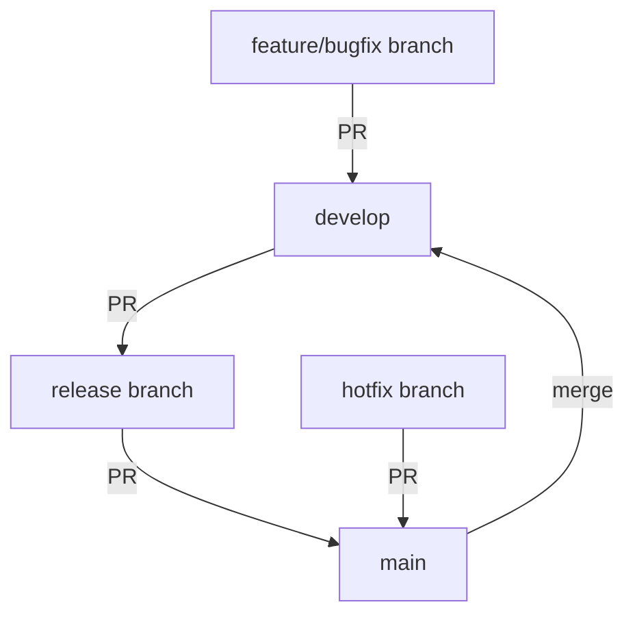
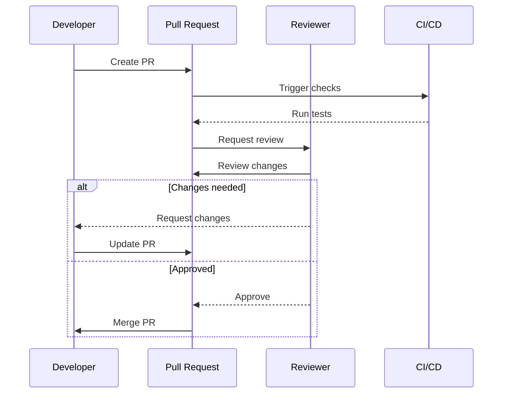

# Development Process Guide

-> IMPORTANT: Never add fictional dates, version numbers, or metrics. Only include real, verified information. If information is not available, mark it as "To be determined" or remove the section.

## Primary Purpose and Main Goals

### Primary Purpose

This guide outlines the development workflow, code organization, and best practices for the Profile Service Microservices project, ensuring consistent and high-quality development practices across the team.

### Main Goals

1. Standardize development practices
2. Ensure code quality
3. Facilitate collaboration
4. Streamline review process
5. Maintain project consistency

## Code Organization

### 1. Project Structure

```
profile-service/
├── cmd/                    # Application entry points
│   ├── api/               # API service
│   ├── worker/            # Background worker
│   └── cli/               # Command-line tools
├── internal/              # Private application code
│   ├── domain/           # Domain models and interfaces
│   ├── service/          # Business logic
│   ├── repository/       # Data access layer
│   └── infrastructure/   # External service integration
├── pkg/                   # Public libraries
├── api/                   # API definitions
├── configs/               # Configuration files
├── deployments/           # Deployment manifests
├── docs/                  # Documentation
└── tests/                 # Test files
```

### 2. Code Style Guidelines

#### Go Code Style

- Follow [Effective Go](https://golang.org/doc/effective_go)
- Use `gofmt` for formatting
- Follow [Go Code Review Comments](https://github.com/golang/go/wiki/CodeReviewComments)

#### JavaScript/TypeScript Style

- Use ESLint for linting
- Follow Airbnb JavaScript Style Guide
- Use Prettier for formatting

## Branch Strategy

### 1. Branch Types

- `main` - Production-ready code
- `develop` - Integration branch
- `feature/*` - New features
- `bugfix/*` - Bug fixes
- `release/*` - Release preparation
- `hotfix/*` - Production fixes

### 2. Branch Workflow



## Commit Guidelines

### 1. Commit Message Format

```
<type>(<scope>): <subject>

<body>

<footer>
```

### 2. Commit Types

- `feat`: New feature
- `fix`: Bug fix
- `docs`: Documentation
- `style`: Formatting
- `refactor`: Code restructuring
- `test`: Adding tests
- `chore`: Maintenance

### 3. Commit Examples

```
feat(auth): implement JWT authentication

- Add JWT token generation
- Implement token validation
- Add refresh token support

Closes #123
```

## Review Process

### 1. Pull Request Guidelines

- Clear title and description
- Link related issues
- Include testing instructions
- Update documentation
- Follow template

### 2. Review Checklist

- [ ] Code follows style guide
- [ ] Tests are included
- [ ] Documentation is updated
- [ ] No security issues
- [ ] Performance impact considered
- [ ] Backward compatibility maintained

### 3. Review Process Flow



## Development Workflow

### 1. Feature Development

1. Create feature branch
2. Implement changes
3. Write tests
4. Update documentation
5. Create pull request
6. Address review comments
7. Merge to develop

### 2. Bug Fix Process

1. Create bugfix branch
2. Reproduce issue
3. Implement fix
4. Add test cases
5. Create pull request
6. Address review comments
7. Merge to develop

### 3. Release Process

1. Create release branch
2. Version bump
3. Update changelog
4. Final testing
5. Create pull request
6. Merge to main
7. Tag release

## Quality Assurance

### 1. Code Quality Tools

- Go: `golangci-lint`
- JavaScript: ESLint, Prettier
- General: SonarQube

### 2. Testing Requirements

- Unit test coverage: To be determined
- Integration test coverage: To be determined
- E2E test coverage: To be determined

### 3. Performance Requirements

- Response time: To be determined
- Throughput: To be determined
- Resource usage: To be determined

## Notes

- Follow the process consistently
- Keep documentation updated
- Communicate changes effectively
- Review code thoroughly
- Test changes comprehensively

## Version History

### Current Version

- Version: To be determined
- Date: To be determined
- Changes:
  - Initial development workflow guide
  - Code organization documented
  - Branch strategy defined
  - Review process outlined
