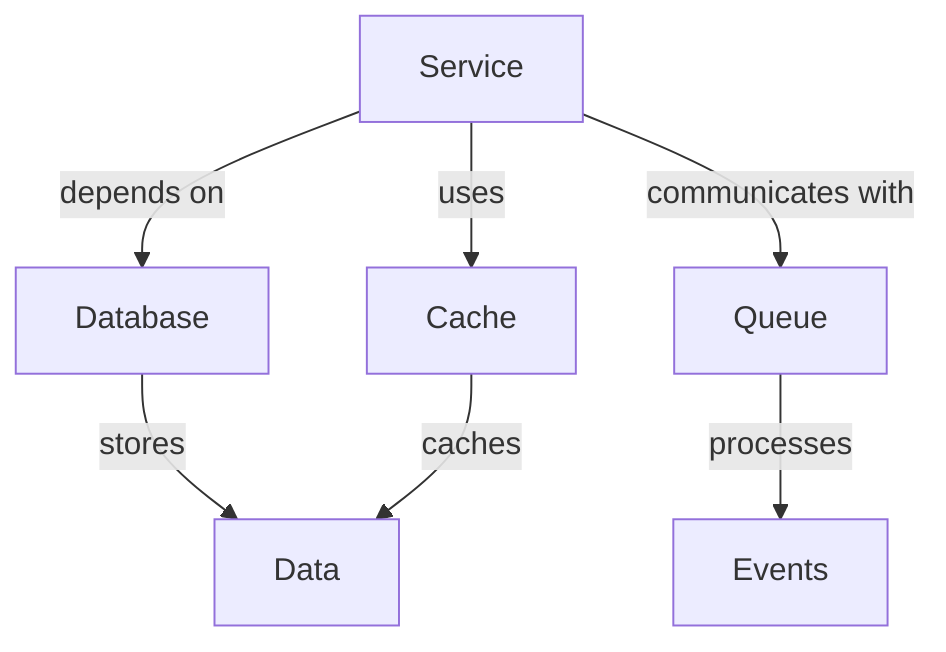
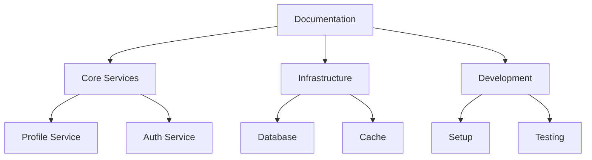

# LLM Context Enhancement Guide

-> IMPORTANT: Never add fictional dates, version numbers, or metrics. Only include real, verified information. If information is not available, mark it as "To be determined" or remove the section.

## Primary Purpose and Main Goals

### Primary Purpose

This guide provides comprehensive instructions for enhancing documentation to be more LLM-friendly, ensuring better context understanding, semantic relationships, and improved information retrieval.

### Main Goals

1. Improve LLM context understanding
2. Enhance semantic relationships
3. Optimize cross-references
4. Add meaningful metadata
5. Create comprehensive context maps

## Context Enhancement Strategies

### 1. Semantic Relationships



#### Implementation

```markdown
# Service Relationships

## Dependencies

- Database: Stores persistent data
- Cache: Improves read performance
- Queue: Handles asynchronous processing

## Data Flow

1. Service receives request
2. Checks cache for data
3. If not in cache, queries database
4. Updates cache with new data
5. Publishes events to queue
```

### 2. Cross-References

#### Implementation

```markdown
# Service Configuration

## Related Components

- [Database Configuration](../database/config.md)
- [Cache Setup](../cache/setup.md)
- [Queue Management](../queue/management.md)

## Dependencies

- [Authentication Service](../../auth/service.md)
- [Monitoring System](../../monitoring/setup.md)
```

### 3. Metadata Enhancement

#### Implementation

```yaml
# metadata.yaml
context:
  type: service
  category: core
  dependencies:
    - database
    - cache
    - queue
  relationships:
    - auth_service
    - monitoring
  lifecycle:
    - development
    - testing
    - deployment
  security:
    - authentication
    - authorization
    - encryption
```

## Documentation Structure

### 1. Context Maps



### 2. Information Hierarchy

```markdown
# Documentation Structure

## Core Services

- Profile Service
  - API Documentation
  - Configuration
  - Dependencies
  - Security

## Infrastructure

- Database
  - Setup
  - Configuration
  - Maintenance
- Cache
  - Setup
  - Configuration
  - Optimization

## Development

- Setup
  - Environment
  - Dependencies
  - Tools
- Testing
  - Unit Tests
  - Integration Tests
  - E2E Tests
```

## Best Practices

### 1. Context Clarity

- Use clear section headers
- Provide context in introductions
- Explain relationships explicitly
- Include relevant examples
- Add cross-references

### 2. Semantic Markup

```markdown
# Service Configuration

## Purpose

This configuration defines how the service interacts with its dependencies
and manages its resources.

## Components

- Database Connection
- Cache Settings
- Queue Configuration

## Relationships

- Depends on: Database Service
- Uses: Cache Service
- Communicates with: Queue Service
```

### 3. Metadata Standards

```yaml
# standards.yaml
metadata:
  required:
    - type
    - category
    - dependencies
    - relationships
  optional:
    - lifecycle
    - security
    - performance
  format:
    - yaml
    - json
    - markdown
```

## Implementation Guidelines

### 1. Document Structure

- Clear hierarchy
- Consistent formatting
- Explicit relationships
- Comprehensive metadata
- Cross-references

### 2. Content Organization

- Logical grouping
- Clear dependencies
- Explicit relationships
- Contextual information
- Related resources

### 3. Cross-Reference Management

- Consistent linking
- Bidirectional references
- Context preservation
- Relationship mapping
- Dependency tracking

## Notes

- Regular context reviews
- Metadata updates
- Cross-reference validation
- Relationship verification
- Documentation updates

## Version History

### Current Version

- Version: To be determined
- Date: To be determined
- Changes:
  - Initial LLM context enhancement guide
  - Context strategies documented
  - Best practices defined
  - Implementation guidelines outlined
