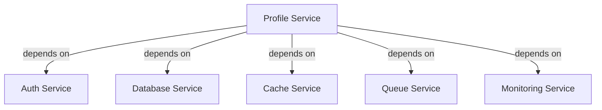
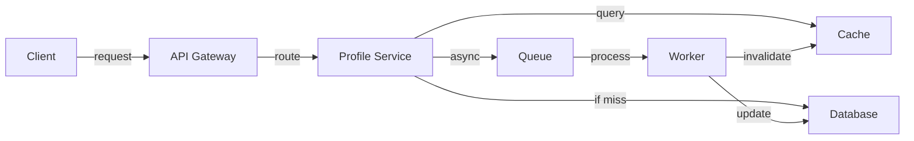
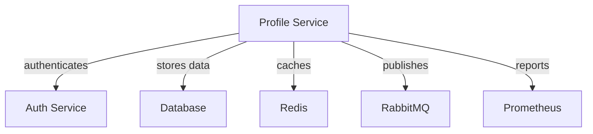

# Semantic Relationships Guide

-> IMPORTANT: Never add fictional dates, version numbers, or metrics. Only include real, verified information. If information is not available, mark it as "To be determined" or remove the section.

## Primary Purpose and Main Goals

### Primary Purpose

This guide provides a structured approach to implementing semantic relationships in the Profile Service Microservices documentation, ensuring clear understanding of component interactions and dependencies.

### Main Goals

1. Document component relationships
2. Map service dependencies
3. Visualize data flows
4. Track component interactions
5. Maintain relationship consistency

## Relationship Types

### 1. Service Dependencies



### 2. Data Flow



### 3. Component Interactions



## Implementation Guidelines

### 1. Service Documentation

```markdown
# Profile Service

## Dependencies

- Auth Service: Handles user authentication and authorization
- Database Service: Manages persistent data storage
- Cache Service: Provides high-speed data access
- Queue Service: Handles asynchronous processing
- Monitoring Service: Tracks service health and metrics

## Data Flow

1. Client request received
2. Authentication verified
3. Cache checked for data
4. Database queried if needed
5. Response returned to client
6. Async updates processed

## Component Interactions

- Auth Service: Validates user sessions
- Database: Stores profile data
- Cache: Improves read performance
- Queue: Handles data updates
- Monitoring: Tracks service metrics
```

### 2. API Documentation

```markdown
# API Endpoints

## Profile Management

- GET /profile

  - Depends on: Auth Service
  - Uses: Cache Service
  - Updates: None
  - Returns: Profile data

- POST /profile

  - Depends on: Auth Service
  - Uses: Database Service
  - Updates: Cache, Queue
  - Returns: Updated profile

- DELETE /profile
  - Depends on: Auth Service
  - Uses: Database Service
  - Updates: Cache, Queue
  - Returns: Success status
```

### 3. Configuration Relationships

```yaml
# service-relationships.yaml
profile_service:
  dependencies:
    auth_service:
      type: required
      purpose: authentication
      interaction: synchronous
    database:
      type: required
      purpose: storage
      interaction: synchronous
    cache:
      type: required
      purpose: performance
      interaction: synchronous
    queue:
      type: required
      purpose: async_processing
      interaction: asynchronous
    monitoring:
      type: required
      purpose: observability
      interaction: asynchronous
```

## Best Practices

### 1. Relationship Documentation

- Document all dependencies
- Explain interaction types
- Describe data flows
- Map component relationships
- Update relationship maps

### 2. Visual Representation

- Use consistent diagrams
- Include relationship types
- Show data flow direction
- Indicate interaction types
- Maintain diagram clarity

### 3. Relationship Maintenance

- Regular relationship reviews
- Update dependency maps
- Verify interaction flows
- Document relationship changes
- Track component updates

## Implementation Steps

### 1. Service Analysis

1. Identify all services
2. Map dependencies
3. Document interactions
4. Create relationship diagrams
5. Validate relationships

### 2. Documentation Updates

1. Add relationship sections
2. Include visual diagrams
3. Document data flows
4. Update component docs
5. Verify consistency

### 3. Relationship Validation

1. Review dependencies
2. Verify interactions
3. Check data flows
4. Update diagrams
5. Document changes

## Notes

- Regular relationship reviews
- Diagram updates
- Documentation consistency
- Change tracking
- Validation checks

## Version History

### Current Version

- Version: To be determined
- Date: To be determined
- Changes:
  - Initial semantic relationships guide
  - Relationship types documented
  - Implementation guidelines outlined
  - Best practices defined
