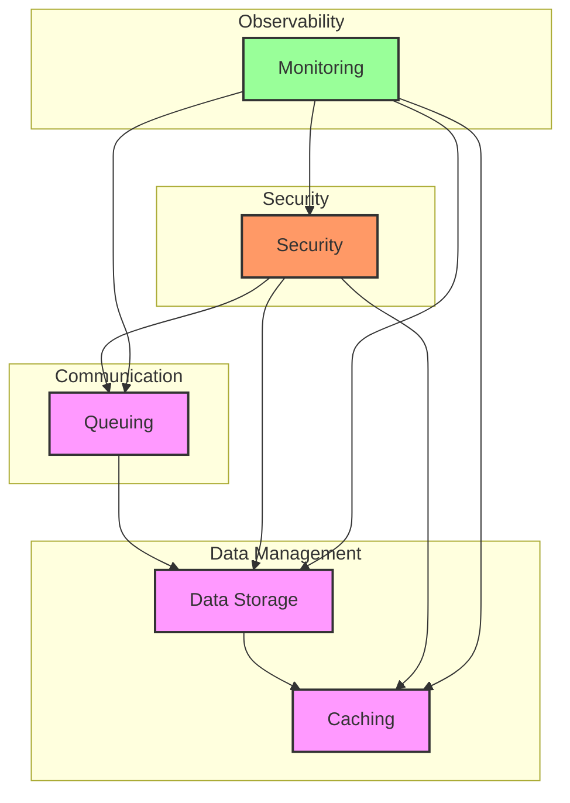
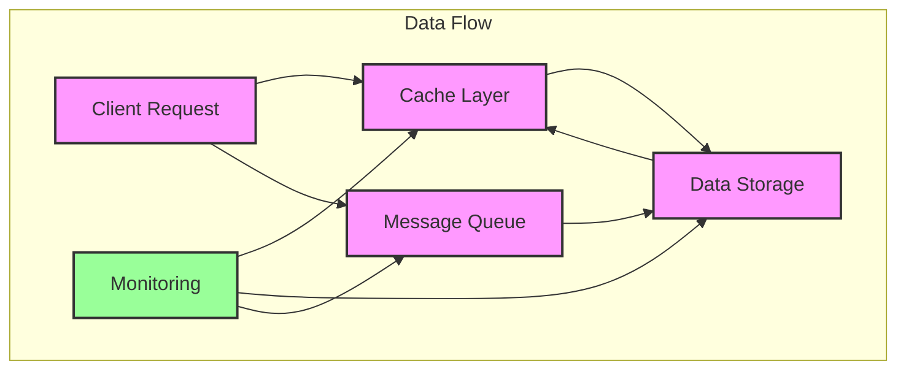
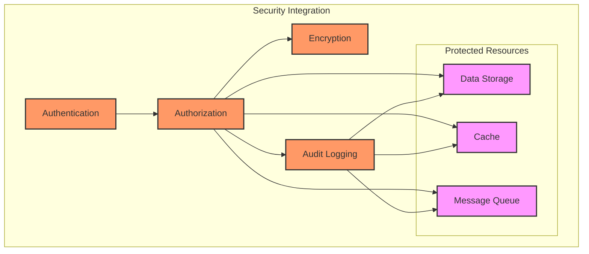
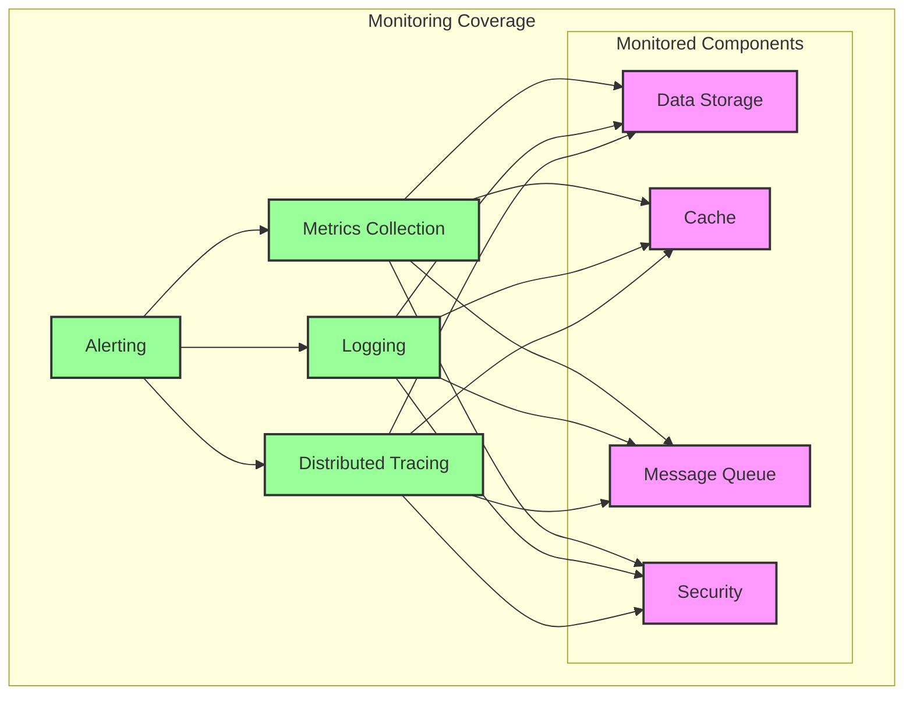
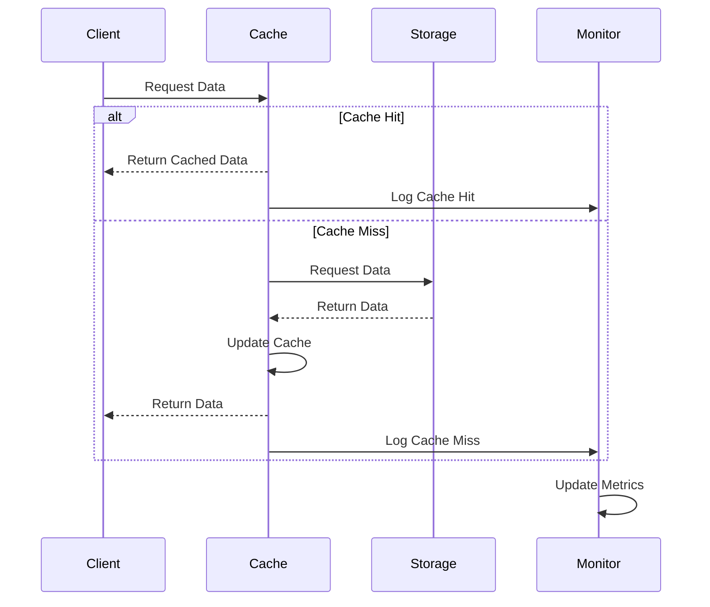
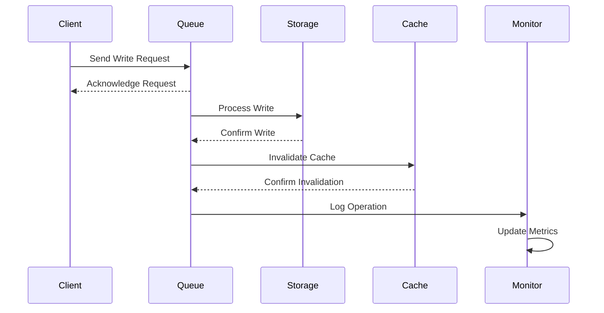
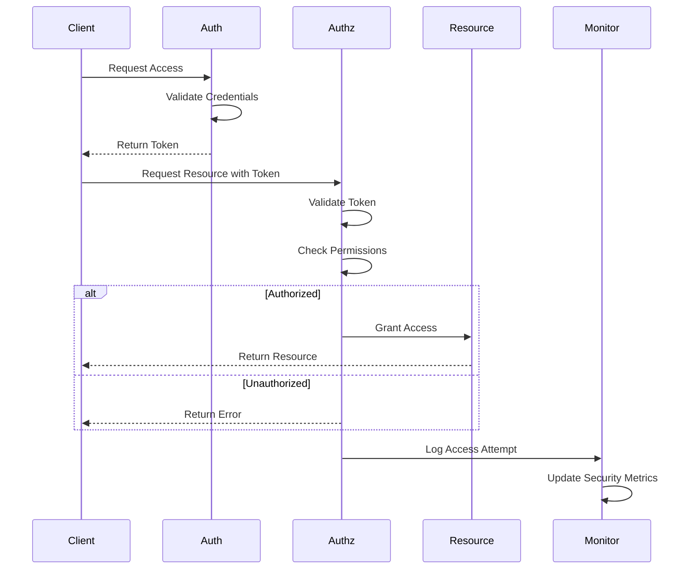
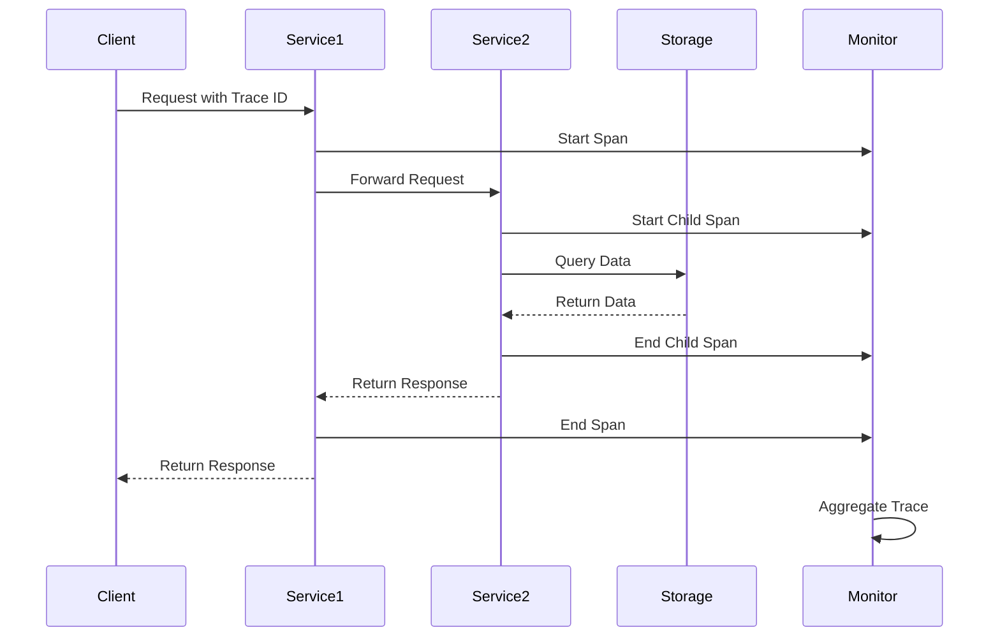
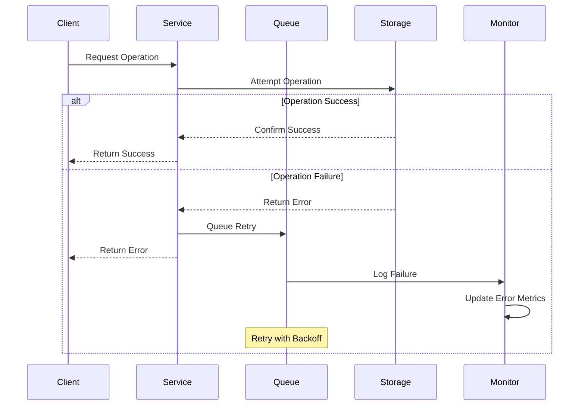

# Pattern Overview

-> IMPORTANT: Never add fictional dates, version numbers, or metrics. Only include real, verified information. If information is not available, mark it as "To be determined" or remove the section.

## Primary Purpose and Main Goals

### Primary Purpose

This document provides a comprehensive overview of all patterns implemented in the Profile Service Microservices system, explaining their relationships, interactions, and how they work together to create a robust and maintainable system.

### Main Goals

1. Provide a high-level view of all system patterns
2. Explain pattern relationships and interactions
3. Guide pattern selection and implementation
4. Ensure pattern consistency and alignment
5. Facilitate system understanding and maintenance

## Current Status

### Phase: Pattern Documentation 🔄

#### Completed Tasks ✅

- Basic pattern identification
- Pattern categorization
- Initial documentation structure
- Individual pattern documentation

#### In Progress 🔄

- Pattern relationship mapping
- Integration documentation
- Best practices documentation
- Pattern selection guidelines

#### Pending Tasks [ ]

- Pattern validation
- Integration testing
- Performance benchmarking
- Pattern evolution tracking

## Pattern Categories

### 1. Data Management Patterns

- [Data Storage Patterns](data_storage/README.md)

  - Primary storage strategies
  - Data access patterns
  - Data consistency patterns
  - Data migration patterns

- [Caching Patterns](caching/README.md)
  - Cache strategies
  - Cache invalidation
  - Cache consistency
  - Cache distribution

### 2. Communication Patterns

- [Queuing Patterns](queuing/README.md)
  - Message queuing
  - Event processing
  - Asynchronous communication
  - Message reliability

### 3. Security Patterns

- [Security Patterns](security/README.md)
  - Authentication patterns
  - Authorization patterns
  - Data protection patterns
  - Security monitoring patterns

### 4. Observability Patterns

- [Monitoring Patterns](monitoring/README.md)
  - Metrics collection
  - Logging patterns
  - Tracing patterns
  - Alerting patterns

## Pattern Relationships

### High-Level Pattern Architecture

### Data Flow Diagram

### Security Integration

### Monitoring Coverage

### Common Operations

#### Data Read Operation with Caching

#### Data Write Operation with Queuing

#### Authentication and Authorization Flow

#### Distributed Tracing Flow

#### Error Handling and Recovery

### Data Flow

1. **Data Storage → Caching**

   - Data is stored in primary storage
   - Frequently accessed data is cached
   - Cache invalidation based on storage changes

2. **Queuing → Data Storage**

   - Messages trigger data operations
   - Events update data state
   - Asynchronous data processing

3. **Security → All Patterns**

   - Security controls all data access
   - Authentication for all operations
   - Authorization for pattern access
   - Security monitoring of all patterns

4. **Monitoring → All Patterns**
   - Metrics for all pattern operations
   - Logging of pattern activities
   - Tracing of pattern interactions
   - Alerts for pattern issues

## Implementation Guidelines

### Pattern Selection

1. **Consider System Requirements**

   - Performance requirements
   - Scalability needs
   - Security requirements
   - Monitoring needs

2. **Evaluate Pattern Compatibility**

   - Pattern interactions
   - Resource requirements
   - Implementation complexity
   - Maintenance overhead

3. **Assess Pattern Impact**
   - System performance
   - Development effort
   - Operational complexity
   - Maintenance requirements

### Pattern Implementation

1. **Implementation Order**

   - Start with core patterns
   - Add supporting patterns
   - Implement security patterns
   - Add monitoring patterns

2. **Integration Points**

   - Pattern interfaces
   - Data flow
   - Event handling
   - Error management

3. **Configuration Management**
   - Pattern settings
   - Integration settings
   - Security settings
   - Monitoring settings

## Quality Considerations

### Performance

- Pattern efficiency
- Resource utilization
- Response times
- Throughput capacity

### Reliability

- Pattern stability
- Error handling
- Recovery procedures
- Data consistency

### Security

- Access control
- Data protection
- Audit logging
- Security monitoring

### Maintainability

- Pattern documentation
- Code organization
- Configuration management
- Update procedures

## Notes

- Patterns should be implemented consistently
- Regular pattern review and updates
- Monitor pattern effectiveness
- Document pattern changes
- Maintain pattern documentation

## Version History

### Current Version

- Version: To be determined
- Date: To be determined
- Changes:
  - Initial pattern overview
  - Pattern relationships documented
  - Implementation guidelines added
  - Quality considerations included
  - Pattern relationship diagrams added
