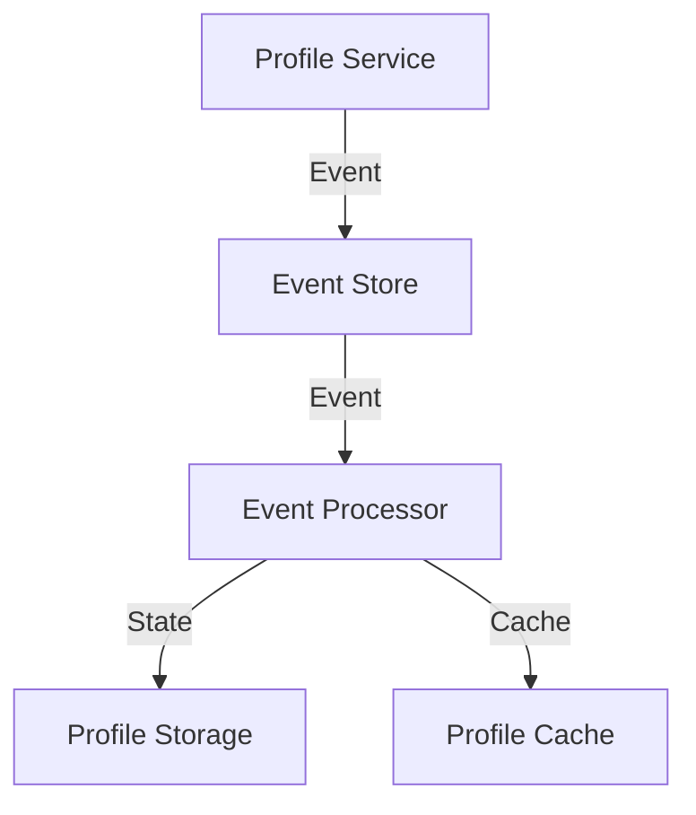
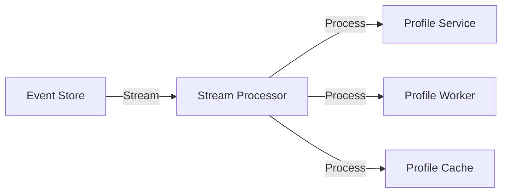

# Event Patterns

## Overview

This document outlines the event patterns used in the Profile Service Microservices architecture for event-driven communication.

## Event Sourcing Patterns

### 1. Event Store



#### Event Store Configuration

```yaml
event_store:
  type: eventstore
  connection:
    host: eventstore.profile
    port: 1113
    credentials:
      username: ${EVENTSTORE_USER}
      password: ${EVENTSTORE_PASSWORD}
  streams:
    profile:
      name: profile-stream
      event_types:
        - ProfileCreated
        - ProfileUpdated
        - ProfileDeleted
      retention:
        max_count: 10000
        max_age: 30d
```

### 2. Event Types

```protobuf
// Event Type Definitions
message ProfileEvent {
  string event_id = 1;
  string event_type = 2;
  google.protobuf.Timestamp timestamp = 3;
  string aggregate_id = 4;
  int64 version = 5;
  oneof data {
    ProfileCreated created = 6;
    ProfileUpdated updated = 7;
    ProfileDeleted deleted = 8;
  }
  map<string, string> metadata = 9;
}
```

## Event Streaming Patterns

### 1. Stream Processing



#### Stream Configuration

```yaml
stream_processing:
  processor:
    type: kafka
    connection:
      bootstrap_servers: kafka.profile:9092
      group_id: profile-processor
    topics:
      - name: profile-events
        partitions: 3
        replication_factor: 2
    consumer:
      auto_offset_reset: earliest
      enable_auto_commit: false
```

### 2. Stream Patterns

```yaml
stream_patterns:
  - name: event-sourcing
    description: Rebuild state from event stream
    implementation:
      - Read events from stream
      - Apply events to state
      - Store state in database
      - Update cache

  - name: event-notification
    description: Notify services of events
    implementation:
      - Publish events to stream
      - Subscribe to events
      - Process notifications
      - Update services
```

## Event Processing Patterns

### 1. Event Handlers

```yaml
event_handlers:
  - name: profile-created
    handler: ProfileCreatedHandler
    actions:
      - validate_profile
      - create_profile
      - update_cache
      - notify_services

  - name: profile-updated
    handler: ProfileUpdatedHandler
    actions:
      - validate_changes
      - update_profile
      - invalidate_cache
      - notify_services

  - name: profile-deleted
    handler: ProfileDeletedHandler
    actions:
      - validate_deletion
      - delete_profile
      - clear_cache
      - notify_services
```

### 2. Processing Strategies

```yaml
processing_strategies:
  - name: at-least-once
    description: Process events at least once
    implementation:
      - Read event
      - Process event
      - Commit offset
      - Handle failures

  - name: exactly-once
    description: Process events exactly once
    implementation:
      - Read event
      - Check processed
      - Process event
      - Mark processed
      - Commit offset
```

## Event Storage Patterns

### 1. Event Persistence

```yaml
event_persistence:
  storage:
    type: eventstore
    configuration:
      - name: profile-events
        retention: 30d
        compression: true
        encryption: true
      - name: profile-snapshots
        retention: 90d
        compression: true
        encryption: true
```

### 2. Event Querying

```yaml
event_querying:
  patterns:
    - name: by-aggregate
      query: "SELECT * FROM events WHERE aggregate_id = ?"
      indexes:
        - aggregate_id
        - version

    - name: by-type
      query: "SELECT * FROM events WHERE event_type = ?"
      indexes:
        - event_type
        - timestamp

    - name: by-time
      query: "SELECT * FROM events WHERE timestamp BETWEEN ? AND ?"
      indexes:
        - timestamp
```

## Event Monitoring

### 1. Event Metrics

```yaml
event_metrics:
  - name: events_processed_total
    type: counter
    labels:
      - event_type
      - handler
      - status

  - name: event_processing_duration_seconds
    type: histogram
    labels:
      - event_type
      - handler
```

### 2. Event Alerts

```yaml
event_alerts:
  - name: high_event_latency
    condition: event_processing_duration_seconds > 5
    severity: warning
    action: notify_team

  - name: event_processing_errors
    condition: events_processed_total{status="error"} > 10
    severity: critical
    action: notify_team
```

## Notes

- Keep documentation up to date
- Maintain cross-references
- Add practical examples
- Document decisions
- Track changes
- Ensure alignment with global architecture
