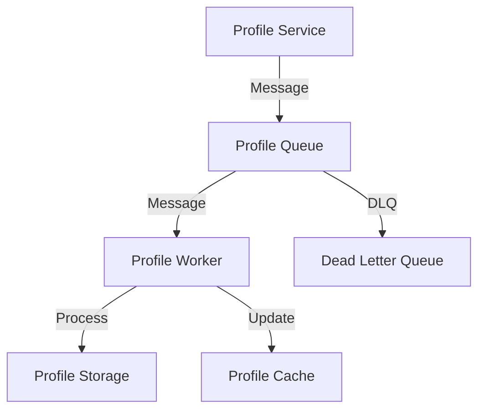
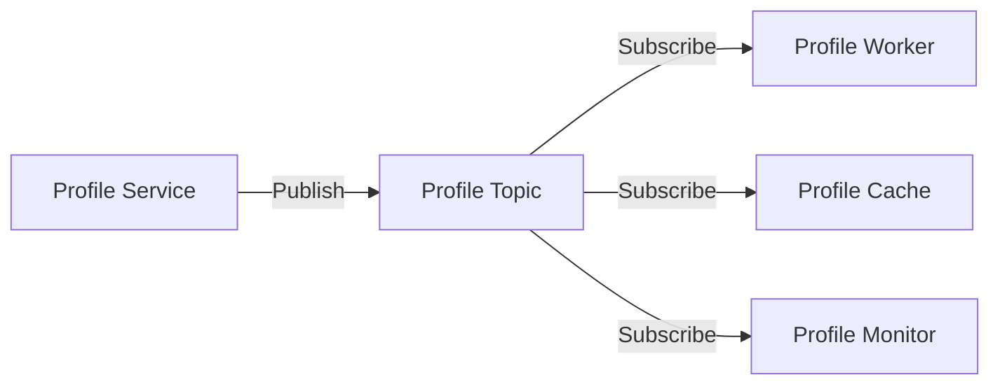

# Message Patterns

## Overview

This document outlines the message patterns used in the Profile Service Microservices architecture for asynchronous communication.

## Message Queue Patterns

### 1. Queue Structure



#### Queue Configuration

```yaml
message_queues:
  - name: profile-updates
    type: rabbitmq
    connection:
      host: rabbitmq.profile
      port: 5672
      virtual_host: /profile
    queues:
      - name: profile-updates
        durable: true
        arguments:
          x-message-ttl: 86400000 # 24 hours
          x-dead-letter-exchange: profile-dlx
      - name: profile-dlq
        durable: true
        arguments:
          x-message-ttl: 604800000 # 7 days
```

### 2. Message Types

```protobuf
// Message Type Definitions
message ProfileMessage {
  string message_id = 1;
  string message_type = 2;
  google.protobuf.Timestamp timestamp = 3;
  string correlation_id = 4;
  oneof payload {
    ProfileUpdate update = 5;
    ProfileDelete delete = 6;
    ProfileSync sync = 7;
  }
  map<string, string> headers = 8;
}
```

## Pub/Sub Patterns

### 1. Topic Structure



#### Topic Configuration

```yaml
pubsub:
  type: kafka
  connection:
    bootstrap_servers: kafka.profile:9092
  topics:
    - name: profile-events
      partitions: 3
      replication_factor: 2
      configs:
        retention.ms: 604800000 # 7 days
        cleanup.policy: delete
    - name: profile-notifications
      partitions: 3
      replication_factor: 2
      configs:
        retention.ms: 86400000 # 24 hours
        cleanup.policy: delete
```

### 2. Subscription Patterns

```yaml
subscription_patterns:
  - name: fan-out
    description: One message to many subscribers
    implementation:
      - Publish to topic
      - Multiple subscribers
      - Independent processing

  - name: topic-filtering
    description: Filter messages by topic
    implementation:
      - Define topic patterns
      - Subscribe to patterns
      - Process matching messages
```

## Message Routing Patterns

### 1. Routing Rules

```yaml
routing_rules:
  - name: profile-updates
    exchange: profile-events
    routing_key: profile.update.*
    queue: profile-updates
    actions:
      - validate_message
      - route_message
      - handle_failure

  - name: profile-deletes
    exchange: profile-events
    routing_key: profile.delete.*
    queue: profile-deletes
    actions:
      - validate_message
      - route_message
      - handle_failure
```

### 2. Routing Strategies

```yaml
routing_strategies:
  - name: direct-routing
    description: Route based on exact match
    implementation:
      - Define routing keys
      - Match exactly
      - Route to queue

  - name: topic-routing
    description: Route based on pattern
    implementation:
      - Define patterns
      - Match patterns
      - Route to queues
```

## Message Persistence Patterns

### 1. Message Storage

```yaml
message_storage:
  - name: profile-messages
    type: mongodb
    collection: messages
    indexes:
      - message_id
      - timestamp
      - status
    retention:
      ttl: 30d
      archive: true

  - name: message-archive
    type: s3
    bucket: profile-messages
    prefix: archive/
    retention:
      ttl: 365d
```

### 2. Message Recovery

```yaml
message_recovery:
  - name: dead-letter-handling
    implementation:
      - Monitor DLQ
      - Analyze failures
      - Retry or archive

  - name: message-replay
    implementation:
      - Select time range
      - Filter messages
      - Replay to queue
```

## Message Monitoring

### 1. Message Metrics

```yaml
message_metrics:
  - name: messages_processed_total
    type: counter
    labels:
      - queue
      - status
      - type

  - name: message_processing_duration_seconds
    type: histogram
    labels:
      - queue
      - type
```

### 2. Message Alerts

```yaml
message_alerts:
  - name: high_message_latency
    condition: message_processing_duration_seconds > 5
    severity: warning
    action: notify_team

  - name: message_processing_errors
    condition: messages_processed_total{status="error"} > 10
    severity: critical
    action: notify_team
```

## Notes

- Keep documentation up to date
- Maintain cross-references
- Add practical examples
- Document decisions
- Track changes
- Ensure alignment with global architecture
