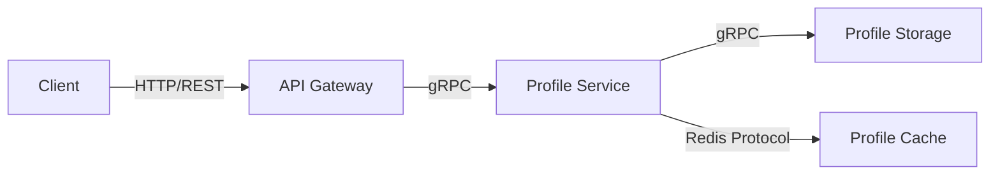
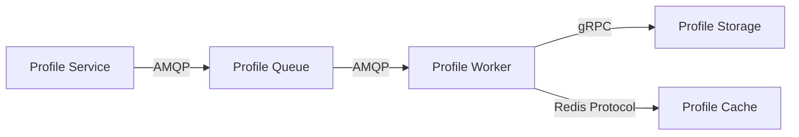
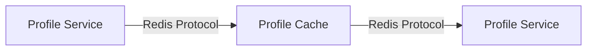

# Service-to-Service Communication

## Overview

This document outlines the communication patterns and protocols used between services in the Profile Service Microservices architecture.

## Communication Patterns

### 1. Synchronous Communication



#### HTTP/REST Communication

- Used for external client communication
- Stateless request-response pattern
- JSON payload format
- Standard HTTP methods (GET, POST, PUT, DELETE)

```yaml
# Example REST API Configuration
api:
  version: v1
  base_path: /api/v1
  endpoints:
    profiles:
      path: /profiles
      methods:
        - GET
        - POST
        - PUT
        - DELETE
      authentication: required
      rate_limit: 100/minute
```

#### gRPC Communication

- Used for internal service-to-service communication
- Strongly typed interface definitions
- Protocol Buffers for serialization
- Bidirectional streaming support

```protobuf
// Example gRPC Service Definition
service ProfileService {
  rpc GetProfile(GetProfileRequest) returns (Profile);
  rpc UpdateProfile(UpdateProfileRequest) returns (Profile);
  rpc DeleteProfile(DeleteProfileRequest) returns (Empty);
  rpc StreamProfileUpdates(StreamProfileRequest) returns (stream ProfileUpdate);
}
```

### 2. Asynchronous Communication



#### Message Queue Communication

- Used for event-driven communication
- AMQP protocol for reliable messaging
- Message persistence and delivery guarantees
- Dead letter queues for error handling

```yaml
# Example Queue Configuration
queue:
  name: profile-updates
  exchange: profile-events
  routing_key: profile.*
  durable: true
  auto_delete: false
  arguments:
    x-message-ttl: 86400000 # 24 hours
    x-dead-letter-exchange: profile-dlx
```

### 3. Caching Communication



#### Cache Communication

- Used for performance optimization
- Redis protocol for in-memory data storage
- Cache invalidation patterns
- Distributed locking mechanisms

```yaml
# Example Cache Configuration
cache:
  type: redis
  connection:
    host: redis.profile-cache
    port: 6379
    password: ${REDIS_PASSWORD}
  patterns:
    - name: profile-cache
      ttl: 3600 # 1 hour
      strategy: write-through
```

## Communication Protocols

### 1. HTTP/REST Protocol

- Version: HTTP/2
- Content-Type: application/json
- Authentication: JWT Bearer Token
- Compression: gzip, deflate

### 2. gRPC Protocol

- Version: gRPC 1.x
- Transport: HTTP/2
- Serialization: Protocol Buffers
- Authentication: mTLS

### 3. AMQP Protocol

- Version: AMQP 0-9-1
- Transport: TCP
- Authentication: SASL PLAIN
- Virtual Host: /profile

### 4. Redis Protocol

- Version: RESP3
- Transport: TCP
- Authentication: Password
- Database: 0

## Service Dependencies

### Direct Dependencies

1. API Gateway

   - Depends on: Profile Service, Auth Service
   - Protocol: gRPC

2. Profile Service

   - Depends on: Profile Storage, Profile Cache, Profile Queue
   - Protocols: gRPC, Redis Protocol, AMQP

3. Profile Worker
   - Depends on: Profile Storage, Profile Cache
   - Protocols: gRPC, Redis Protocol

### Indirect Dependencies

1. Profile Storage

   - Used by: Profile Service, Profile Worker
   - Protocol: gRPC

2. Profile Cache

   - Used by: Profile Service, Profile Worker
   - Protocol: Redis Protocol

3. Profile Queue
   - Used by: Profile Service, Profile Worker
   - Protocol: AMQP

## Error Handling

### 1. Retry Patterns

```yaml
retry:
  max_attempts: 3
  initial_interval: 1000 # ms
  multiplier: 2
  max_interval: 10000 # ms
```

### 2. Circuit Breaker

```yaml
circuit_breaker:
  failure_threshold: 5
  reset_timeout: 30000 # ms
  half_open_timeout: 5000 # ms
```

### 3. Fallback Strategies

```yaml
fallback:
  cache_fallback: true
  default_response: true
  timeout: 5000 # ms
```

## Monitoring and Metrics

### 1. Communication Metrics

- Request latency
- Error rates
- Throughput
- Connection pool status

### 2. Health Checks

- Service availability
- Protocol health
- Connection status
- Queue depth

### 3. Alerts

- High latency
- Error rate thresholds
- Connection failures
- Queue overflow

## Notes

- Keep documentation up to date
- Maintain cross-references
- Add practical examples
- Document decisions
- Track changes
- Ensure alignment with global architecture
