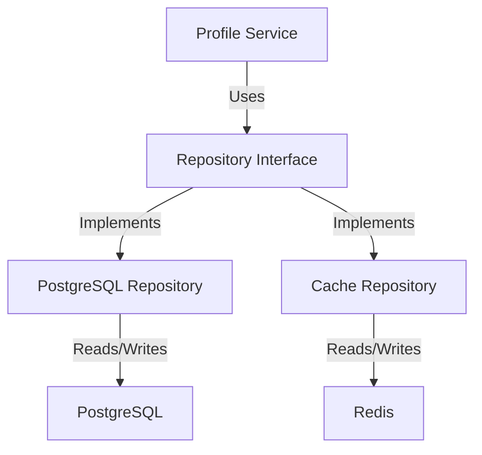

# Access Patterns

## Overview

This document outlines the data access patterns used in the Profile Service Microservices architecture.

## Data Access Layers

### 1. Repository Pattern



#### Repository Interface

```yaml
repository_pattern:
  interface: ProfileRepository
  methods:
    - name: findById
      parameters:
        - id: string
      returns: Profile
      cache: true
      ttl: 3600

    - name: findByEmail
      parameters:
        - email: string
      returns: Profile
      cache: true
      ttl: 3600

    - name: save
      parameters:
        - profile: Profile
      returns: Profile
      cache: invalidate

    - name: delete
      parameters:
        - id: string
      returns: void
      cache: invalidate
```

### 2. Data Access Objects

```yaml
data_access_objects:
  - name: ProfileDAO
    table: profiles
    operations:
      - name: create
        type: insert
        validation: true
        cache: invalidate

      - name: read
        type: select
        cache: true
        ttl: 3600

      - name: update
        type: update
        validation: true
        cache: invalidate

      - name: delete
        type: soft_delete
        cache: invalidate
```

## Query Patterns

### 1. Read Queries

```yaml
read_queries:
  - name: get_profile_by_id
    type: direct
    query: |
      SELECT * FROM profiles
      WHERE id = $1
    parameters:
      - id: uuid
    cache:
      key: "profile:{id}"
      ttl: 3600

  - name: get_profile_by_email
    type: indexed
    query: |
      SELECT * FROM profiles
      WHERE email = $1
    parameters:
      - email: string
    cache:
      key: "profile:email:{email}"
      ttl: 3600

  - name: get_profile_activities
    type: paginated
    query: |
      SELECT * FROM profile_activities
      WHERE profile_id = $1
      ORDER BY created_at DESC
      LIMIT $2 OFFSET $3
    parameters:
      - profile_id: uuid
      - limit: integer
      - offset: integer
    cache: false
```

### 2. Write Queries

```yaml
write_queries:
  - name: create_profile
    type: insert
    query: |
      INSERT INTO profiles (
        id, user_id, email, display_name,
        avatar_url, preferences, status
      ) VALUES ($1, $2, $3, $4, $5, $6, $7)
      RETURNING *
    parameters:
      - id: uuid
      - user_id: uuid
      - email: string
      - display_name: string
      - avatar_url: string
      - preferences: jsonb
      - status: string
    cache: invalidate

  - name: update_profile
    type: update
    query: |
      UPDATE profiles
      SET display_name = $2,
          avatar_url = $3,
          preferences = $4,
          status = $5,
          updated_at = NOW()
      WHERE id = $1
      RETURNING *
    parameters:
      - id: uuid
      - display_name: string
      - avatar_url: string
      - preferences: jsonb
      - status: string
    cache: invalidate
```

## Access Control

### 1. Authorization Rules

```yaml
authorization_rules:
  - name: profile_read
    resource: profile
    action: read
    conditions:
      - user_id matches profile.user_id
      - user has admin role
      - profile is public

  - name: profile_write
    resource: profile
    action: write
    conditions:
      - user_id matches profile.user_id
      - user has admin role
```

### 2. Access Policies

```yaml
access_policies:
  - name: profile_access
    resource: profile
    rules:
      - action: read
        roles:
          - user
          - admin
        conditions:
          - owner
          - public

      - action: write
        roles:
          - user
          - admin
        conditions:
          - owner
```

## Performance Patterns

### 1. Query Optimization

```yaml
query_optimization:
  - name: profile_lookup
    type: indexed
    indexes:
      - user_id
      - email
    cache: true
    ttl: 3600

  - name: profile_activity
    type: paginated
    indexes:
      - profile_id
      - created_at
    cache: false
    limit: 100
```

### 2. Batch Operations

```yaml
batch_operations:
  - name: bulk_profile_update
    type: batch
    size: 100
    operation: update
    validation: true
    cache: invalidate

  - name: bulk_profile_delete
    type: batch
    size: 100
    operation: delete
    validation: true
    cache: invalidate
```

## Access Monitoring

### 1. Access Metrics

```yaml
access_metrics:
  - name: query_execution_time
    type: histogram
    labels:
      - query_type
      - table
      - status

  - name: cache_operations
    type: counter
    labels:
      - operation
      - cache
      - status

  - name: authorization_checks
    type: counter
    labels:
      - resource
      - action
      - result
```

### 2. Access Alerts

```yaml
access_alerts:
  - name: slow_queries
    condition: query_execution_time > 1
    severity: warning
    action: notify_team

  - name: high_cache_misses
    condition: cache_operations{operation="miss"} > 1000
    severity: warning
    action: notify_team

  - name: authorization_failures
    condition: authorization_checks{result="denied"} > 100
    severity: critical
    action: notify_team
```

## Notes

- Keep documentation up to date
- Maintain cross-references
- Add practical examples
- Document decisions
- Track changes
- Ensure alignment with global architecture
