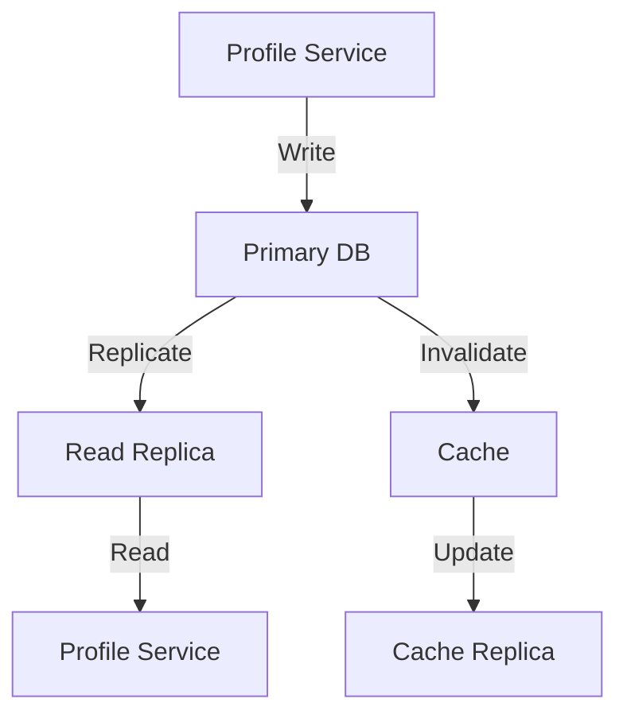
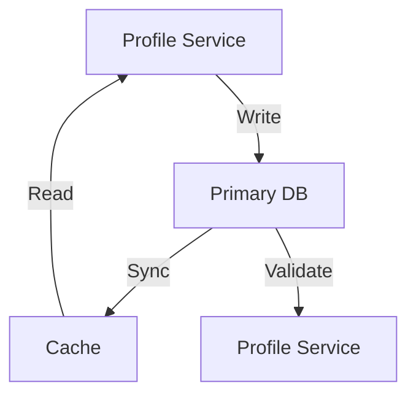

# Consistency Patterns

## Overview

This document outlines the data consistency patterns used in the Profile Service Microservices architecture.

## Consistency Models

### 1. Eventual Consistency



#### Eventual Consistency Configuration

```yaml
eventual_consistency:
  - name: profile_data
    type: read_replica
    replication:
      lag_threshold: 1000
      max_lag: 5000
    cache:
      invalidation: immediate
      ttl: 3600
    monitoring:
      - metric: replication_lag
        threshold: 1000
        action: alert

  - name: profile_metadata
    type: cache_first
    cache:
      ttl: 1800
      invalidation: lazy
    database:
      consistency: eventual
      max_lag: 1000
```

### 2. Strong Consistency



#### Strong Consistency Configuration

```yaml
strong_consistency:
  - name: profile_core
    type: immediate
    requirements:
      - atomic_writes
      - immediate_reads
      - cache_coherence
    implementation:
      - write_through_cache
      - synchronous_replication
      - distributed_locks

  - name: profile_settings
    type: immediate
    requirements:
      - atomic_updates
      - immediate_reads
    implementation:
      - write_through_cache
      - synchronous_replication
```

## Consistency Patterns

### 1. Write Patterns

```yaml
write_patterns:
  - name: profile_update
    type: atomic
    steps:
      - acquire_lock
      - validate_data
      - update_database
      - invalidate_cache
      - release_lock
    consistency: strong
    timeout: 5s

  - name: profile_metadata_update
    type: eventual
    steps:
      - update_database
      - queue_cache_invalidation
      - notify_services
    consistency: eventual
    timeout: 30s
```

### 2. Read Patterns

```yaml
read_patterns:
  - name: profile_read
    type: cache_first
    steps:
      - check_cache
      - if_miss_read_database
      - update_cache
    consistency: eventual
    timeout: 1s

  - name: profile_critical_read
    type: database_first
    steps:
      - read_database
      - update_cache
    consistency: strong
    timeout: 2s
```

## Consistency Mechanisms

### 1. Distributed Locks

```yaml
distributed_locks:
  - name: profile_lock
    type: redis
    implementation:
      - acquire: SET NX
      - release: DEL
      - timeout: 10s
      - retry:
          attempts: 3
          delay: 100ms

  - name: profile_metadata_lock
    type: redis
    implementation:
      - acquire: SET NX
      - release: DEL
      - timeout: 5s
      - retry:
          attempts: 3
          delay: 50ms
```

### 2. Cache Coherence

```yaml
cache_coherence:
  - name: profile_cache
    type: write_through
    implementation:
      - write_database
      - update_cache
      - invalidate_replicas
    consistency: strong
    timeout: 1s

  - name: profile_metadata_cache
    type: write_behind
    implementation:
      - update_cache
      - queue_database_update
      - eventual_consistency
    consistency: eventual
    timeout: 5s
```

## Consistency Monitoring

### 1. Consistency Metrics

```yaml
consistency_metrics:
  - name: replication_lag
    type: gauge
    labels:
      - database
      - replica
    thresholds:
      warning: 1000
      critical: 5000

  - name: cache_coherence
    type: gauge
    labels:
      - cache
      - operation
    thresholds:
      warning: 0.95
      critical: 0.90

  - name: consistency_violations
    type: counter
    labels:
      - type
      - severity
    thresholds:
      warning: 10
      critical: 50
```

### 2. Consistency Alerts

```yaml
consistency_alerts:
  - name: high_replication_lag
    condition: replication_lag > 1000
    severity: warning
    action: notify_team

  - name: cache_incoherence
    condition: cache_coherence < 0.95
    severity: warning
    action: notify_team

  - name: consistency_violation
    condition: consistency_violations > 10
    severity: critical
    action: notify_team
```

## Consistency Recovery

### 1. Recovery Procedures

```yaml
recovery_procedures:
  - name: replication_recovery
    trigger: high_replication_lag
    steps:
      - pause_writes
      - sync_replicas
      - verify_consistency
      - resume_writes
    timeout: 300s

  - name: cache_recovery
    trigger: cache_incoherence
    steps:
      - invalidate_cache
      - rebuild_from_database
      - verify_consistency
    timeout: 60s
```

### 2. Consistency Verification

```yaml
consistency_verification:
  - name: data_verification
    type: checksum
    implementation:
      - calculate_checksum
      - compare_replicas
      - report_differences
    schedule: daily

  - name: cache_verification
    type: sample_verification
    implementation:
      - sample_keys
      - verify_values
      - report_inconsistencies
    schedule: hourly
```

## Notes

- Keep documentation up to date
- Maintain cross-references
- Add practical examples
- Document decisions
- Track changes
- Ensure alignment with global architecture
