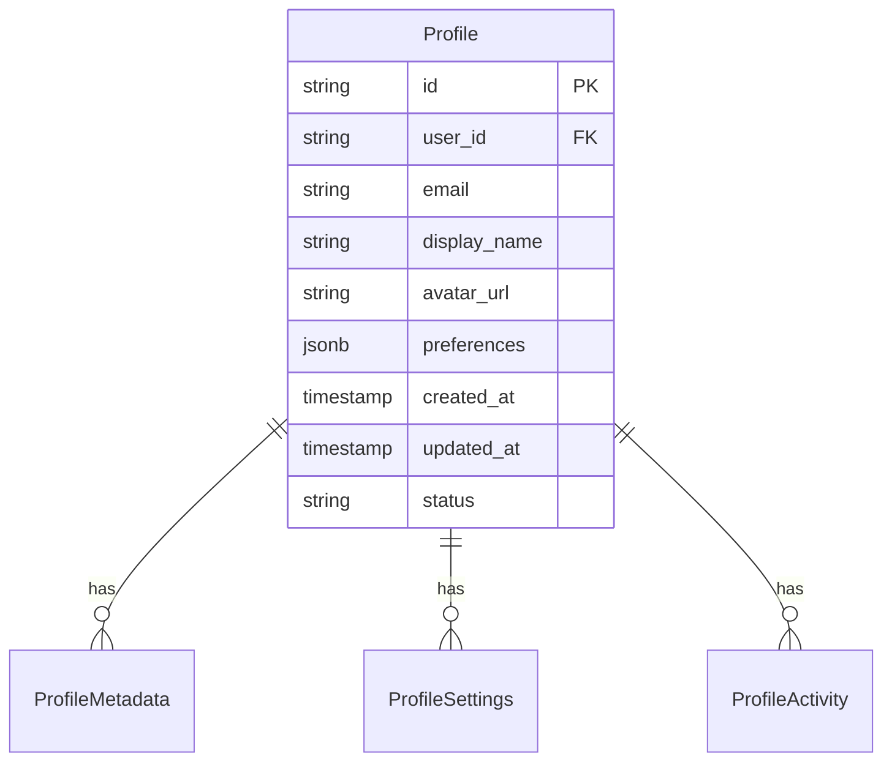
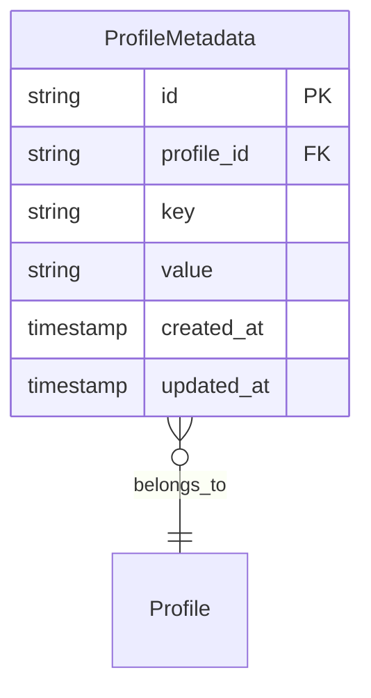
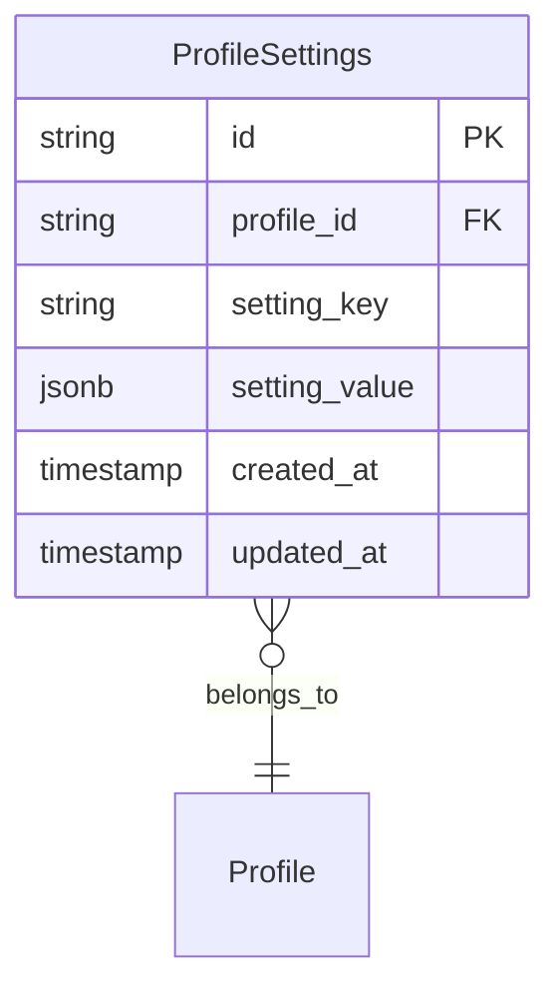
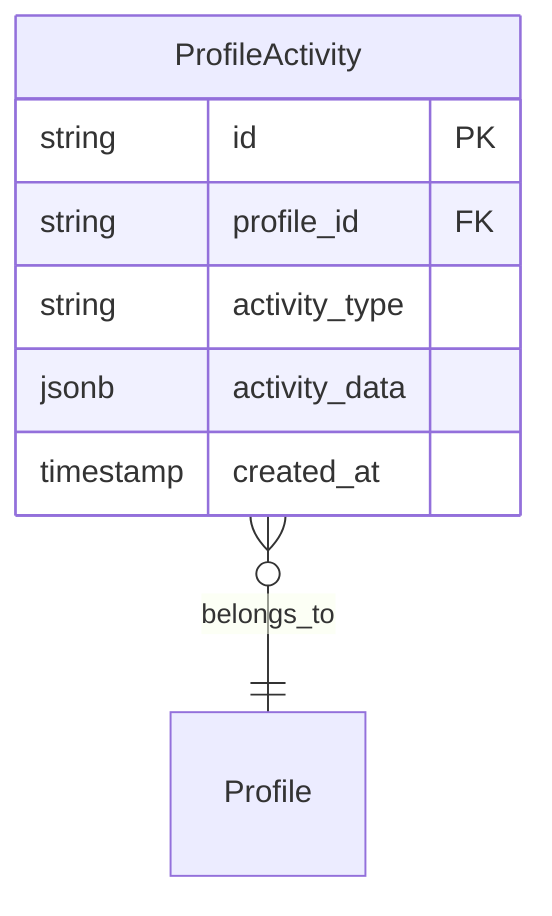

# Data Models

## Overview

This document outlines the data models used in the Profile Service Microservices architecture.

## Core Data Models

### 1. Profile Model



#### Profile Schema

```yaml
profile_model:
  name: Profile
  fields:
    - name: id
      type: string
      format: uuid
      description: Unique identifier
      constraints:
        - primary_key
        - not_null

    - name: user_id
      type: string
      format: uuid
      description: Reference to user
      constraints:
        - foreign_key
        - not_null
        - unique

    - name: email
      type: string
      format: email
      description: User email
      constraints:
        - not_null
        - unique

    - name: display_name
      type: string
      description: User display name
      constraints:
        - not_null
        - max_length: 100

    - name: avatar_url
      type: string
      format: uri
      description: Profile picture URL
      constraints:
        - nullable

    - name: preferences
      type: jsonb
      description: User preferences
      constraints:
        - nullable

    - name: created_at
      type: timestamp
      description: Creation timestamp
      constraints:
        - not_null

    - name: updated_at
      type: timestamp
      description: Last update timestamp
      constraints:
        - not_null

    - name: status
      type: string
      description: Profile status
      constraints:
        - not_null
        - enum: [active, inactive, suspended]
```

### 2. Profile Metadata Model



#### Profile Metadata Schema

```yaml
profile_metadata_model:
  name: ProfileMetadata
  fields:
    - name: id
      type: string
      format: uuid
      description: Unique identifier
      constraints:
        - primary_key
        - not_null

    - name: profile_id
      type: string
      format: uuid
      description: Reference to profile
      constraints:
        - foreign_key
        - not_null

    - name: key
      type: string
      description: Metadata key
      constraints:
        - not_null
        - max_length: 50

    - name: value
      type: string
      description: Metadata value
      constraints:
        - not_null

    - name: created_at
      type: timestamp
      description: Creation timestamp
      constraints:
        - not_null

    - name: updated_at
      type: timestamp
      description: Last update timestamp
      constraints:
        - not_null
```

### 3. Profile Settings Model



#### Profile Settings Schema

```yaml
profile_settings_model:
  name: ProfileSettings
  fields:
    - name: id
      type: string
      format: uuid
      description: Unique identifier
      constraints:
        - primary_key
        - not_null

    - name: profile_id
      type: string
      format: uuid
      description: Reference to profile
      constraints:
        - foreign_key
        - not_null

    - name: setting_key
      type: string
      description: Setting key
      constraints:
        - not_null
        - max_length: 50

    - name: setting_value
      type: jsonb
      description: Setting value
      constraints:
        - not_null

    - name: created_at
      type: timestamp
      description: Creation timestamp
      constraints:
        - not_null

    - name: updated_at
      type: timestamp
      description: Last update timestamp
      constraints:
        - not_null
```

### 4. Profile Activity Model



#### Profile Activity Schema

```yaml
profile_activity_model:
  name: ProfileActivity
  fields:
    - name: id
      type: string
      format: uuid
      description: Unique identifier
      constraints:
        - primary_key
        - not_null

    - name: profile_id
      type: string
      format: uuid
      description: Reference to profile
      constraints:
        - foreign_key
        - not_null

    - name: activity_type
      type: string
      description: Activity type
      constraints:
        - not_null
        - enum: [login, update, delete]

    - name: activity_data
      type: jsonb
      description: Activity data
      constraints:
        - not_null

    - name: created_at
      type: timestamp
      description: Creation timestamp
      constraints:
        - not_null
```

## Data Relationships

### 1. One-to-Many Relationships

```yaml
relationships:
  - name: profile_to_metadata
    type: one_to_many
    from: Profile
    to: ProfileMetadata
    foreign_key: profile_id
    cascade: delete

  - name: profile_to_settings
    type: one_to_many
    from: Profile
    to: ProfileSettings
    foreign_key: profile_id
    cascade: delete

  - name: profile_to_activity
    type: one_to_many
    from: Profile
    to: ProfileActivity
    foreign_key: profile_id
    cascade: delete
```

### 2. Indexes

```yaml
indexes:
  - name: profile_user_id_idx
    table: Profile
    columns:
      - user_id
    type: btree
    unique: true

  - name: profile_email_idx
    table: Profile
    columns:
      - email
    type: btree
    unique: true

  - name: profile_metadata_profile_id_idx
    table: ProfileMetadata
    columns:
      - profile_id
    type: btree

  - name: profile_settings_profile_id_idx
    table: ProfileSettings
    columns:
      - profile_id
    type: btree

  - name: profile_activity_profile_id_idx
    table: ProfileActivity
    columns:
      - profile_id
      - created_at
    type: btree
```

## Data Validation

### 1. Field Validation

```yaml
validation_rules:
  - name: email_format
    field: email
    type: regex
    pattern: "^[a-zA-Z0-9._%+-]+@[a-zA-Z0-9.-]+\\.[a-zA-Z]{2,}$"

  - name: display_name_length
    field: display_name
    type: length
    min: 1
    max: 100

  - name: avatar_url_format
    field: avatar_url
    type: uri
    schemes:
      - http
      - https
```

### 2. Business Rules

```yaml
business_rules:
  - name: unique_email
    description: Email must be unique across all profiles
    validation:
      - type: unique
        fields:
          - email

  - name: valid_status
    description: Status must be one of the allowed values
    validation:
      - type: enum
        field: status
        values:
          - active
          - inactive
          - suspended
```

## Notes

- Keep documentation up to date
- Maintain cross-references
- Add practical examples
- Document decisions
- Track changes
- Ensure alignment with global architecture
