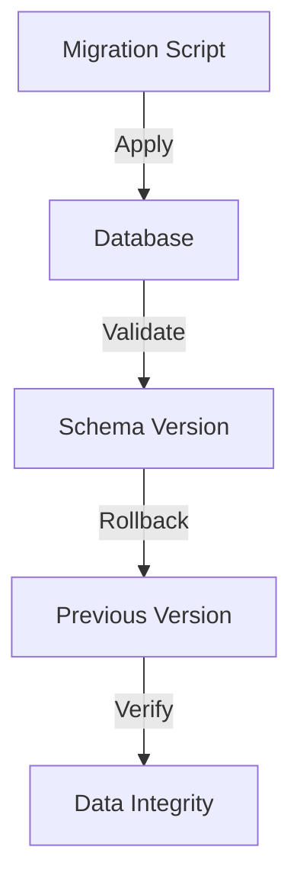
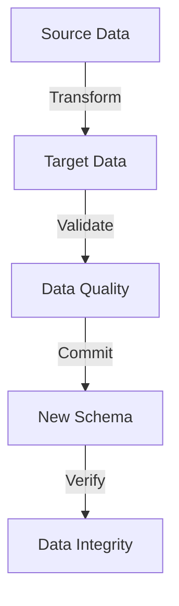

# Migration Strategies

## Overview

This document outlines the data migration strategies used in the Profile Service Microservices architecture.

## Migration Types

### 1. Schema Migrations



#### Schema Migration Configuration

```yaml
schema_migrations:
  - name: profile_schema_v1
    version: 1.0.0
    changes:
      - type: create_table
        table: profiles
        columns:
          - id: uuid
          - user_id: uuid
          - email: string
          - display_name: string
          - created_at: timestamp
          - updated_at: timestamp
    rollback:
      - type: drop_table
        table: profiles

  - name: profile_schema_v2
    version: 2.0.0
    changes:
      - type: add_column
        table: profiles
        column: avatar_url
        type: string
        nullable: true
    rollback:
      - type: drop_column
        table: profiles
        column: avatar_url
```

### 2. Data Migrations



#### Data Migration Configuration

```yaml
data_migrations:
  - name: profile_data_v1_to_v2
    source_version: 1.0.0
    target_version: 2.0.0
    steps:
      - type: transform
        source: profiles
        target: profiles_v2
        mapping:
          id: id
          user_id: user_id
          email: email
          display_name: display_name
          created_at: created_at
          updated_at: updated_at
          avatar_url: null
    validation:
      - type: count_check
        source: profiles
        target: profiles_v2
      - type: data_integrity
        fields:
          - id
          - user_id
          - email
```

## Migration Patterns

### 1. Zero-Downtime Migrations

```yaml
zero_downtime_migrations:
  - name: profile_schema_update
    type: online
    steps:
      - create_new_table
      - sync_data
      - switch_tables
      - cleanup_old
    validation:
      - data_consistency
      - performance_impact
    rollback:
      - switch_back
      - cleanup_new

  - name: profile_data_update
    type: online
    steps:
      - dual_write
      - verify_consistency
      - switch_reads
      - cleanup_old
    validation:
      - write_consistency
      - read_consistency
    rollback:
      - switch_reads_back
      - cleanup_new
```

### 2. Blue-Green Migrations

```yaml
blue_green_migrations:
  - name: profile_service_update
    type: blue_green
    steps:
      - deploy_new_version
      - sync_data
      - switch_traffic
      - decommission_old
    validation:
      - service_health
      - data_consistency
    rollback:
      - switch_traffic_back
      - decommission_new
```

## Migration Tools

### 1. Migration Framework

```yaml
migration_framework:
  - name: schema_migrator
    type: framework
    features:
      - version_control
      - rollback_support
      - validation_hooks
      - logging
    configuration:
      - migration_dir: migrations
      - version_table: schema_versions
      - timeout: 300s

  - name: data_migrator
    type: framework
    features:
      - batch_processing
      - error_handling
      - progress_tracking
      - logging
    configuration:
      - batch_size: 1000
      - retry_attempts: 3
      - timeout: 600s
```

### 2. Migration Scripts

```yaml
migration_scripts:
  - name: profile_migration
    type: script
    language: python
    dependencies:
      - psycopg2
      - redis
    features:
      - data_validation
      - error_handling
      - logging
    configuration:
      - source_db: postgresql
      - target_db: postgresql
      - cache: redis
```

## Migration Monitoring

### 1. Migration Metrics

```yaml
migration_metrics:
  - name: migration_progress
    type: gauge
    labels:
      - migration_id
      - step
    thresholds:
      warning: 0.8
      critical: 0.9

  - name: migration_duration
    type: histogram
    labels:
      - migration_id
      - step
    thresholds:
      warning: 300s
      critical: 600s

  - name: migration_errors
    type: counter
    labels:
      - migration_id
      - error_type
    thresholds:
      warning: 10
      critical: 50
```

### 2. Migration Alerts

```yaml
migration_alerts:
  - name: migration_stalled
    condition: migration_progress < 0.8
    severity: warning
    action: notify_team

  - name: migration_timeout
    condition: migration_duration > 600s
    severity: critical
    action: notify_team

  - name: migration_errors
    condition: migration_errors > 10
    severity: critical
    action: notify_team
```

## Migration Recovery

### 1. Recovery Procedures

```yaml
recovery_procedures:
  - name: migration_rollback
    trigger: migration_failure
    steps:
      - stop_migration
      - verify_state
      - execute_rollback
      - verify_rollback
    timeout: 300s

  - name: data_recovery
    trigger: data_corruption
    steps:
      - stop_services
      - restore_backup
      - verify_data
      - resume_services
    timeout: 600s
```

### 2. Migration Verification

```yaml
migration_verification:
  - name: schema_verification
    type: validation
    checks:
      - table_structure
      - constraints
      - indexes
    schedule: post_migration

  - name: data_verification
    type: validation
    checks:
      - data_consistency
      - data_quality
      - performance_impact
    schedule: post_migration
```

## Notes

- Keep documentation up to date
- Maintain cross-references
- Add practical examples
- Document decisions
- Track changes
- Ensure alignment with global architecture
