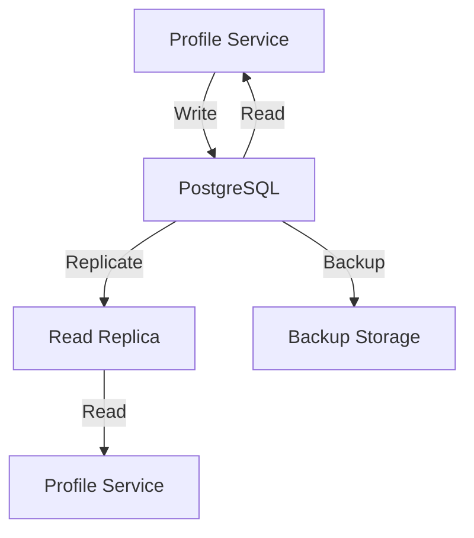
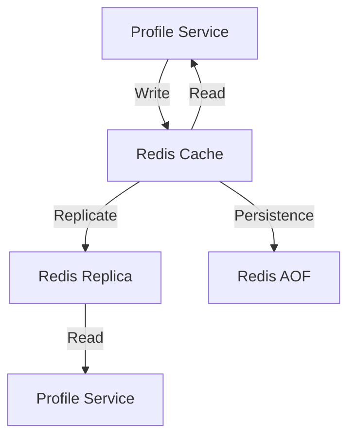

# Storage Patterns

## Overview

This document outlines the storage patterns used in the Profile Service Microservices architecture.

## Database Storage

### 1. Primary Storage



#### PostgreSQL Configuration

```yaml
postgresql_storage:
  primary:
    host: postgres.profile
    port: 5432
    database: profile_db
    user: ${POSTGRES_USER}
    password: ${POSTGRES_PASSWORD}
    ssl: true
    pool:
      min_connections: 5
      max_connections: 20
      idle_timeout: 300
    replication:
      enabled: true
      max_lag: 1000
    backup:
      schedule: "0 0 * * *"
      retention: 30d
      type: full
```

### 2. Cache Storage



#### Redis Configuration

```yaml
redis_storage:
  primary:
    host: redis.profile
    port: 6379
    password: ${REDIS_PASSWORD}
    ssl: true
    max_memory: 2gb
    max_memory_policy: allkeys-lru
    persistence:
      type: aof
      appendfsync: everysec
    replication:
      enabled: true
      role: master
```

## Storage Patterns

### 1. Data Partitioning

```yaml
partitioning_strategy:
  - name: profile_data
    type: horizontal
    key: user_id
    method: hash
    partitions: 10
    distribution:
      - range: 0-9
        shard: shard_0
      - range: 10-19
        shard: shard_1
      # ... additional ranges

  - name: profile_activity
    type: time-based
    key: created_at
    interval: monthly
    retention: 12
```

### 2. Data Replication

```yaml
replication_strategy:
  - name: profile_data
    type: master-slave
    replication_factor: 2
    consistency: eventual
    failover:
      automatic: true
      timeout: 30s

  - name: profile_cache
    type: master-replica
    replication_factor: 2
    consistency: eventual
    failover:
      automatic: true
      timeout: 5s
```

## Storage Access Patterns

### 1. Read Patterns

```yaml
read_patterns:
  - name: profile_by_id
    type: direct
    cache: true
    ttl: 3600
    fallback: database

  - name: profile_by_email
    type: indexed
    cache: true
    ttl: 3600
    fallback: database

  - name: profile_activity
    type: time_range
    cache: false
    pagination: true
    limit: 100
```

### 2. Write Patterns

```yaml
write_patterns:
  - name: profile_create
    type: insert
    validation: true
    cache: invalidate
    notification: true

  - name: profile_update
    type: update
    validation: true
    cache: invalidate
    notification: true

  - name: profile_delete
    type: soft_delete
    validation: true
    cache: invalidate
    notification: true
```

## Storage Optimization

### 1. Indexing Strategy

```yaml
indexing_strategy:
  - name: profile_lookup
    table: profiles
    columns:
      - user_id
      - email
    type: btree
    unique: true

  - name: profile_activity_lookup
    table: profile_activities
    columns:
      - profile_id
      - created_at
    type: btree
    unique: false
```

### 2. Caching Strategy

```yaml
caching_strategy:
  - name: profile_cache
    type: lru
    max_size: 10000
    ttl: 3600
    invalidation:
      - on_update
      - on_delete

  - name: profile_metadata_cache
    type: lru
    max_size: 50000
    ttl: 1800
    invalidation:
      - on_update
      - on_delete
```

## Storage Monitoring

### 1. Storage Metrics

```yaml
storage_metrics:
  - name: storage_operations_total
    type: counter
    labels:
      - operation
      - table
      - status

  - name: storage_latency_seconds
    type: histogram
    labels:
      - operation
      - table

  - name: cache_hit_ratio
    type: gauge
    labels:
      - cache
```

### 2. Storage Alerts

```yaml
storage_alerts:
  - name: high_storage_latency
    condition: storage_latency_seconds > 1
    severity: warning
    action: notify_team

  - name: low_cache_hit_ratio
    condition: cache_hit_ratio < 0.8
    severity: warning
    action: notify_team

  - name: storage_errors
    condition: storage_operations_total{status="error"} > 10
    severity: critical
    action: notify_team
```

## Notes

- Keep documentation up to date
- Maintain cross-references
- Add practical examples
- Document decisions
- Track changes
- Ensure alignment with global architecture
