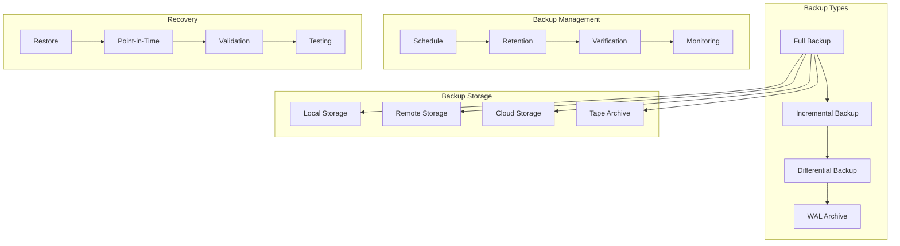

# Backup Strategies

## Overview

This document outlines the database backup strategies for the Profile Service Microservices, detailing backup types, schedules, retention policies, and recovery procedures.

## Backup Architecture

### 1. Backup Components



### 2. Backup Configuration

```yaml
backup_configuration:
  backup_types:
    full_backup:
      schedule: "weekly"
      retention: "30 days"
      compression: true
      encryption: true

    incremental_backup:
      schedule: "daily"
      retention: "7 days"
      compression: true
      encryption: true

    wal_archive:
      schedule: "continuous"
      retention: "14 days"
      compression: true
      encryption: true

  storage_configuration:
    local_storage:
      path: "/var/lib/postgresql/backups"
      max_size: "1TB"
      cleanup_policy: "after_remote_sync"

    remote_storage:
      type: "s3"
      bucket: "profile-service-backups"
      region: "us-west-2"
      encryption: true
```

## Backup Strategies

### 1. Backup Types

```yaml
backup_strategies:
  full_backup:
    frequency: "weekly"
    timing: "Sunday 02:00 UTC"
    retention: "30 days"
    verification: "immediate"
    storage:
      - local
      - remote
      - cloud

  incremental_backup:
    frequency: "daily"
    timing: "02:00 UTC"
    retention: "7 days"
    verification: "immediate"
    storage:
      - local
      - remote

  wal_archive:
    frequency: "continuous"
    retention: "14 days"
    verification: "daily"
    storage:
      - local
      - remote
```

### 2. Retention Policies

```yaml
retention_policies:
  full_backups:
    - daily: "7 days"
    - weekly: "30 days"
    - monthly: "12 months"
    - yearly: "5 years"

  incremental_backups:
    - daily: "7 days"
    - weekly: "30 days"

  wal_archives:
    - continuous: "14 days"
    - archived: "30 days"
```

## Backup Management

### 1. Backup Scheduling

```yaml
backup_scheduling:
  full_backup:
    schedule: "0 2 * * 0" # Weekly on Sunday at 02:00
    timeout: "4h"
    max_retries: 3
    retry_delay: "15m"

  incremental_backup:
    schedule: "0 2 * * *" # Daily at 02:00
    timeout: "2h"
    max_retries: 3
    retry_delay: "15m"

  wal_archive:
    schedule: "continuous"
    timeout: "1h"
    max_retries: 5
    retry_delay: "5m"
```

### 2. Backup Verification

```yaml
backup_verification:
  verification_types:
    - checksum_verification
    - restore_test
    - consistency_check
    - integrity_validation

  verification_schedule:
    full_backup: "immediate"
    incremental_backup: "immediate"
    wal_archive: "daily"
```

## Recovery Procedures

### 1. Recovery Types

```yaml
recovery_procedures:
  full_restore:
    steps:
      - stop_services
      - restore_full_backup
      - apply_incremental_backups
      - apply_wal_archives
      - verify_restore
      - start_services
    verification:
      - data_consistency
      - service_health
      - performance_check

  point_in_time:
    steps:
      - identify_recovery_point
      - restore_full_backup
      - apply_incremental_backups
      - apply_wal_archives
      - verify_restore
    verification:
      - data_consistency
      - service_health
      - performance_check
```

### 2. Recovery Testing

```yaml
recovery_testing:
  test_schedule:
    - full_restore: "monthly"
    - point_in_time: "quarterly"
    - disaster_recovery: "biannually"

  test_verification:
    - data_consistency
    - service_health
    - performance_check
    - recovery_time
```

## Backup Monitoring

### 1. Monitoring Metrics

```yaml
backup_metrics:
  backup_metrics:
    - backup_size
    - backup_duration
    - backup_success_rate
    - storage_usage
    - compression_ratio

  recovery_metrics:
    - recovery_time
    - recovery_success_rate
    - data_loss_risk
    - service_impact
```

### 2. Monitoring Alerts

```yaml
backup_alerts:
  backup_alerts:
    - backup_failure:
        threshold: "1 failure"
        duration: "1h"
        severity: "critical"

    - backup_delay:
        threshold: "1h"
        duration: "1h"
        severity: "warning"

  storage_alerts:
    - low_storage:
        threshold: "85%"
        duration: "1h"
        severity: "warning"

    - storage_full:
        threshold: "95%"
        duration: "1h"
        severity: "critical"
```

## Recovery Verification

### 1. Verification Procedures

```yaml
recovery_verification:
  data_verification:
    - checksum_verification
    - consistency_check
    - integrity_validation
    - performance_test

  service_verification:
    - service_health
    - connectivity_test
    - performance_check
    - functionality_test
```

### 2. Verification Schedule

```yaml
verification_schedule:
  automated_tests:
    - daily: "backup_verification"
    - weekly: "restore_test"
    - monthly: "disaster_recovery"

  manual_tests:
    - quarterly: "full_disaster_recovery"
    - biannually: "cross_region_restore"
```

## Notes

- Keep documentation up to date
- Maintain cross-references
- Add practical examples
- Document decisions
- Track changes
- Ensure alignment with global architecture
