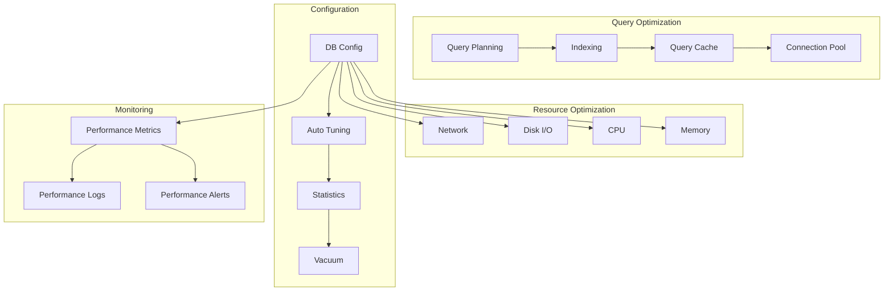

# Performance Optimization

## Overview

This document outlines the database performance optimization strategies for the Profile Service Microservices, detailing optimization techniques, monitoring, and best practices for database performance.

## Performance Architecture

### 1. Optimization Components



### 2. Performance Configuration

```yaml
performance_configuration:
  memory_settings:
    shared_buffers: "4GB"
    work_mem: "64MB"
    maintenance_work_mem: "256MB"
    effective_cache_size: "12GB"

  query_settings:
    random_page_cost: 1.1
    effective_io_concurrency: 200
    max_parallel_workers_per_gather: 4
    max_parallel_workers: 8
    max_parallel_maintenance_workers: 4

  autovacuum_settings:
    autovacuum: true
    autovacuum_max_workers: 3
    autovacuum_naptime: "1min"
    autovacuum_vacuum_threshold: 50
    autovacuum_analyze_threshold: 50
```

## Query Optimization

### 1. Query Planning

```yaml
query_planning:
  plan_analysis:
    - analyze_query_patterns
    - identify_bottlenecks
    - optimize_execution_plans
    - monitor_plan_changes

  optimization_techniques:
    - index_usage_optimization
    - join_order_optimization
    - parallel_query_execution
    - materialized_views
    - query_rewriting
```

### 2. Index Optimization

```yaml
index_optimization:
  index_maintenance:
    - regular_reindexing
    - index_bloat_removal
    - index_statistics_update
    - partial_index_optimization

  index_strategies:
    - covering_indexes
    - composite_indexes
    - partial_indexes
    - expression_indexes
    - index_compression
```

## Resource Optimization

### 1. Memory Management

```yaml
memory_optimization:
  buffer_management:
    - shared_buffer_tuning
    - work_mem_allocation
    - temp_buffer_optimization
    - cache_management

  memory_monitoring:
    - buffer_usage
    - cache_hit_ratio
    - memory_pressure
    - swap_usage
```

### 2. I/O Optimization

```yaml
io_optimization:
  disk_optimization:
    - data_file_placement
    - tablespace_management
    - io_scheduling
    - disk_cache_tuning

  network_optimization:
    - connection_pooling
    - query_batching
    - result_set_compression
    - network_buffer_tuning
```

## Configuration Optimization

### 1. Database Tuning

```yaml
database_tuning:
  parameter_tuning:
    - connection_parameters
    - query_parameters
    - resource_parameters
    - maintenance_parameters

  auto_tuning:
    - workload_analysis
    - parameter_optimization
    - performance_profiling
    - recommendation_generation
```

### 2. Maintenance Optimization

```yaml
maintenance_optimization:
  vacuum_optimization:
    - vacuum_scheduling
    - vacuum_parameters
    - table_statistics
    - index_statistics

  statistics_optimization:
    - statistics_collection
    - statistics_analysis
    - statistics_maintenance
    - statistics_usage
```

## Performance Monitoring

### 1. Monitoring Metrics

```yaml
performance_metrics:
  query_metrics:
    - execution_time
    - rows_processed
    - buffer_usage
    - cache_hit_ratio
    - index_usage
    - sequential_scans

  resource_metrics:
    - cpu_usage
    - memory_usage
    - disk_io
    - network_io
    - connection_count
```

### 2. Performance Alerts

```yaml
performance_alerts:
  query_alerts:
    - slow_query:
        threshold: "1s"
        duration: "5m"
        severity: "warning"

    - high_resource_usage:
        threshold: "80%"
        duration: "5m"
        severity: "warning"

  resource_alerts:
    - memory_pressure:
        threshold: "90%"
        duration: "5m"
        severity: "critical"

    - disk_space:
        threshold: "85%"
        duration: "5m"
        severity: "warning"
```

## Performance Recovery

### 1. Recovery Procedures

```yaml
performance_recovery:
  query_degradation:
    steps:
      - identify_bottleneck
      - analyze_query_plan
      - optimize_query
      - verify_improvement
    verification:
      - check_query_performance
      - monitor_resource_usage
      - verify_optimization

  resource_exhaustion:
    steps:
      - identify_resource
      - adjust_parameters
      - optimize_usage
      - verify_recovery
    verification:
      - check_resource_usage
      - monitor_performance
      - verify_stability
```

### 2. Recovery Verification

```yaml
recovery_verification:
  performance_verification:
    - verify_query_performance
    - check_resource_usage
    - monitor_metrics
    - verify_alerts

  resource_verification:
    - verify_resource_limits
    - check_usage_patterns
    - monitor_metrics
    - verify_alerts
```

## Notes

- Keep documentation up to date
- Maintain cross-references
- Add practical examples
- Document decisions
- Track changes
- Ensure alignment with global architecture
