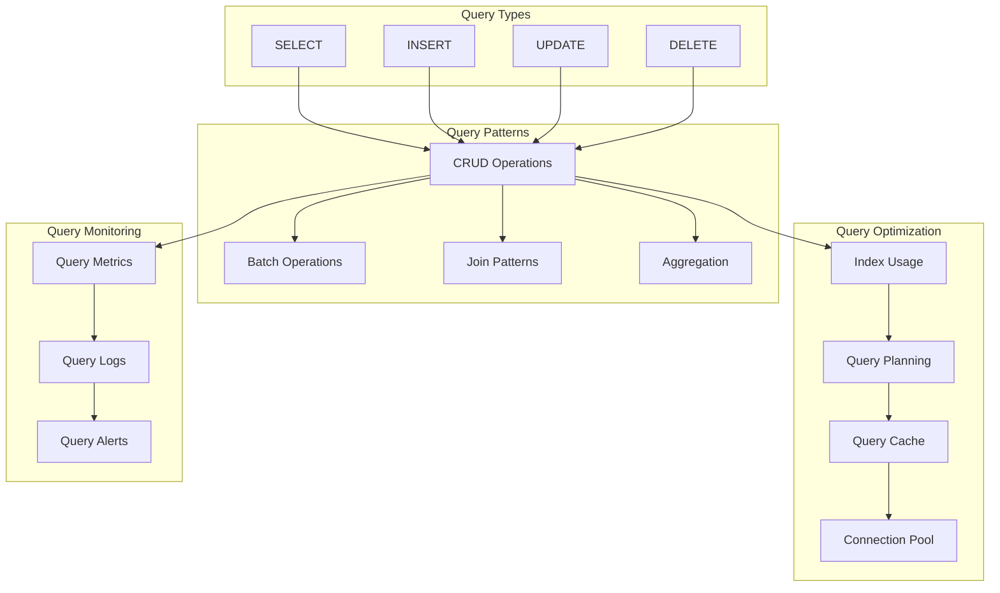

# Query Patterns

## Overview

This document outlines the database query patterns for the Profile Service Microservices, detailing query design patterns, optimization strategies, and best practices for database operations.

## Query Architecture

### 1. Query Components



### 2. Query Configuration

```yaml
query_configuration:
  connection_pool:
    min_connections: 5
    max_connections: 20
    idle_timeout: "300s"
    connection_timeout: "10s"

  query_settings:
    statement_timeout: "30s"
    lock_timeout: "10s"
    idle_in_transaction_timeout: "60s"
    max_parallel_workers: 4
```

## Query Patterns

### 1. CRUD Patterns

```yaml
crud_patterns:
  create_patterns:
    single_insert:
      pattern: "INSERT INTO table (columns) VALUES (values)"
      example: |
        INSERT INTO profiles (id, user_id, email, name)
        VALUES (uuid_generate_v4(), $1, $2, $3)

    batch_insert:
      pattern: "INSERT INTO table (columns) VALUES (values), (values)"
      example: |
        INSERT INTO user_preferences (id, user_id, preference_type, value)
        VALUES 
          (uuid_generate_v4(), $1, 'language', $2),
          (uuid_generate_v4(), $1, 'timezone', $3)

  read_patterns:
    single_select:
      pattern: "SELECT columns FROM table WHERE conditions"
      example: |
        SELECT id, email, name
        FROM profiles
        WHERE user_id = $1

    join_select:
      pattern: "SELECT columns FROM table1 JOIN table2 ON conditions"
      example: |
        SELECT p.id, p.email, p.name, up.preference_type, up.value
        FROM profiles p
        JOIN user_preferences up ON p.id = up.user_id
        WHERE p.user_id = $1
```

### 2. Batch Operations

```yaml
batch_patterns:
  batch_update:
    pattern: "UPDATE table SET column = value WHERE conditions"
    example: |
      UPDATE user_preferences
      SET value = CASE preference_type
        WHEN 'language' THEN $1
        WHEN 'timezone' THEN $2
      END
      WHERE user_id = $3

  batch_delete:
    pattern: "DELETE FROM table WHERE conditions"
    example: |
      DELETE FROM user_activities
      WHERE user_id = $1
      AND created_at < NOW() - INTERVAL '30 days'
```

## Query Optimization

### 1. Index Usage

```yaml
index_usage:
  index_types:
    - btree: "equality and range queries"
    - hash: "equality queries only"
    - gist: "geometric data"
    - gin: "full-text search"
    - brin: "large tables with natural ordering"

  index_strategies:
    - covering_index: "include frequently accessed columns"
    - partial_index: "index subset of rows"
    - expression_index: "index computed values"
    - composite_index: "index multiple columns"
```

### 2. Query Planning

```yaml
query_planning:
  execution_plans:
    - sequential_scan: "full table scan"
    - index_scan: "using index"
    - bitmap_scan: "multiple indexes"
    - nested_loop: "joins with small tables"
    - hash_join: "equality joins"
    - merge_join: "sorted data joins"

  optimization_hints:
    - use_index: "force index usage"
    - no_index: "prevent index usage"
    - parallel: "enable parallel execution"
    - materialize: "materialize subquery"
```

## Query Monitoring

### 1. Monitoring Metrics

```yaml
query_metrics:
  performance_metrics:
    - execution_time
    - rows_processed
    - buffer_usage
    - cache_hit_ratio
    - index_usage
    - sequential_scans

  resource_metrics:
    - cpu_usage
    - memory_usage
    - disk_io
    - network_io
    - connection_count
```

### 2. Monitoring Alerts

```yaml
query_alerts:
  performance_alerts:
    - slow_query:
        threshold: "1s"
        duration: "5m"
        severity: "warning"

    - high_resource_usage:
        threshold: "80%"
        duration: "5m"
        severity: "warning"

  error_alerts:
    - query_timeout:
        threshold: "30s"
        duration: "1m"
        severity: "critical"

    - connection_errors:
        threshold: "10/min"
        duration: "5m"
        severity: "warning"
```

## Query Recovery

### 1. Recovery Procedures

```yaml
query_recovery:
  query_timeout:
    steps:
      - identify_timeout
      - kill_query
      - log_incident
      - notify_team
    verification:
      - check_query_logs
      - verify_connection
      - monitor_performance

  resource_exhaustion:
    steps:
      - identify_resource
      - adjust_limits
      - optimize_query
      - notify_team
    verification:
      - check_resource_usage
      - verify_performance
      - monitor_metrics
```

### 2. Recovery Verification

```yaml
recovery_verification:
  query_verification:
    - verify_execution_time
    - check_resource_usage
    - monitor_performance
    - verify_alerts

  resource_verification:
    - verify_resource_limits
    - check_usage_patterns
    - monitor_metrics
    - verify_alerts
```

## Notes

- Keep documentation up to date
- Maintain cross-references
- Add practical examples
- Document decisions
- Track changes
- Ensure alignment with global architecture
