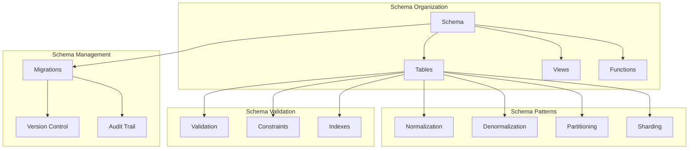

# Schema Patterns

## Overview

This document outlines the database schema patterns for the Profile Service Microservices, detailing schema design patterns, naming conventions, and best practices for database organization.

## Schema Architecture

### 1. Schema Components



### 2. Schema Configuration

```yaml
schema_configuration:
  naming_conventions:
    tables:
      pattern: "snake_case"
      prefix: ""
      suffix: ""
    columns:
      pattern: "snake_case"
      primary_key: "id"
      foreign_key: "{table_name}_id"
    indexes:
      pattern: "{table_name}_{column_name}_idx"
    constraints:
      pattern: "{table_name}_{constraint_type}"

  schema_organization:
    schemas:
      - name: "public"
        description: "Public schema for core tables"
      - name: "audit"
        description: "Audit schema for tracking changes"
      - name: "reporting"
        description: "Reporting schema for analytics"
```

## Schema Patterns

### 1. Normalization Patterns

```yaml
normalization_patterns:
  first_normal_form:
    rules:
      - atomic_values
      - no_repeating_groups
      - unique_identifiers
    example:
      table: "user_contacts"
      columns:
        - id
        - user_id
        - contact_type
        - contact_value

  second_normal_form:
    rules:
      - first_normal_form
      - no_partial_dependencies
    example:
      table: "user_preferences"
      columns:
        - id
        - user_id
        - preference_type
        - preference_value

  third_normal_form:
    rules:
      - second_normal_form
      - no_transitive_dependencies
    example:
      table: "user_roles"
      columns:
        - id
        - user_id
        - role_id
```

### 2. Denormalization Patterns

```yaml
denormalization_patterns:
  read_optimization:
    patterns:
      - materialized_views
      - summary_tables
      - redundant_columns
    example:
      table: "user_profiles"
      columns:
        - id
        - user_id
        - full_name
        - email
        - role_name
        - department_name

  write_optimization:
    patterns:
      - batch_updates
      - async_updates
      - cache_invalidation
    example:
      table: "user_activity"
      columns:
        - id
        - user_id
        - activity_type
        - activity_data
        - last_updated
```

## Schema Management

### 1. Migration Patterns

```yaml
migration_patterns:
  version_control:
    pattern: "timestamp_description"
    example: "20240315000000_add_user_preferences"

  migration_types:
    - create_table
    - alter_table
    - drop_table
    - create_index
    - drop_index
    - add_column
    - drop_column
    - modify_column

  rollback_strategy:
    - backup_before_migration
    - reversible_migrations
    - point_in_time_recovery
```

### 2. Schema Evolution

```yaml
schema_evolution:
  compatibility_rules:
    - backward_compatible
    - forward_compatible
    - breaking_changes

  evolution_patterns:
    - additive_changes
    - destructive_changes
    - data_migration
    - schema_versioning
```

## Schema Validation

### 1. Constraint Patterns

```yaml
constraint_patterns:
  primary_keys:
    - single_column
    - composite_keys
    - uuid_keys
    - auto_increment

  foreign_keys:
    - referential_integrity
    - cascade_delete
    - cascade_update
    - set_null

  check_constraints:
    - value_ranges
    - pattern_matching
    - custom_validation
```

### 2. Index Patterns

```yaml
index_patterns:
  index_types:
    - btree
    - hash
    - gist
    - gin
    - brin

  index_strategies:
    - single_column
    - composite_index
    - partial_index
    - expression_index
    - covering_index
```

## Schema Monitoring

### 1. Monitoring Metrics

```yaml
schema_metrics:
  performance_metrics:
    - index_usage
    - constraint_violations
    - table_size
    - index_size
    - fragmentation

  health_metrics:
    - schema_changes
    - migration_status
    - constraint_checks
    - index_health
```

### 2. Monitoring Alerts

```yaml
schema_alerts:
  performance_alerts:
    - high_fragmentation:
        threshold: "30%"
        duration: "1d"
        severity: "warning"

    - large_table_size:
        threshold: "10GB"
        duration: "1d"
        severity: "warning"

  health_alerts:
    - constraint_violations:
        threshold: "100/day"
        duration: "1d"
        severity: "critical"

    - index_usage:
        threshold: "0%"
        duration: "7d"
        severity: "warning"
```

## Schema Recovery

### 1. Recovery Procedures

```yaml
schema_recovery:
  migration_failure:
    steps:
      - identify_failure
      - rollback_migration
      - verify_schema
      - notify_team
    verification:
      - check_schema_version
      - verify_constraints
      - validate_data

  corruption_recovery:
    steps:
      - identify_corruption
      - backup_current_state
      - restore_from_backup
      - verify_integrity
    verification:
      - check_data_consistency
      - verify_constraints
      - validate_indexes
```

### 2. Recovery Verification

```yaml
recovery_verification:
  schema_verification:
    - verify_schema_version
    - check_constraints
    - validate_indexes
    - verify_data

  migration_verification:
    - verify_migration_status
    - check_rollback_state
    - validate_changes
    - verify_data
```

## Notes

- Keep documentation up to date
- Maintain cross-references
- Add practical examples
- Document decisions
- Track changes
- Ensure alignment with global architecture
