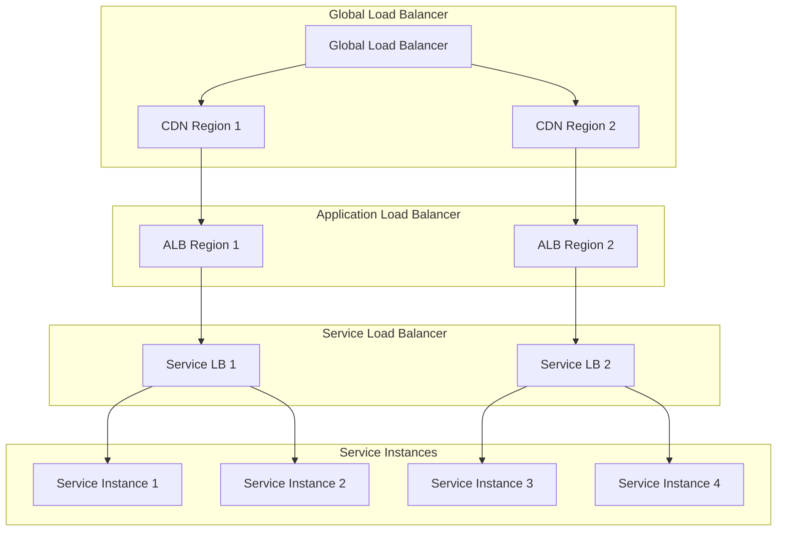

# Load Balancing

## Overview

This document outlines the load balancing architecture for the Profile Service Microservices, detailing the load balancing strategies, configurations, and monitoring across different service layers.

## Load Balancing Architecture

### 1. Load Balancer Types



### 2. Load Balancing Configuration

```yaml
load_balancing:
  global_load_balancer:
    type: "DNS-based"
    algorithm: "geographic"
    health_check:
      protocol: "HTTP"
      path: "/health"
      interval: "30s"
      timeout: "5s"
      healthy_threshold: 3
      unhealthy_threshold: 3

  application_load_balancer:
    type: "Layer 7"
    algorithm: "least_connections"
    sticky_sessions: true
    health_check:
      protocol: "HTTP"
      path: "/health"
      interval: "15s"
      timeout: "3s"
      healthy_threshold: 2
      unhealthy_threshold: 2

  service_load_balancer:
    type: "Layer 4"
    algorithm: "round_robin"
    health_check:
      protocol: "TCP"
      port: 8080
      interval: "10s"
      timeout: "2s"
      healthy_threshold: 2
      unhealthy_threshold: 2
```

## Load Balancing Strategies

### 1. Distribution Algorithms

```yaml
distribution_algorithms:
  global_level:
    - geographic_routing
    - latency_based
    - weighted_distribution

  application_level:
    - least_connections
    - round_robin
    - weighted_round_robin
    - ip_hash

  service_level:
    - round_robin
    - least_connections
    - consistent_hashing
```

### 2. Session Management

```yaml
session_management:
  sticky_sessions:
    enabled: true
    cookie_name: "session_id"
    cookie_ttl: "1h"
    cookie_secure: true
    cookie_http_only: true

  session_persistence:
    type: "cookie_based"
    fallback: "ip_based"
    timeout: "1h"
```

## Load Balancer Monitoring

### 1. Monitoring Metrics

```yaml
load_balancer_metrics:
  performance_metrics:
    - request_rate
    - response_time
    - connection_count
    - error_rate
    - bandwidth_usage

  health_metrics:
    - healthy_host_count
    - unhealthy_host_count
    - target_health_status
    - backend_health_status

  capacity_metrics:
    - active_connections
    - queued_requests
    - rejected_connections
    - backend_capacity
```

### 2. Monitoring Alerts

```yaml
load_balancer_alerts:
  performance_alerts:
    - high_latency:
        threshold: "200ms"
        duration: "5m"
        severity: "warning"

    - high_error_rate:
        threshold: "5%"
        duration: "5m"
        severity: "critical"

  health_alerts:
    - unhealthy_hosts:
        threshold: "50%"
        duration: "5m"
        severity: "critical"

    - backend_failures:
        threshold: "3"
        duration: "1m"
        severity: "critical"

  capacity_alerts:
    - high_connection_count:
        threshold: "10000"
        duration: "5m"
        severity: "warning"

    - queue_overflow:
        threshold: "1000"
        duration: "1m"
        severity: "critical"
```

## Load Balancer Recovery

### 1. Recovery Procedures

```yaml
load_balancer_recovery:
  service_degradation:
    steps:
      - check_health_status
      - verify_backend_health
      - check_connection_pools
      - verify_session_state
    verification:
      - test_service_health
      - verify_load_distribution
      - check_error_rates

  backend_failure:
    steps:
      - identify_failed_backends
      - remove_from_rotation
      - notify_operations
      - initiate_failover
    verification:
      - verify_health_checks
      - test_service_availability
      - check_load_distribution
```

### 2. Recovery Verification

```yaml
recovery_verification:
  health_verification:
    - verify_backend_health
    - check_health_checks
    - test_service_availability
    - verify_load_distribution

  performance_verification:
    - check_response_times
    - verify_error_rates
    - test_connection_handling
    - verify_session_management
```

## Notes

- Keep documentation up to date
- Maintain cross-references
- Add practical examples
- Document decisions
- Track changes
- Ensure alignment with global architecture
