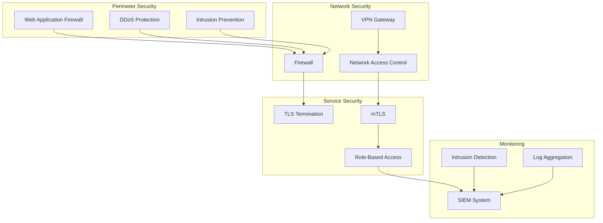

# Network Security

## Overview

This document outlines the network security architecture for the Profile Service Microservices, detailing security measures, access controls, and monitoring across the network infrastructure.

## Network Security Architecture

### 1. Security Components



### 2. Security Configuration

```yaml
network_security:
  perimeter_security:
    web_application_firewall:
      enabled: true
      rules:
        - name: "sql_injection"
          action: "block"
          priority: 1
        - name: "xss_attack"
          action: "block"
          priority: 2
        - name: "path_traversal"
          action: "block"
          priority: 3

    ddos_protection:
      enabled: true
      rate_limiting:
        requests_per_second: 1000
        burst_size: 2000
      blacklist:
        enabled: true
        duration: "24h"

  network_security:
    firewall:
      inbound_rules:
        - protocol: "TCP"
          ports: [80, 443]
          source: "0.0.0.0/0"
          action: "allow"
        - protocol: "TCP"
          ports: [22]
          source: "10.0.0.0/8"
          action: "allow"
      outbound_rules:
        - protocol: "TCP"
          ports: [80, 443]
          destination: "0.0.0.0/0"
          action: "allow"

    vpn:
      type: "openvpn"
      authentication: "certificate"
      encryption: "AES-256-GCM"
      key_rotation: "30d"
```

## Access Control

### 1. Network Access Policies

```yaml
access_control:
  network_policies:
    - name: "service-to-service"
      source:
        namespace: "default"
        labels:
          app: "profile-service"
      destination:
        namespace: "default"
        labels:
          app: "auth-service"
      ports:
        - protocol: "TCP"
          port: 8080

    - name: "external-access"
      source:
        ip_blocks: ["0.0.0.0/0"]
      destination:
        namespace: "default"
        labels:
          app: "api-gateway"
      ports:
        - protocol: "TCP"
          port: 443
```

### 2. Security Groups

```yaml
security_groups:
  api_gateway:
    inbound:
      - protocol: "TCP"
        ports: [80, 443]
        source: "0.0.0.0/0"
    outbound:
      - protocol: "TCP"
        ports: [8080]
        destination: "10.0.0.0/8"

  internal_services:
    inbound:
      - protocol: "TCP"
        ports: [8080]
        source: "10.0.0.0/8"
    outbound:
      - protocol: "TCP"
        ports: [80, 443]
        destination: "0.0.0.0/0"
```

## Security Monitoring

### 1. Monitoring Metrics

```yaml
security_metrics:
  firewall_metrics:
    - blocked_connections
    - allowed_connections
    - rule_hits
    - rule_misses

  waf_metrics:
    - blocked_requests
    - allowed_requests
    - attack_attempts
    - rule_violations

  vpn_metrics:
    - active_connections
    - failed_attempts
    - bandwidth_usage
    - connection_duration
```

### 2. Security Alerts

```yaml
security_alerts:
  firewall_alerts:
    - high_block_rate:
        threshold: "100/min"
        duration: "5m"
        severity: "warning"

    - suspicious_ip:
        threshold: "50 connections/min"
        duration: "1m"
        severity: "critical"

  waf_alerts:
    - attack_detected:
        threshold: "10 attempts/min"
        duration: "1m"
        severity: "critical"

    - rule_violation:
        threshold: "100 violations/min"
        duration: "5m"
        severity: "warning"

  vpn_alerts:
    - failed_attempts:
        threshold: "5/min"
        duration: "5m"
        severity: "warning"

    - unusual_activity:
        threshold: "10 connections/min"
        duration: "1m"
        severity: "critical"
```

## Security Recovery

### 1. Recovery Procedures

```yaml
security_recovery:
  firewall_incident:
    steps:
      - identify_attack_source
      - update_firewall_rules
      - block_suspicious_ips
      - notify_security_team
    verification:
      - check_firewall_logs
      - verify_rule_updates
      - monitor_traffic_patterns

  waf_incident:
    steps:
      - analyze_attack_pattern
      - update_waf_rules
      - block_attack_sources
      - notify_security_team
    verification:
      - check_waf_logs
      - verify_rule_updates
      - monitor_request_patterns
```

### 2. Recovery Verification

```yaml
recovery_verification:
  firewall_verification:
    - verify_rule_effectiveness
    - check_traffic_patterns
    - monitor_blocked_ips
    - verify_logging

  waf_verification:
    - verify_rule_effectiveness
    - check_request_patterns
    - monitor_blocked_requests
    - verify_logging
```

## Notes

- Keep documentation up to date
- Maintain cross-references
- Add practical examples
- Document decisions
- Track changes
- Ensure alignment with global architecture
