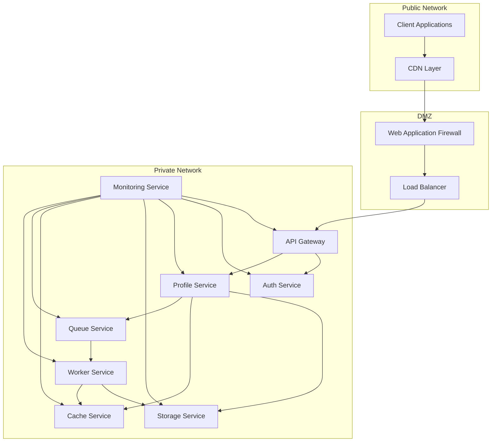

# Network Topology

## Overview

This document outlines the network topology for the Profile Service Microservices architecture, detailing the network layout, components, and their interconnections.

## Network Components

### 1. Network Layout



### 2. Network Zones

```yaml
network_zones:
  public_zone:
    components:
      - client_applications
      - cdn_layer
    security:
      - ssl_termination
      - ddos_protection
      - rate_limiting

  dmz_zone:
    components:
      - web_application_firewall
      - load_balancer
    security:
      - traffic_filtering
      - ssl_termination
      - access_control

  private_zone:
    components:
      - api_gateway
      - microservices
      - databases
      - caches
      - message_queues
    security:
      - internal_encryption
      - service_mesh
      - network_policies
```

## Network Configuration

### 1. IP Addressing

```yaml
ip_addressing:
  public_zone:
    cidr: "10.0.0.0/24"
    components:
      cdn:
        range: "10.0.0.0/26"
      waf:
        range: "10.0.0.64/26"
      load_balancer:
        range: "10.0.0.128/26"

  private_zone:
    cidr: "10.1.0.0/16"
    components:
      api_gateway:
        range: "10.1.0.0/24"
      microservices:
        range: "10.1.1.0/24"
      databases:
        range: "10.1.2.0/24"
      caches:
        range: "10.1.3.0/24"
      message_queues:
        range: "10.1.4.0/24"
```

### 2. Network Policies

```yaml
network_policies:
  ingress:
    - source: public_zone
      destination: dmz_zone
      protocols: ["HTTP", "HTTPS"]
      ports: [80, 443]

    - source: dmz_zone
      destination: private_zone
      protocols: ["HTTP", "HTTPS"]
      ports: [8080, 8443]

  egress:
    - source: private_zone
      destination: public_zone
      protocols: ["HTTP", "HTTPS"]
      ports: [80, 443]
```

## Network Monitoring

### 1. Monitoring Metrics

```yaml
network_metrics:
  traffic_metrics:
    - bytes_in
    - bytes_out
    - packets_in
    - packets_out
    - connection_count
    - error_count

  performance_metrics:
    - latency
    - throughput
    - packet_loss
    - jitter
    - bandwidth_utilization

  security_metrics:
    - failed_connections
    - blocked_requests
    - ssl_errors
    - ddos_attempts
```

### 2. Monitoring Alerts

```yaml
network_alerts:
  traffic_alerts:
    - high_bandwidth_usage:
        threshold: "80%"
        duration: "5m"
        severity: "warning"

    - connection_spike:
        threshold: "1000/s"
        duration: "1m"
        severity: "critical"

  performance_alerts:
    - high_latency:
        threshold: "200ms"
        duration: "5m"
        severity: "warning"

    - packet_loss:
        threshold: "1%"
        duration: "1m"
        severity: "critical"

  security_alerts:
    - ddos_attack:
        threshold: "1000 req/s"
        duration: "1m"
        severity: "critical"

    - ssl_errors:
        threshold: "10/min"
        duration: "5m"
        severity: "warning"
```

## Network Recovery

### 1. Recovery Procedures

```yaml
network_recovery:
  ddos_mitigation:
    steps:
      - enable_traffic_filtering
      - activate_ddos_protection
      - scale_load_balancers
      - notify_security_team
    verification:
      - check_traffic_patterns
      - verify_service_health
      - monitor_attack_patterns

  network_outage:
    steps:
      - check_network_connectivity
      - verify_dns_resolution
      - check_firewall_rules
      - verify_load_balancer_health
    verification:
      - test_service_connectivity
      - verify_traffic_flow
      - check_monitoring_systems
```

### 2. Recovery Verification

```yaml
recovery_verification:
  connectivity_tests:
    - test_public_access
    - test_internal_communication
    - test_service_health
    - test_monitoring_systems

  security_verification:
    - verify_firewall_rules
    - check_security_groups
    - verify_ssl_certificates
    - test_waf_rules
```

## Notes

- Keep documentation up to date
- Maintain cross-references
- Add practical examples
- Document decisions
- Track changes
- Ensure alignment with global architecture
