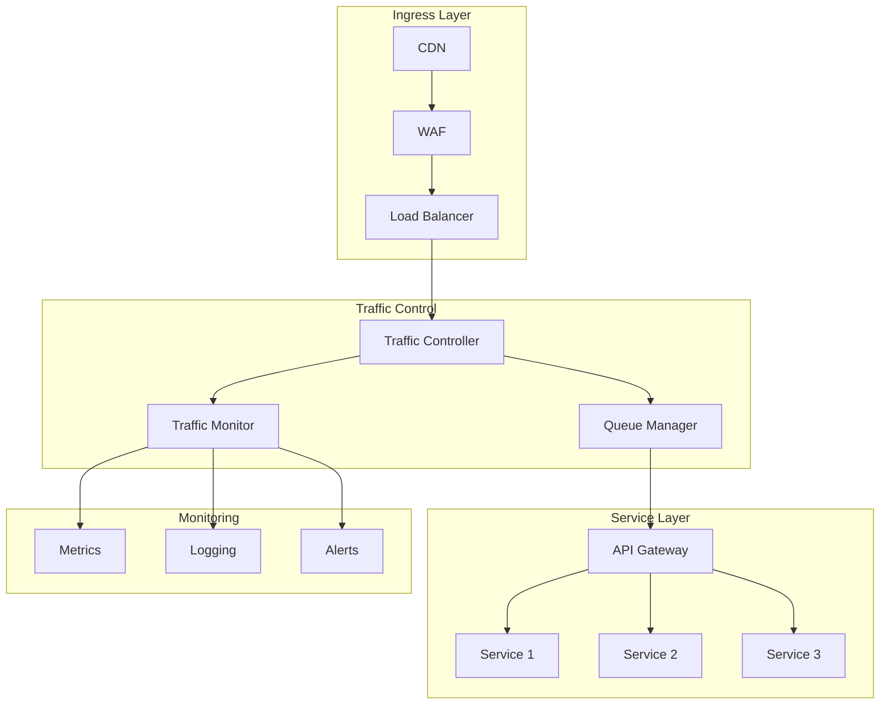

# Traffic Management

## Overview

This document outlines the traffic management architecture for the Profile Service Microservices, detailing traffic routing, shaping, and monitoring strategies across the network infrastructure.

## Traffic Management Architecture

### 1. Traffic Flow Components



### 2. Traffic Management Configuration

```yaml
traffic_management:
  ingress_control:
    rate_limiting:
      global:
        requests_per_second: 1000
        burst_size: 2000
      per_client:
        requests_per_second: 100
        burst_size: 200

    traffic_shaping:
      priority_queues:
        - name: "high_priority"
          weight: 70
          max_size: 1000
        - name: "normal_priority"
          weight: 20
          max_size: 2000
        - name: "low_priority"
          weight: 10
          max_size: 5000

  service_routing:
    api_gateway:
      routes:
        - path: "/api/v1/profile"
          service: "profile-service"
          timeout: "5s"
          retries: 3
        - path: "/api/v1/auth"
          service: "auth-service"
          timeout: "3s"
          retries: 2
```

## Traffic Control

### 1. Traffic Policies

```yaml
traffic_policies:
  rate_limiting:
    global_policy:
      requests_per_second: 1000
      burst_size: 2000
      window_size: "1m"

    service_policies:
      profile_service:
        requests_per_second: 500
        burst_size: 1000
        window_size: "1m"
      auth_service:
        requests_per_second: 300
        burst_size: 600
        window_size: "1m"

  circuit_breakers:
    profile_service:
      max_requests: 100
      error_threshold: "50%"
      reset_timeout: "30s"
    auth_service:
      max_requests: 50
      error_threshold: "30%"
      reset_timeout: "20s"
```

### 2. Traffic Shaping

```yaml
traffic_shaping:
  queue_management:
    priority_queues:
      - name: "critical"
        weight: 50
        max_size: 500
        timeout: "5s"
      - name: "high"
        weight: 30
        max_size: 1000
        timeout: "10s"
      - name: "normal"
        weight: 20
        max_size: 2000
        timeout: "30s"

  bandwidth_control:
    global_limit: "100Mbps"
    service_limits:
      profile_service: "50Mbps"
      auth_service: "30Mbps"
      other_services: "20Mbps"
```

## Traffic Monitoring

### 1. Monitoring Metrics

```yaml
traffic_metrics:
  flow_metrics:
    - requests_per_second
    - response_time
    - error_rate
    - bandwidth_usage
    - queue_size
    - queue_wait_time

  service_metrics:
    - service_health
    - service_latency
    - service_errors
    - service_throughput
    - service_queue_depth

  client_metrics:
    - client_requests
    - client_errors
    - client_latency
    - client_bandwidth
```

### 2. Monitoring Alerts

```yaml
traffic_alerts:
  flow_alerts:
    - high_traffic:
        threshold: "80% of capacity"
        duration: "5m"
        severity: "warning"

    - queue_overflow:
        threshold: "90% of queue size"
        duration: "1m"
        severity: "critical"

  service_alerts:
    - high_latency:
        threshold: "200ms"
        duration: "5m"
        severity: "warning"

    - high_error_rate:
        threshold: "5%"
        duration: "5m"
        severity: "critical"

  client_alerts:
    - client_abuse:
        threshold: "1000 requests/min"
        duration: "1m"
        severity: "critical"

    - client_errors:
        threshold: "50 errors/min"
        duration: "5m"
        severity: "warning"
```

## Traffic Recovery

### 1. Recovery Procedures

```yaml
traffic_recovery:
  service_degradation:
    steps:
      - identify_bottleneck
      - adjust_traffic_shaping
      - update_circuit_breakers
      - notify_operations
    verification:
      - check_service_health
      - verify_traffic_flow
      - monitor_metrics

  queue_overflow:
    steps:
      - check_queue_status
      - adjust_queue_limits
      - update_priority_weights
      - notify_operations
    verification:
      - check_queue_health
      - verify_traffic_flow
      - monitor_metrics
```

### 2. Recovery Verification

```yaml
recovery_verification:
  service_verification:
    - verify_service_health
    - check_traffic_flow
    - monitor_metrics
    - verify_alerts

  queue_verification:
    - verify_queue_health
    - check_traffic_flow
    - monitor_metrics
    - verify_alerts
```

## Notes

- Keep documentation up to date
- Maintain cross-references
- Add practical examples
- Document decisions
- Track changes
- Ensure alignment with global architecture
