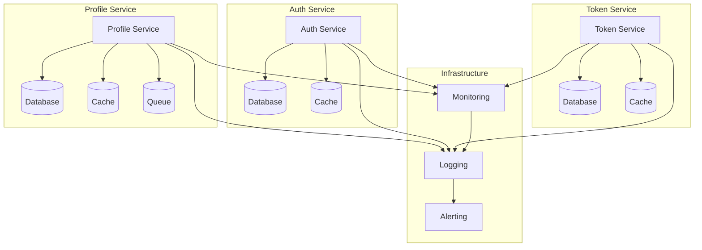

# Component Relationships

## Overview

This document details the relationships and interactions between components in the Profile Service Microservices architecture, including dependencies, communication patterns, and data flow.

## Component Relationships

### 1. Service Dependencies



### 2. Communication Patterns

```yaml
communication_patterns:
  synchronous:
    - http_rest:
        protocol: "HTTP/1.1"
        method: "REST"
        authentication: "JWT"
        rate_limiting: true

    - grpc:
        protocol: "gRPC"
        method: "RPC"
        authentication: "mTLS"
        rate_limiting: true

  asynchronous:
    - message_queue:
        protocol: "AMQP"
        method: "Pub/Sub"
        authentication: "Basic Auth"
        persistence: true

    - event_stream:
        protocol: "WebSocket"
        method: "Event Stream"
        authentication: "JWT"
        persistence: false
```

## Service Interactions

### 1. Direct Dependencies

```yaml
direct_dependencies:
  profile_service:
    required_services:
      - auth_service:
          purpose: "Authentication"
          type: "Synchronous"
          protocol: "HTTP/REST"

      - token_service:
          purpose: "Token Management"
          type: "Synchronous"
          protocol: "HTTP/REST"

      - cache_service:
          purpose: "Data Caching"
          type: "Synchronous"
          protocol: "Redis Protocol"

      - queue_service:
          purpose: "Message Queue"
          type: "Asynchronous"
          protocol: "AMQP"

  auth_service:
    required_services:
      - clerk_service:
          purpose: "Authentication"
          type: "Synchronous"
          protocol: "HTTP/REST"

      - cache_service:
          purpose: "Session Cache"
          type: "Synchronous"
          protocol: "Redis Protocol"

  token_service:
    required_services:
      - auth_service:
          purpose: "Token Validation"
          type: "Synchronous"
          protocol: "HTTP/REST"

      - cache_service:
          purpose: "Token Cache"
          type: "Synchronous"
          protocol: "Redis Protocol"
```

### 2. Indirect Dependencies

```yaml
indirect_dependencies:
  profile_service:
    infrastructure:
      - monitoring_service:
          purpose: "Metrics Collection"
          type: "Asynchronous"
          protocol: "Prometheus"

      - logging_service:
          purpose: "Log Collection"
          type: "Asynchronous"
          protocol: "Syslog"

      - alerting_service:
          purpose: "Alert Management"
          type: "Asynchronous"
          protocol: "Webhook"

  auth_service:
    infrastructure:
      - monitoring_service:
          purpose: "Metrics Collection"
          type: "Asynchronous"
          protocol: "Prometheus"

      - logging_service:
          purpose: "Log Collection"
          type: "Asynchronous"
          protocol: "Syslog"

  token_service:
    infrastructure:
      - monitoring_service:
          purpose: "Metrics Collection"
          type: "Asynchronous"
          protocol: "Prometheus"

      - logging_service:
          purpose: "Log Collection"
          type: "Asynchronous"
          protocol: "Syslog"
```

## Data Flow

### 1. Request Flow

```yaml
request_flow:
  profile_request:
    steps:
      - client_request:
          from: "Client"
          to: "API Gateway"
          protocol: "HTTP/REST"

      - auth_validation:
          from: "API Gateway"
          to: "Auth Service"
          protocol: "HTTP/REST"

      - token_validation:
          from: "Auth Service"
          to: "Token Service"
          protocol: "HTTP/REST"

      - profile_processing:
          from: "Token Service"
          to: "Profile Service"
          protocol: "HTTP/REST"

      - data_persistence:
          from: "Profile Service"
          to: "Database"
          protocol: "SQL"

  auth_request:
    steps:
      - client_request:
          from: "Client"
          to: "API Gateway"
          protocol: "HTTP/REST"

      - clerk_validation:
          from: "API Gateway"
          to: "Clerk Service"
          protocol: "HTTP/REST"

      - session_management:
          from: "Clerk Service"
          to: "Auth Service"
          protocol: "HTTP/REST"
```

### 2. Event Flow

```yaml
event_flow:
  profile_events:
    steps:
      - event_generation:
          from: "Profile Service"
          to: "Queue Service"
          protocol: "AMQP"

      - event_processing:
          from: "Queue Service"
          to: "Worker Service"
          protocol: "AMQP"

      - cache_invalidation:
          from: "Worker Service"
          to: "Cache Service"
          protocol: "Redis Protocol"

  auth_events:
    steps:
      - event_generation:
          from: "Auth Service"
          to: "Queue Service"
          protocol: "AMQP"

      - event_processing:
          from: "Queue Service"
          to: "Worker Service"
          protocol: "AMQP"

      - session_cleanup:
          from: "Worker Service"
          to: "Cache Service"
          protocol: "Redis Protocol"
```

## Dependency Management

### 1. Version Management

```yaml
version_management:
  service_versions:
    profile_service:
      current: "v1.0.0"
      dependencies:
        auth_service: "v1.0.0"
        token_service: "v1.0.0"
        cache_service: "v1.0.0"
        queue_service: "v1.0.0"

    auth_service:
      current: "v1.0.0"
      dependencies:
        clerk_service: "v1.0.0"
        cache_service: "v1.0.0"

    token_service:
      current: "v1.0.0"
      dependencies:
        auth_service: "v1.0.0"
        cache_service: "v1.0.0"
```

### 2. Compatibility Rules

```yaml
compatibility_rules:
  version_compatibility:
    - major_version:
        rule: "Breaking changes"
        action: "New version required"

    - minor_version:
        rule: "Backward compatible"
        action: "Optional upgrade"

    - patch_version:
        rule: "Bug fixes"
        action: "Recommended upgrade"

  dependency_rules:
    - direct_dependencies:
        rule: "Explicit version"
        action: "Lock version"

    - indirect_dependencies:
        rule: "Version range"
        action: "Allow updates"
```

## Notes

- Keep documentation up to date
- Maintain cross-references
- Add practical examples
- Document decisions
- Track changes
- Ensure alignment with global architecture
