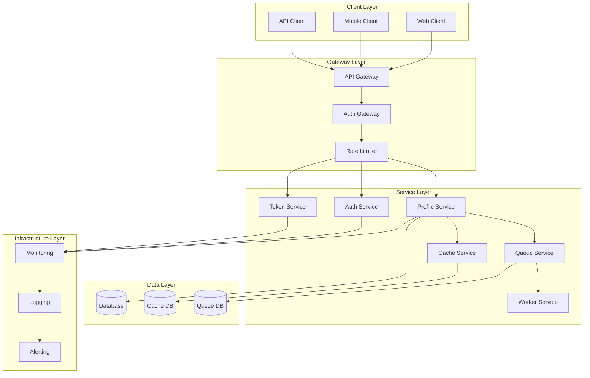

# System Architecture

## Overview

This document provides a comprehensive overview of the Profile Service Microservices system architecture, detailing the system components, their interactions, and the overall architectural design.

## System Architecture

### 1. System Components



### 2. System Configuration

```yaml
system_configuration:
  client_layer:
    web_client:
      type: "SPA"
      framework: "React"
      authentication: "Clerk"
      api_version: "v1"

    mobile_client:
      type: "Native"
      platforms: ["iOS", "Android"]
      authentication: "Clerk"
      api_version: "v1"

    api_client:
      type: "REST"
      authentication: "API Key"
      api_version: "v1"

  gateway_layer:
    api_gateway:
      type: "Kong"
      routing: "path-based"
      load_balancing: "round-robin"
      rate_limiting: true

    auth_gateway:
      type: "Clerk"
      authentication: "JWT"
      authorization: "RBAC"
      session_management: true

  service_layer:
    profile_service:
      type: "Microservice"
      language: "Go"
      framework: "Gin"
      database: "PostgreSQL"
      cache: "Redis"

    auth_service:
      type: "Microservice"
      language: "Go"
      framework: "Gin"
      authentication: "Clerk"
      token_management: true

    token_service:
      type: "Microservice"
      language: "Go"
      framework: "Gin"
      token_translation: true
      token_validation: true
```

## System Design

### 1. Architecture Patterns

```yaml
architecture_patterns:
  microservices:
    pattern: "Service-based"
    communication: "HTTP/REST"
    discovery: "Service Registry"
    resilience: "Circuit Breaker"

  event_driven:
    pattern: "Event-based"
    messaging: "Message Queue"
    events: "Domain Events"
    processing: "Event Handlers"

  data_management:
    pattern: "CQRS"
    read_model: "Cache"
    write_model: "Database"
    consistency: "Eventual"
```

### 2. System Integration

```yaml
system_integration:
  service_integration:
    - service_discovery
    - load_balancing
    - circuit_breaking
    - retry_policies
    - timeout_handling

  data_integration:
    - data_consistency
    - event_sourcing
    - message_queuing
    - cache_invalidation
    - data_synchronization
```

## System Components

### 1. Core Services

```yaml
core_services:
  profile_service:
    responsibilities:
      - profile_management
      - data_validation
      - business_logic
      - data_persistence
    dependencies:
      - database
      - cache
      - queue
      - monitoring

  auth_service:
    responsibilities:
      - authentication
      - authorization
      - session_management
      - user_management
    dependencies:
      - clerk
      - database
      - cache
      - monitoring

  token_service:
    responsibilities:
      - token_translation
      - token_validation
      - token_management
      - token_refresh
    dependencies:
      - database
      - cache
      - monitoring
```

### 2. Supporting Services

```yaml
supporting_services:
  cache_service:
    responsibilities:
      - data_caching
      - cache_invalidation
      - cache_synchronization
    dependencies:
      - redis
      - monitoring

  queue_service:
    responsibilities:
      - message_queuing
      - event_processing
      - task_scheduling
    dependencies:
      - rabbitmq
      - monitoring

  worker_service:
    responsibilities:
      - background_processing
      - task_execution
      - job_scheduling
    dependencies:
      - queue
      - monitoring
```

## System Monitoring

### 1. Monitoring Metrics

```yaml
monitoring_metrics:
  service_metrics:
    - response_time
    - error_rate
    - request_rate
    - resource_usage
    - service_health

  system_metrics:
    - system_load
    - resource_utilization
    - network_traffic
    - database_performance
    - cache_performance
```

### 2. Monitoring Alerts

```yaml
monitoring_alerts:
  service_alerts:
    - high_error_rate:
        threshold: "5%"
        duration: "5m"
        severity: "critical"

    - high_latency:
        threshold: "1s"
        duration: "5m"
        severity: "warning"

  system_alerts:
    - high_resource_usage:
        threshold: "80%"
        duration: "5m"
        severity: "warning"

    - service_unavailable:
        threshold: "1 failure"
        duration: "1m"
        severity: "critical"
```

## System Recovery

### 1. Recovery Procedures

```yaml
recovery_procedures:
  service_recovery:
    steps:
      - identify_failure
      - check_dependencies
      - restart_service
      - verify_health
    verification:
      - service_health
      - dependency_health
      - performance_check

  system_recovery:
    steps:
      - identify_issue
      - check_resources
      - apply_fixes
      - verify_system
    verification:
      - system_health
      - resource_health
      - performance_check
```

### 2. Recovery Verification

```yaml
recovery_verification:
  service_verification:
    - service_health
    - dependency_health
    - performance_check
    - error_rate_check

  system_verification:
    - system_health
    - resource_health
    - performance_check
    - stability_check
```

## Notes

- Keep documentation up to date
- Maintain cross-references
- Add practical examples
- Document decisions
- Track changes
- Ensure alignment with global architecture
