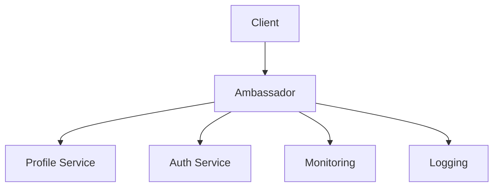
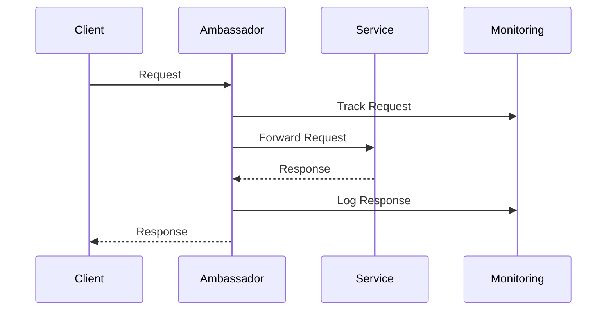

INITIAL CONTEXT FOR LLM - never change the context-----------------------------
-> THIS SECTION IS A GUIDELINE TO THE LLM CONSIDER BEFORE WORKING IN THIS FILE, DO NOT CHANGE THIS

-> GOES OF THE AMBASSADOR PATTERN:

- This document describes the Ambassador pattern used in the microservices architecture
- It covers service proxying, protocol translation, and client-side functionality
- Includes implementation details and configuration examples
- All patterns are implemented and tested in the current architecture
- For LLM-specific guidelines, refer to [LLM Integration Guide](../../../docs/llm/README.md)

-> CONSIDERER BEFORE UPDATING THIS FILE:

- This is a documentation file about the Ambassador pattern
- Never add fictional dates, version numbers, or metrics
- Changes should be incremental and based on verified information
- Add comments for clarification when needed
- Maintain LLM-friendly format

---

# Ambassador Pattern

## Context

- When to use: For offloading cross-cutting concerns to a proxy service
- Problem it solves: Simplifies service implementation by handling common functionality
- Related patterns: Sidecar Pattern, Proxy Pattern, Service Mesh

## Solution

### Service Proxying

- Request routing
- Protocol translation
- Load balancing
- Service discovery

Implementation:

```yaml
service_proxying:
  routing:
    rules:
      - path: /api/v1/profiles/*
        service: profile-service
      - path: /api/v1/auth/*
        service: auth-service
  protocol:
    translation:
      - from: http1
        to: http2
      - from: grpc
        to: http2
  load_balancing:
    strategy: round_robin
    health_check: true
```

### Client-Side Functionality

- Retry logic
- Circuit breaking
- Rate limiting
- Caching

Implementation:

```yaml
client_functionality:
  retry:
    max_attempts: 3
    backoff: exponential
  circuit_breaker:
    threshold: 5
    timeout: 30s
  rate_limiting:
    requests_per_second: 100
    burst: 200
  caching:
    ttl: 300s
    strategy: stale_while_revalidate
```

### Protocol Translation

- HTTP versions
- gRPC to REST
- WebSocket support
- Custom protocols

Implementation:

```yaml
protocol_translation:
  http:
    versions:
      - 1.1
      - 2.0
    upgrade: true
  grpc:
    to_rest: true
    swagger: true
  websocket:
    support: true
    ping_interval: 30s
```

### Monitoring and Logging

- Request tracking
- Performance metrics
- Error logging
- Access logs

Implementation:

```yaml
monitoring:
  tracking:
    request_id: true
    correlation_id: true
  metrics:
    - latency
    - throughput
    - error_rate
  logging:
    format: json
    level: info
    destination: elasticsearch
```

## Benefits

- Simplified service implementation
- Centralized cross-cutting concerns
- Protocol flexibility
- Improved monitoring
- Better error handling

## Drawbacks

- Additional network hop
- Increased complexity
- Resource overhead
- Configuration management
- Testing complexity

## Examples

### Ambassador Architecture



### Request Flow



## Related Patterns

- Sidecar Pattern: For service augmentation
- Proxy Pattern: For request forwarding
- Service Mesh: For service-to-service communication
- Circuit Breaker: For failure handling
- Rate Limiting: For request throttling

## Notes

- Monitor proxy performance
- Handle failures gracefully
- Maintain protocol compatibility
- Test thoroughly
- Document configurations
