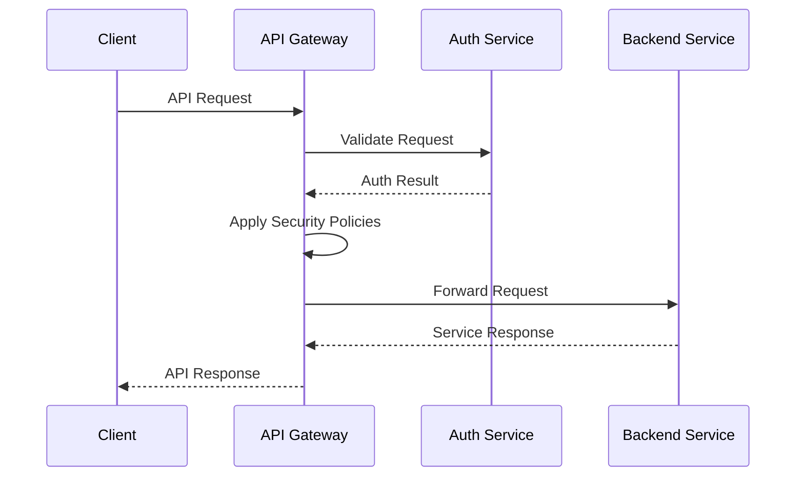
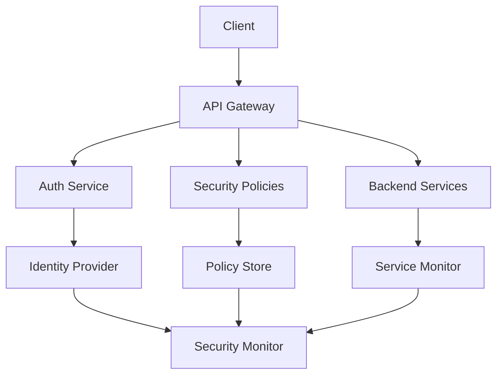

INITIAL CONTEXT FOR LLM - never change the context-----------------------------
-> THIS SECTION IS A GUIDELINE TO THE LLM CONSIDER BEFORE WORKING IN THIS FILE, DO NOT CHANGE THIS

-> GOES OF THE API GATEWAY SECURITY PATTERN:

- This document describes the API Gateway Security pattern used in the microservices architecture
- It covers API protection, request validation, and security enforcement
- Includes implementation details and configuration examples
- All patterns are implemented and tested in the current architecture
- For LLM-specific guidelines, refer to [LLM Integration Guide](../../../docs/llm/README.md)

-> CONSIDERER BEFORE UPDATING THIS FILE:

- This is a documentation file about the API Gateway Security pattern
- Never add fictional dates, version numbers, or metrics
- Changes should be incremental and based on verified information
- Add comments for clarification when needed
- Maintain LLM-friendly format

---

# API Gateway Security Pattern

## Context

- When to use: For securing API endpoints and managing API access
- Problem it solves: Ensures API security and access control
- Related patterns: Authentication, Authorization, Rate Limiting

## Solution

### API Protection

- Request validation
- Input sanitization
- Schema validation
- Security headers

Implementation:

```yaml
api_protection:
  request_validation:
    enabled: true
    schema: openapi
    strict: true
  input_sanitization:
    enabled: true
    rules:
      - xss
      - sql_injection
      - path_traversal
  schema_validation:
    enabled: true
    format: json
    cache: true
  security_headers:
    enabled: true
    headers:
      - X-Content-Type-Options
      - X-Frame-Options
      - X-XSS-Protection
      - Content-Security-Policy
```

### Access Control

- API key management
- Client authentication
- Rate limiting
- IP filtering

Implementation:

```yaml
access_control:
  api_key:
    enabled: true
    rotation: 90d
    format: uuid
  client_auth:
    enabled: true
    methods:
      - oauth2
      - jwt
      - api_key
  rate_limiting:
    enabled: true
    window: 60
    max_requests: 100
  ip_filtering:
    enabled: true
    whitelist: true
    blacklist: true
```

### Security Policies

- CORS configuration
- SSL/TLS settings
- Request signing
- Response encryption

Implementation:

```yaml
security_policies:
  cors:
    enabled: true
    origins:
      - https://example.com
    methods:
      - GET
      - POST
      - PUT
      - DELETE
  ssl_tls:
    enabled: true
    min_version: TLS1.2
    ciphers: modern
  request_signing:
    enabled: true
    algorithm: HMAC-SHA256
    header: X-Signature
  response_encryption:
    enabled: true
    algorithm: AES-256-GCM
    key_rotation: 30d
```

### Monitoring and Logging

- Access logs
- Security events
- Performance metrics
- Alert configuration

Implementation:

```yaml
monitoring_logging:
  access_logs:
    enabled: true
    format: json
    storage: elasticsearch
  security_events:
    enabled: true
    level: info
    storage: elasticsearch
  performance_metrics:
    enabled: true
    collection: 60s
    storage: prometheus
  alerts:
    enabled: true
    channels:
      - email
      - slack
    severity:
      - high
      - medium
      - low
```

## Benefits

- Centralized security
- Consistent enforcement
- Simplified management
- Enhanced monitoring
- Compliance support

## Drawbacks

- Single point of failure
- Performance overhead
- Configuration complexity
- Maintenance burden
- Security risks

## Examples

### API Gateway Security Flow



### API Gateway Security Architecture



## Related Patterns

- Authentication: For identity verification
- Authorization: For access control
- Rate Limiting: For request throttling
- Circuit Breaker: For failure handling
- Security Monitoring: For threat detection

## Notes

- Implement proper security measures
- Configure access control
- Monitor security events
- Update security policies
- Document security measures
