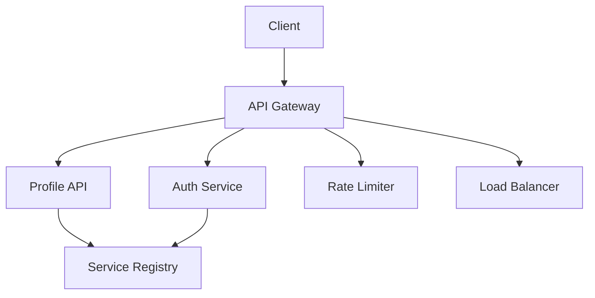
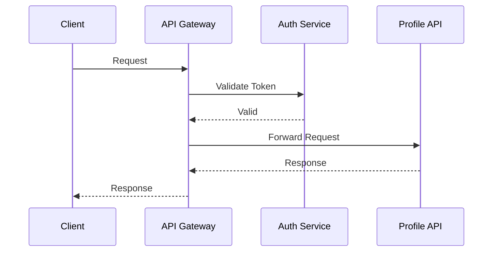

INITIAL CONTEXT FOR LLM - never change the context-----------------------------
-> THIS SECTION IS A GUIDELINE TO THE LLM CONSIDER BEFORE WORKING IN THIS FILE, DO NOT CHANGE THIS

-> GOES OF THE API GATEWAY PATTERN:

- This document describes the API Gateway pattern used in the microservices architecture
- It covers routing, authentication, and request/response transformation
- Includes implementation details and configuration examples
- All patterns are implemented and tested in the current architecture
- For LLM-specific guidelines, refer to [LLM Integration Guide](../../../docs/llm/README.md)

-> CONSIDERER BEFORE UPDATING THIS FILE:

- This is a documentation file about the API Gateway pattern
- Never add fictional dates, version numbers, or metrics
- Changes should be incremental and based on verified information
- Add comments for clarification when needed
- Maintain LLM-friendly format

---

# API Gateway Pattern

## Context

- When to use: For managing external access to microservices
- Problem it solves: Provides a single entry point for client applications
- Related patterns: Service Discovery, Circuit Breaker, Rate Limiting

## Solution

### Routing

- Path-based routing
- Service discovery integration
- Load balancing
- Request forwarding

Implementation:

```yaml
routing:
  rules:
    - path: /api/v1/profiles/*
      service: profile-api
      methods: [GET, POST, PUT, DELETE]
    - path: /api/v1/auth/*
      service: auth-service
      methods: [POST]
  load_balancing:
    strategy: round_robin
    health_check: true
```

### Authentication

- JWT validation
- API key management
- OAuth2 integration
- Session handling

Implementation:

```yaml
authentication:
  jwt:
    issuer: auth-service
    audience: profile-api
    validation:
      - verify_signature
      - check_expiration
      - validate_claims
  api_keys:
    storage: redis
    rotation: 90d
```

### Rate Limiting

- Request throttling
- Quota management
- Rate window configuration
- Client identification

Implementation:

```yaml
rate_limiting:
  rules:
    - client: default
      requests_per_second: 100
      burst: 200
    - client: premium
      requests_per_second: 1000
      burst: 2000
  storage: redis
  window: 1s
```

### Request/Response Transformation

- Header manipulation
- Body transformation
- Protocol conversion
- Error handling

Implementation:

```yaml
transformation:
  request:
    - add_headers:
        x-request-id: ${uuid}
        x-client-id: ${client_id}
    - transform_body:
        type: json
        template: ${request.body}
  response:
    - transform_status:
        success: 200
        error: 400
    - transform_body:
        type: json
        template: ${response.body}
```

## Benefits

- Centralized access control
- Simplified client integration
- Enhanced security
- Better monitoring
- Protocol translation

## Drawbacks

- Single point of failure
- Performance overhead
- Configuration complexity
- Maintenance overhead
- Versioning challenges

## Examples

### Gateway Architecture



### Request Flow



## Related Patterns

- Service Discovery: For service location
- Circuit Breaker: For fault tolerance
- Rate Limiting: For request throttling
- Load Balancing: For request distribution
- Caching: For performance optimization

## Notes

- Keep configurations up to date
- Monitor gateway performance
- Document routing rules
- Test thoroughly
- Maintain security
