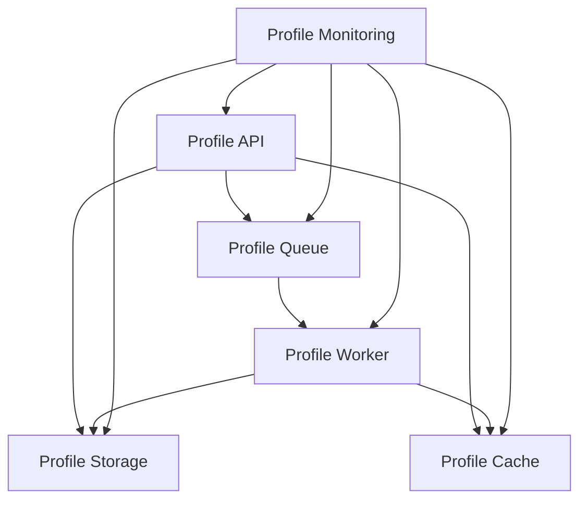
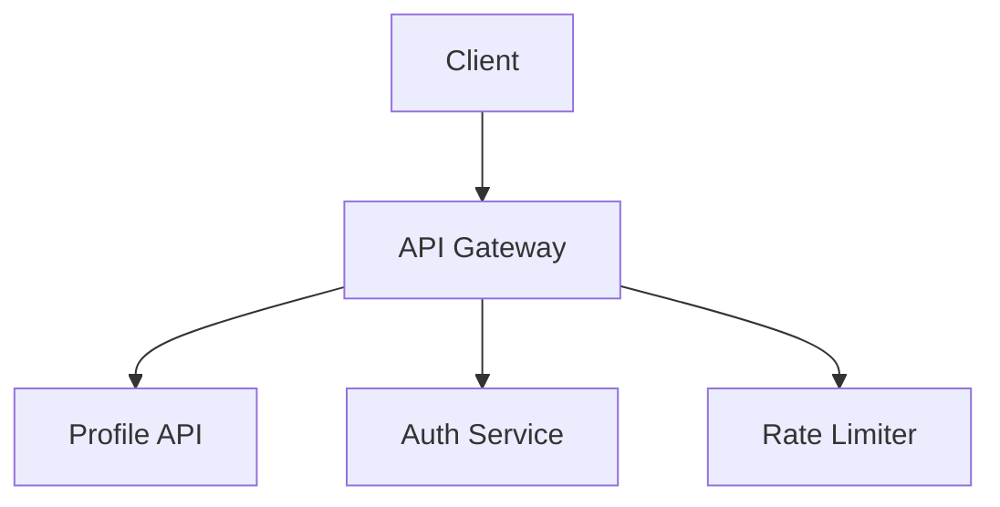
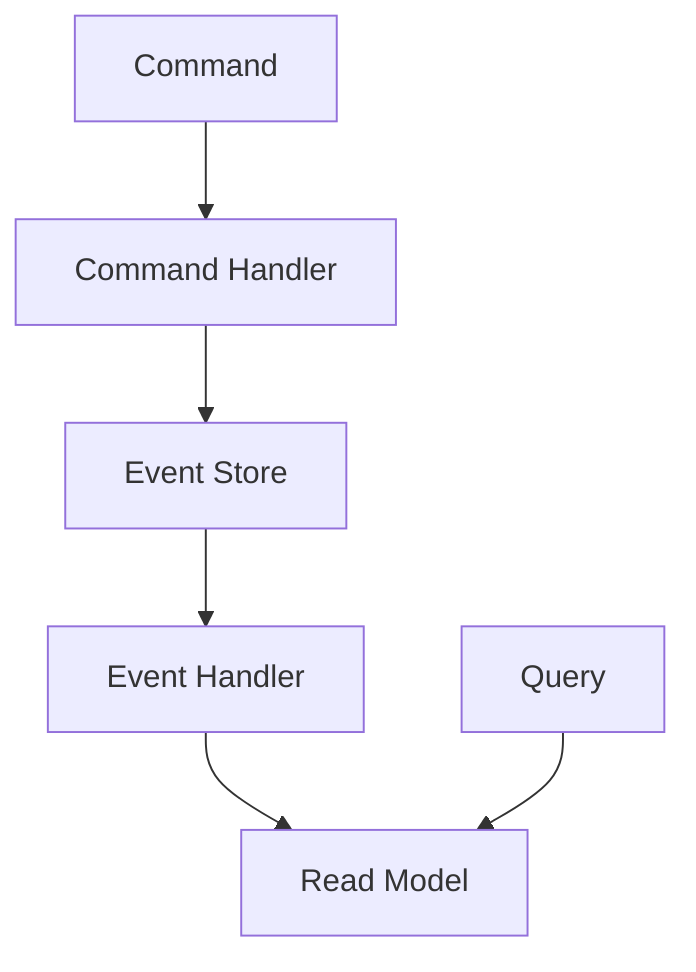

INITIAL CONTEXT FOR LLM - never change the context-----------------------------
-> THIS SECTION IS A GUIDELINE TO THE LLM CONSIDER BEFORE WORKING IN THIS FILE, DO NOT CHANGE THIS

-> GOES OF THE CORE ARCHITECTURE PATTERN:

- This document describes the core architectural patterns used in the Profile Service microservices architecture
- It covers the fundamental patterns that form the foundation of the system
- Includes patterns for service organization, data management, and deployment
- All patterns are implemented and tested in the current architecture
- For LLM-specific guidelines, refer to [LLM Integration Guide](../../../docs/llm/README.md)

-> CONSIDERER BEFORE UPDATING THIS FILE:

- This is a documentation file about core architectural patterns
- Never add fictional dates, version numbers, or metrics
- Changes should be incremental and based on verified information
- Add comments for clarification when needed
- Maintain LLM-friendly format

---

# Core Architecture Pattern

## Context

- When to use: For the overall system architecture and service organization
- Problem it solves: Provides a foundation for building scalable, maintainable, and resilient services
- Related patterns: Microservices, API Gateway, CQRS, Event Sourcing

## Solution

### Microservices Pattern

- Service Independence
- Domain-Driven Design
- Bounded Contexts
- Independent Deployment

Implementation:

```yaml
microservices:
  principles:
    - single_responsibility
    - loose_coupling
    - high_cohesion
  deployment:
    strategy: independent
    orchestration: kubernetes
```

### API Gateway Pattern

- Request Routing
- Authentication
- Rate Limiting
- Request/Response Transformation

Implementation:

```yaml
api_gateway:
  features:
    - routing
    - authentication
    - rate_limiting
    - transformation
  scaling:
    strategy: horizontal
    replicas: 3
```

### CQRS Pattern

- Command/Query Separation
- Event Sourcing
- Read/Write Model Separation
- Eventual Consistency

Implementation:

```yaml
cqrs:
  command_side:
    storage: event_store
    consistency: strong
  query_side:
    storage: read_model
    consistency: eventual
```

### Event Sourcing

- Event-First Design
- Event Store
- Event Replay
- Temporal Queries

Implementation:

```yaml
event_sourcing:
  store:
    type: event_store
    persistence: append_only
  events:
    versioning: optimistic
    schema: json
```

### Caching Pattern

- Multi-Level Cache
- Cache Invalidation
- Cache Consistency
- Cache Warming

Implementation:

```yaml
caching:
  levels:
    - type: local
      max_size: 1GB
    - type: distributed
      provider: redis
  invalidation:
    strategy: write_through
    ttl: 1h
```

### Bulkhead Pattern

- Resource Isolation
- Failure Containment
- Independent Scaling
- Resource Limits

Implementation:

```yaml
bulkhead:
  isolation:
    type: thread_pool
    max_threads: 10
  limits:
    max_connections: 100
    timeout: 5s
```

### Saga Pattern

- Distributed Transactions
- Compensation Logic
- Eventual Consistency
- Failure Recovery

Implementation:

```yaml
saga:
  coordination:
    type: choreography
    events:
      - transaction_started
      - transaction_completed
      - compensation_required
```

## Benefits

- Scalable architecture
- Maintainable services
- Resilient system
- Independent deployment
- Clear separation of concerns

## Drawbacks

- Increased complexity
- Distributed system challenges
- Eventual consistency
- Operational overhead
- Testing complexity

## Examples

### Service Organization



### API Gateway



### CQRS Flow



## Related Patterns

- Service Communication: For inter-service communication
- Data Management: For data storage and retrieval
- Security: For authentication and authorization
- Monitoring: For system observability
- Deployment: For service deployment and scaling

## Notes

- Keep architecture documentation up to date
- Document architectural decisions
- Maintain pattern consistency
- Test thoroughly
- Monitor system performance
