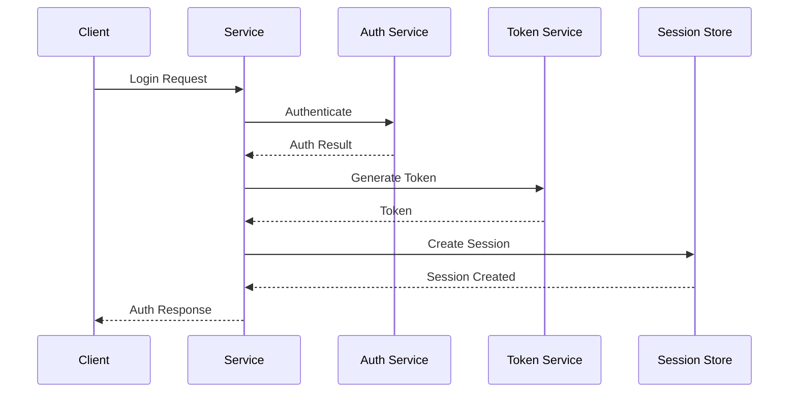
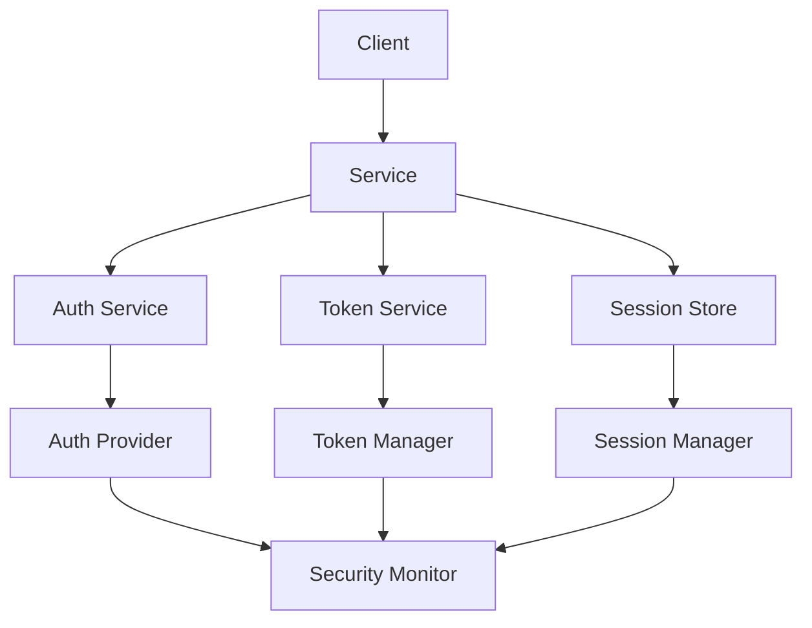

INITIAL CONTEXT FOR LLM - never change the context-----------------------------
-> THIS SECTION IS A GUIDELINE TO THE LLM CONSIDER BEFORE WORKING IN THIS FILE, DO NOT CHANGE THIS

-> GOES OF THE AUTHENTICATION PATTERN:

- This document describes the Authentication pattern used in the microservices architecture
- It covers user authentication, token management, and security best practices
- Includes implementation details and configuration examples
- All patterns are implemented and tested in the current architecture
- For LLM-specific guidelines, refer to [LLM Integration Guide](../../../docs/llm/README.md)

-> CONSIDERER BEFORE UPDATING THIS FILE:

- This is a documentation file about the Authentication pattern
- Never add fictional dates, version numbers, or metrics
- Changes should be incremental and based on verified information
- Add comments for clarification when needed
- Maintain LLM-friendly format

---

# Authentication Pattern

## Context

- When to use: For securing service access and managing user identity
- Problem it solves: Ensures secure access and identity verification
- Related patterns: Authorization, API Gateway Security, Token Management

## Solution

### Authentication Methods

- OAuth 2.0
- OpenID Connect
- JWT
- API Keys

Implementation:

```yaml
authentication_methods:
  oauth2:
    enabled: true
    providers:
      - google
      - github
      - custom
    scopes:
      - read
      - write
      - admin
  openid_connect:
    enabled: true
    providers:
      - google
      - azure
    claims:
      - sub
      - email
      - name
  jwt:
    enabled: true
    algorithm: RS256
    expiration: 3600
  api_keys:
    enabled: true
    rotation: 90d
    format: uuid
```

### Token Management

- Token generation
- Token validation
- Token refresh
- Token revocation

Implementation:

```yaml
token_management:
  generation:
    algorithm: RS256
    expiration: 3600
    refresh: true
  validation:
    signature: true
    expiration: true
    issuer: true
  refresh:
    enabled: true
    window: 300
    max_refresh: 30
  revocation:
    enabled: true
    storage: redis
    ttl: 86400
```

### Session Management

- Session creation
- Session validation
- Session timeout
- Session cleanup

Implementation:

```yaml
session_management:
  creation:
    strategy: jwt
    storage: redis
    ttl: 3600
  validation:
    enabled: true
    interval: 300
    timeout: 3600
  timeout:
    idle: 1800
    absolute: 86400
  cleanup:
    enabled: true
    interval: 3600
    strategy: lazy
```

### Security Measures

- Rate limiting
- IP blocking
- Brute force protection
- Audit logging

Implementation:

```yaml
security_measures:
  rate_limiting:
    enabled: true
    window: 60
    max_requests: 100
  ip_blocking:
    enabled: true
    threshold: 5
    duration: 3600
  brute_force:
    enabled: true
    max_attempts: 5
    lockout: 900
  audit_logging:
    enabled: true
    level: info
    storage: elasticsearch
```

## Benefits

- Secure access control
- Identity verification
- Session management
- Audit trail
- Compliance support

## Drawbacks

- Implementation complexity
- Performance overhead
- Maintenance burden
- User experience impact
- Security risks

## Examples

### Authentication Flow



### Authentication Architecture



## Related Patterns

- Authorization: For access control
- API Gateway Security: For API protection
- Token Management: For token handling
- Session Management: For user sessions
- Security Monitoring: For threat detection

## Notes

- Implement secure protocols
- Handle tokens securely
- Monitor authentication
- Manage sessions properly
- Document security measures
