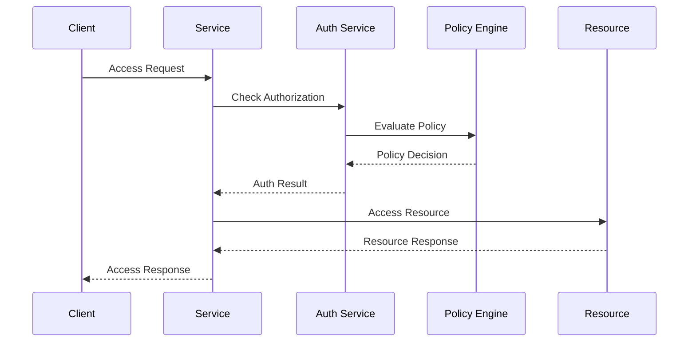
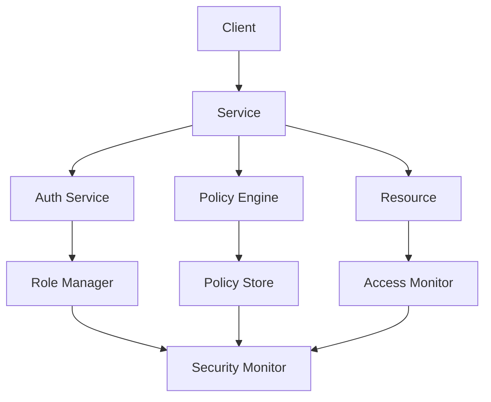

INITIAL CONTEXT FOR LLM - never change the context-----------------------------
-> THIS SECTION IS A GUIDELINE TO THE LLM CONSIDER BEFORE WORKING IN THIS FILE, DO NOT CHANGE THIS

-> GOES OF THE AUTHORIZATION PATTERN:

- This document describes the Authorization pattern used in the microservices architecture
- It covers access control, role management, and permission enforcement
- Includes implementation details and configuration examples
- All patterns are implemented and tested in the current architecture
- For LLM-specific guidelines, refer to [LLM Integration Guide](../../../docs/llm/README.md)

-> CONSIDERER BEFORE UPDATING THIS FILE:

- This is a documentation file about the Authorization pattern
- Never add fictional dates, version numbers, or metrics
- Changes should be incremental and based on verified information
- Add comments for clarification when needed
- Maintain LLM-friendly format

---

# Authorization Pattern

## Context

- When to use: For controlling access to resources and operations
- Problem it solves: Ensures proper access control and permission management
- Related patterns: Authentication, API Gateway Security, Role-Based Access Control

## Solution

### Access Control

- Role-based access control (RBAC)
- Attribute-based access control (ABAC)
- Policy-based access control (PBAC)
- Resource-based access control

Implementation:

```yaml
access_control:
  rbac:
    enabled: true
    roles:
      - admin
      - user
      - guest
    permissions:
      - read
      - write
      - delete
  abac:
    enabled: true
    attributes:
      - user_role
      - resource_type
      - time_of_day
      - location
  pbac:
    enabled: true
    policies:
      - resource_access
      - data_privacy
      - compliance
  resource_based:
    enabled: true
    resources:
      - api
      - database
      - file
```

### Permission Management

- Permission definition
- Permission assignment
- Permission validation
- Permission inheritance

Implementation:

```yaml
permission_management:
  definition:
    granularity: resource
    scope: service
    inheritance: true
  assignment:
    strategy: role_based
    validation: strict
    audit: true
  validation:
    enabled: true
    cache: true
    timeout: 300
  inheritance:
    enabled: true
    depth: 3
    override: true
```

### Policy Enforcement

- Policy evaluation
- Policy decision
- Policy enforcement
- Policy audit

Implementation:

```yaml
policy_enforcement:
  evaluation:
    engine: opa
    cache: true
    timeout: 100
  decision:
    strategy: allow_deny
    fallback: deny
    logging: true
  enforcement:
    mode: strict
    bypass: false
    monitoring: true
  audit:
    enabled: true
    storage: elasticsearch
    retention: 90d
```

### Access Monitoring

- Access logging
- Policy violations
- Usage patterns
- Security alerts

Implementation:

```yaml
access_monitoring:
  logging:
    enabled: true
    level: info
    format: json
  violations:
    enabled: true
    threshold: 5
    action: alert
  patterns:
    enabled: true
    analysis: daily
    storage: elasticsearch
  alerts:
    enabled: true
    channels:
      - email
      - slack
    severity:
      - high
      - medium
      - low
```

## Benefits

- Granular access control
- Flexible permission management
- Policy-based enforcement
- Audit trail
- Compliance support

## Drawbacks

- Implementation complexity
- Performance impact
- Maintenance overhead
- Policy management
- Security risks

## Examples

### Authorization Flow



### Authorization Architecture



## Related Patterns

- Authentication: For identity verification
- API Gateway Security: For API protection
- Role-Based Access Control: For role management
- Policy Management: For policy handling
- Security Monitoring: For threat detection

## Notes

- Implement proper access control
- Manage permissions effectively
- Enforce policies consistently
- Monitor access patterns
- Document security measures
