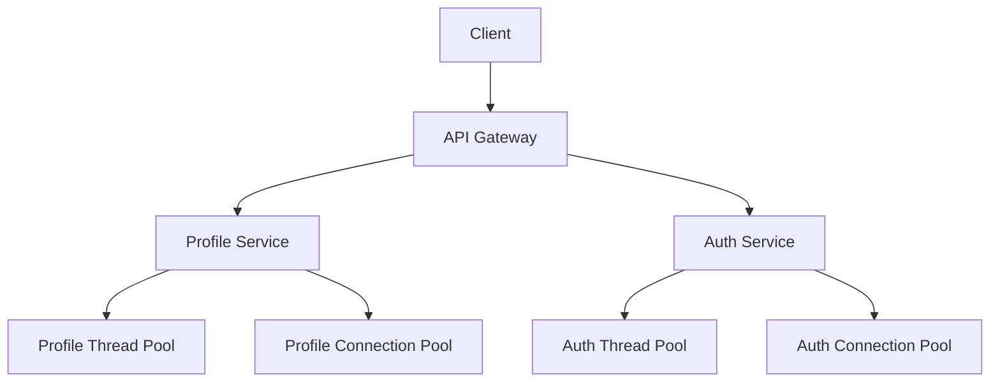
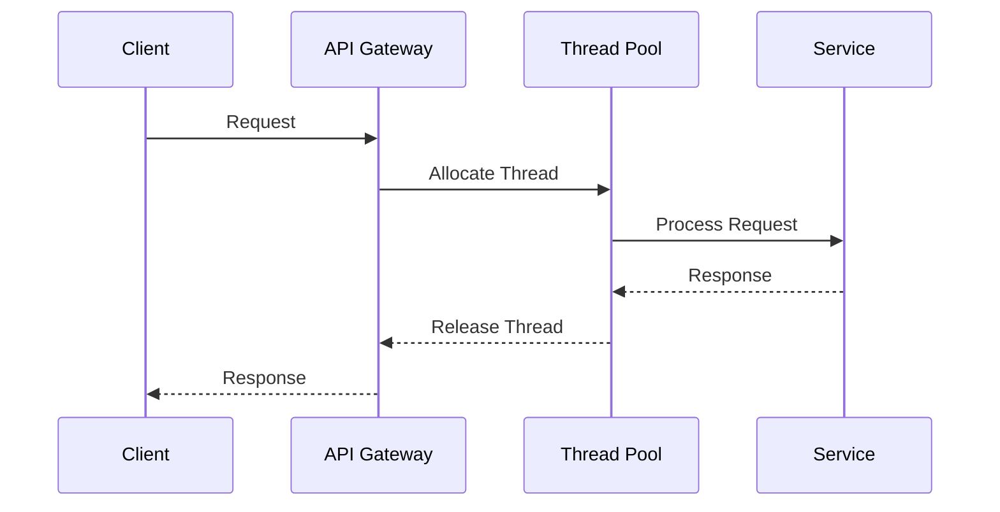

INITIAL CONTEXT FOR LLM - never change the context-----------------------------
-> THIS SECTION IS A GUIDELINE TO THE LLM CONSIDER BEFORE WORKING IN THIS FILE, DO NOT CHANGE THIS

-> GOES OF THE BULKHEAD PATTERN:

- This document describes the Bulkhead pattern used in the microservices architecture
- It covers resource isolation, failure containment, and system resilience
- Includes implementation details and configuration examples
- All patterns are implemented and tested in the current architecture
- For LLM-specific guidelines, refer to [LLM Integration Guide](../../../docs/llm/README.md)

-> CONSIDERER BEFORE UPDATING THIS FILE:

- This is a documentation file about the Bulkhead pattern
- Never add fictional dates, version numbers, or metrics
- Changes should be incremental and based on verified information
- Add comments for clarification when needed
- Maintain LLM-friendly format

---

# Bulkhead Pattern

## Context

- When to use: For isolating system components and preventing cascading failures
- Problem it solves: Prevents a single component failure from affecting the entire system
- Related patterns: Circuit Breaker, Rate Limiting, Timeout Pattern

## Solution

### Resource Isolation

- Thread pool isolation
- Connection pool isolation
- Process isolation
- Memory isolation

Implementation:

```yaml
resource_isolation:
  thread_pools:
    - name: profile_operations
      max_threads: 10
      queue_size: 100
    - name: auth_operations
      max_threads: 5
      queue_size: 50
  connection_pools:
    - name: database
      max_connections: 20
      idle_timeout: 30s
    - name: cache
      max_connections: 10
      idle_timeout: 60s
```

### Failure Containment

- Error boundaries
- Failure detection
- Recovery strategies
- Monitoring

Implementation:

```yaml
failure_containment:
  error_boundaries:
    - service: profile_api
      max_errors: 5
      window: 60s
    - service: auth_service
      max_errors: 3
      window: 30s
  recovery:
    strategy: exponential_backoff
    max_attempts: 3
  monitoring:
    metrics:
      - error_rate
      - response_time
      - resource_usage
```

### Resource Limits

- CPU limits
- Memory limits
- Network limits
- Storage limits

Implementation:

```yaml
resource_limits:
  cpu:
    limit: 1.0
    request: 0.5
  memory:
    limit: 1Gi
    request: 512Mi
  network:
    max_connections: 1000
    bandwidth: 100Mbps
  storage:
    limit: 10Gi
    request: 5Gi
```

### Monitoring and Alerts

- Resource usage
- Error rates
- Performance metrics
- Health checks

Implementation:

```yaml
monitoring:
  metrics:
    - resource_usage
    - error_rates
    - performance
    - health_status
  alerts:
    - high_resource_usage
    - high_error_rate
    - degraded_performance
    - unhealthy_status
  health_checks:
    interval: 30s
    timeout: 5s
```

## Benefits

- System resilience
- Failure isolation
- Resource protection
- Better scalability
- Improved stability

## Drawbacks

- Resource overhead
- Configuration complexity
- Monitoring requirements
- Operational complexity
- Testing challenges

## Examples

### Bulkhead Architecture



### Resource Flow



## Related Patterns

- Circuit Breaker: For failure detection
- Rate Limiting: For request throttling
- Timeout Pattern: For request timeouts
- Retry Pattern: For error recovery
- Fallback Pattern: For graceful degradation

## Notes

- Monitor resource usage
- Set appropriate limits
- Handle failures gracefully
- Test isolation boundaries
- Document configurations
