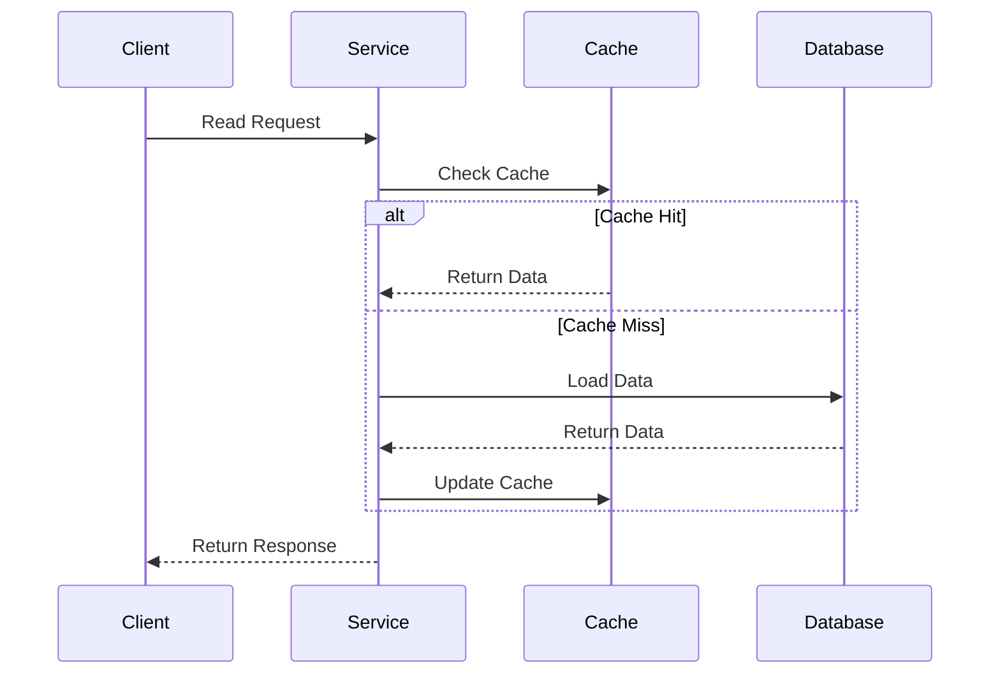
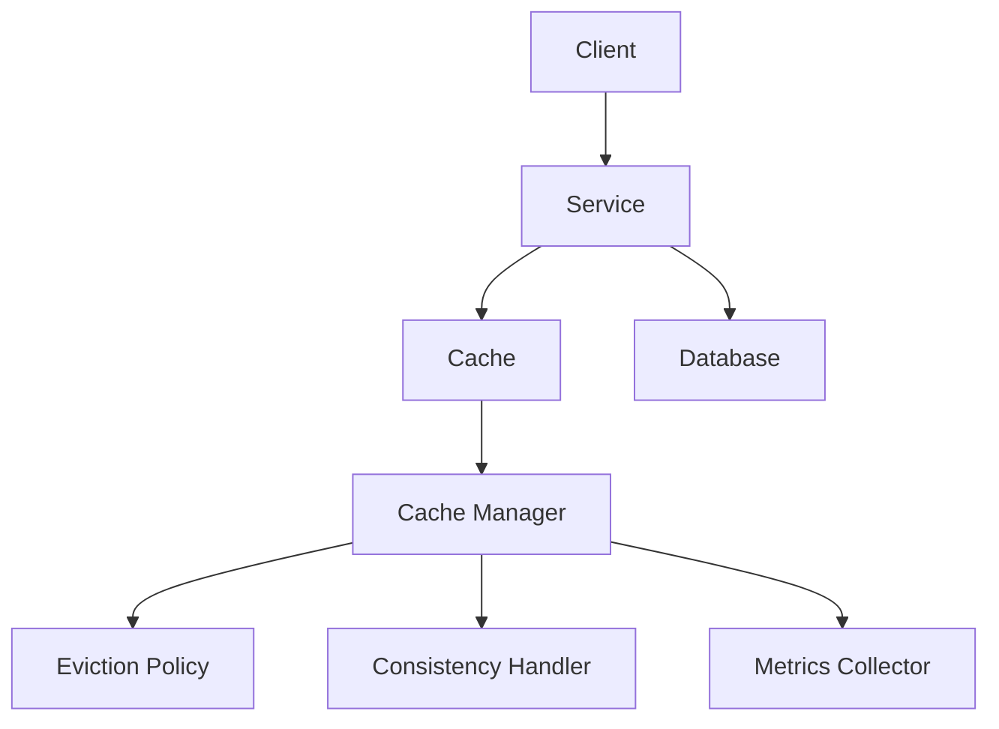

INITIAL CONTEXT FOR LLM - never change the context-----------------------------
-> THIS SECTION IS A GUIDELINE TO THE LLM CONSIDER BEFORE WORKING IN THIS FILE, DO NOT CHANGE THIS

-> GOES OF THE CACHE-ASIDE PATTERN:

- This document describes the Cache-Aside pattern used in the microservices architecture
- It covers cache management, data consistency, and performance optimization
- Includes implementation details and configuration examples
- All patterns are implemented and tested in the current architecture
- For LLM-specific guidelines, refer to [LLM Integration Guide](../../../docs/llm/README.md)

-> CONSIDERER BEFORE UPDATING THIS FILE:

- This is a documentation file about the Cache-Aside pattern
- Never add fictional dates, version numbers, or metrics
- Changes should be incremental and based on verified information
- Add comments for clarification when needed
- Maintain LLM-friendly format

---

# Cache-Aside Pattern

## Context

- When to use: For improving read performance and reducing database load
- Problem it solves: Optimizes data access and reduces latency
- Related patterns: Write-Through, Write-Behind, Read-Through

## Solution

### Cache Management

- Cache population
- Cache invalidation
- Cache eviction
- Cache consistency

Implementation:

```yaml
cache_management:
  population:
    strategy: lazy_loading
    on_miss: true
    background_refresh: true
  invalidation:
    strategy: time_based
    ttl: 300s
    event_based: true
  eviction:
    policy: lru
    max_size: 1000
    max_memory: 1GB
  consistency:
    strategy: eventual
    sync_interval: 60s
```

### Read Operations

- Cache lookup
- Cache miss handling
- Data loading
- Cache update

Implementation:

```yaml
read_operations:
  lookup:
    strategy: local_first
    fallback: distributed
  miss_handling:
    load_from_db: true
    update_cache: true
    parallel_requests: false
  data_loading:
    batch_size: 100
    timeout: 5s
  cache_update:
    async: true
    retry: true
    max_retries: 3
```

### Write Operations

- Cache invalidation
- Write-through
- Write-behind
- Consistency handling

Implementation:

```yaml
write_operations:
  invalidation:
    immediate: true
    broadcast: true
    pattern: key_pattern
  write_through:
    enabled: false
    sync: true
  write_behind:
    enabled: true
    batch_size: 50
    interval: 1s
  consistency:
    strategy: eventual
    sync_interval: 60s
```

### Monitoring and Metrics

- Cache hit rate
- Cache miss rate
- Latency metrics
- Memory usage

Implementation:

```yaml
monitoring:
  metrics:
    - hit_rate
    - miss_rate
    - latency
    - memory_usage
  alerts:
    - low_hit_rate
    - high_latency
    - memory_pressure
  thresholds:
    hit_rate: 0.8
    latency: 100ms
    memory_usage: 0.8
```

## Benefits

- Improved performance
- Reduced database load
- Better scalability
- Cost optimization
- Flexible consistency

## Drawbacks

- Cache invalidation complexity
- Potential stale data
- Memory overhead
- Consistency challenges
- Cache warming needs

## Examples

### Cache-Aside Flow



### Cache-Aside Architecture



## Related Patterns

- Write-Through: For immediate cache updates
- Write-Behind: For batched cache updates
- Read-Through: For automatic cache population
- Cache-Aside: For manual cache management
- Cache-Aside with Write-Through: For hybrid approach

## Notes

- Monitor cache performance
- Tune cache parameters
- Handle cache misses gracefully
- Maintain cache consistency
- Document cache strategies
