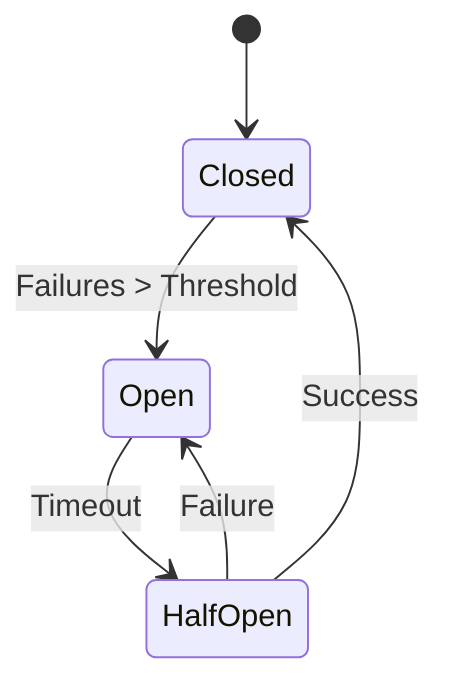
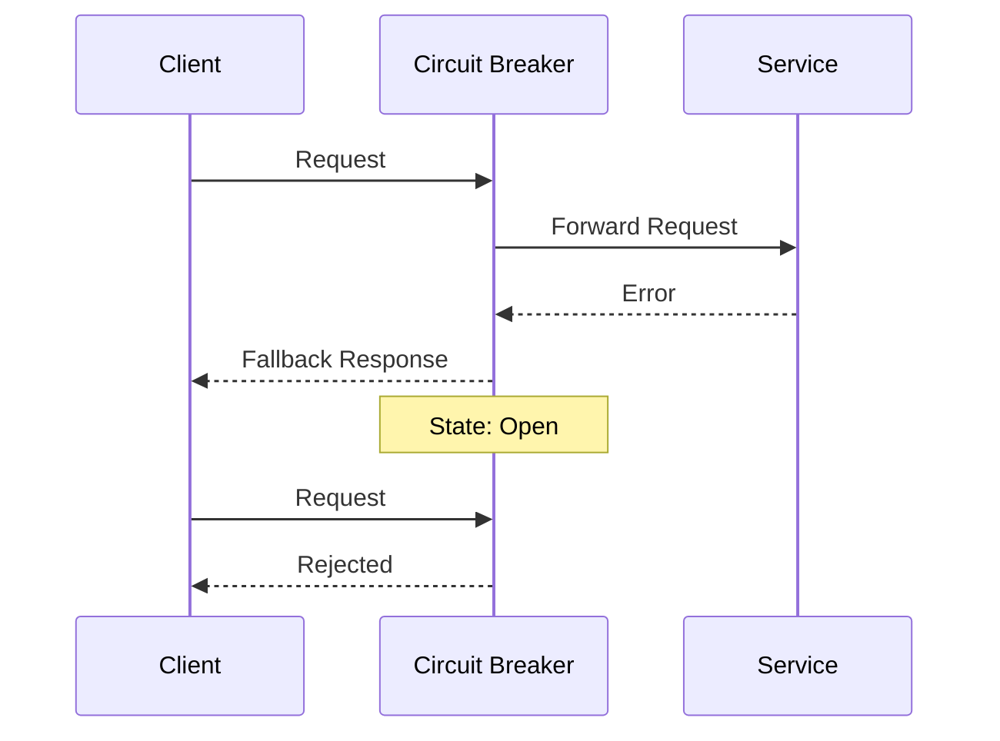

INITIAL CONTEXT FOR LLM - never change the context-----------------------------
-> THIS SECTION IS A GUIDELINE TO THE LLM CONSIDER BEFORE WORKING IN THIS FILE, DO NOT CHANGE THIS

-> GOES OF THE CIRCUIT BREAKER PATTERN:

- This document describes the Circuit Breaker pattern used in the microservices architecture
- It covers failure detection, state management, and recovery strategies
- Includes implementation details and configuration examples
- All patterns are implemented and tested in the current architecture
- For LLM-specific guidelines, refer to [LLM Integration Guide](../../../docs/llm/README.md)

-> CONSIDERER BEFORE UPDATING THIS FILE:

- This is a documentation file about the Circuit Breaker pattern
- Never add fictional dates, version numbers, or metrics
- Changes should be incremental and based on verified information
- Add comments for clarification when needed
- Maintain LLM-friendly format

---

# Circuit Breaker Pattern

## Context

- When to use: For handling service failures and preventing cascading failures
- Problem it solves: Prevents repeated calls to failing services
- Related patterns: Retry Pattern, Bulkhead Pattern, Fallback Pattern

## Solution

### State Management

- Closed state
- Open state
- Half-open state
- State transitions

Implementation:

```yaml
state_management:
  states:
    closed:
      max_failures: 5
      window: 60s
    open:
      timeout: 30s
    half_open:
      max_requests: 3
      timeout: 5s
  transitions:
    closed_to_open: failure_threshold
    open_to_half_open: timeout
    half_open_to_closed: success_threshold
```

### Failure Detection

- Error counting
- Timeout detection
- Error classification
- Threshold management

Implementation:

```yaml
failure_detection:
  errors:
    - connection_timeout
    - service_unavailable
    - internal_error
  timeouts:
    default: 5s
    max: 30s
  thresholds:
    error_rate: 0.5
    min_requests: 10
```

### Recovery Strategy

- Automatic recovery
- Manual override
- Gradual recovery
- Health monitoring

Implementation:

```yaml
recovery_strategy:
  automatic:
    enabled: true
    interval: 30s
  manual:
    enabled: true
    endpoints:
      - /circuit/force-open
      - /circuit/force-closed
  monitoring:
    metrics:
      - error_rate
      - response_time
      - success_rate
```

### Fallback Handling

- Default responses
- Cached data
- Alternative services
- Error messages

Implementation:

```yaml
fallback_handling:
  responses:
    default: cached_data
    timeout: error_message
  cache:
    ttl: 300s
    strategy: stale_while_revalidate
  alternatives:
    - service: backup-service
      priority: 1
    - service: local-cache
      priority: 2
```

## Benefits

- Prevents cascading failures
- Improves system resilience
- Reduces resource waste
- Enables graceful degradation
- Provides failure isolation

## Drawbacks

- Increased complexity
- State management
- Configuration tuning
- Monitoring overhead
- Recovery coordination

## Examples

### Circuit Breaker States



### Request Flow



## Related Patterns

- Retry Pattern: For handling transient failures
- Bulkhead Pattern: For resource isolation
- Fallback Pattern: For graceful degradation
- Health Checks: For service monitoring
- Rate Limiting: For request throttling

## Notes

- Monitor circuit states
- Tune thresholds carefully
- Document fallback strategies
- Test failure scenarios
- Maintain metrics
