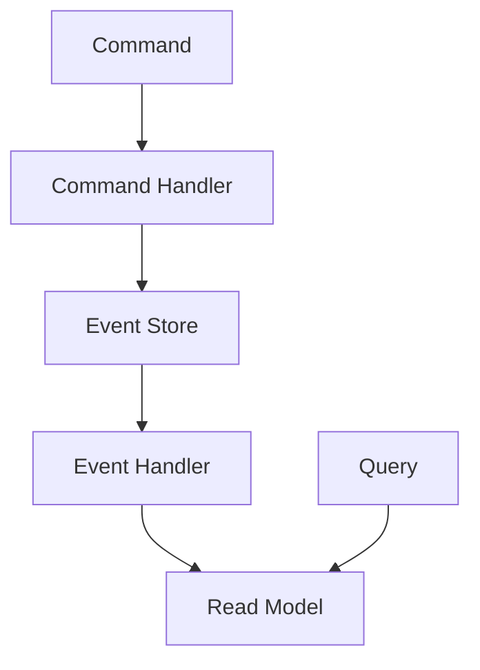
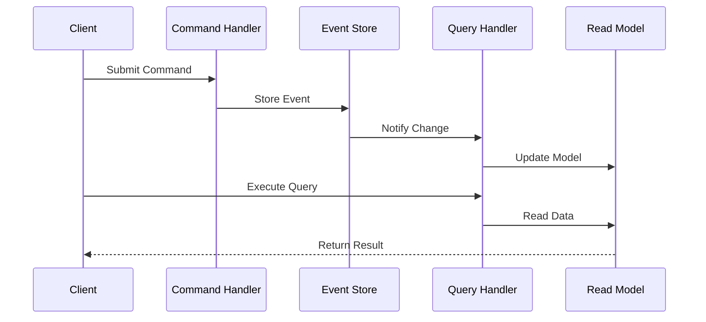

INITIAL CONTEXT FOR LLM - never change the context-----------------------------
-> THIS SECTION IS A GUIDELINE TO THE LLM CONSIDER BEFORE WORKING IN THIS FILE, DO NOT CHANGE THIS

-> GOES OF THE CQRS PATTERN:

- This document describes the Command Query Responsibility Segregation pattern used in the microservices architecture
- It covers command and query separation, event sourcing, and read/write models
- Includes implementation details and configuration examples
- All patterns are implemented and tested in the current architecture
- For LLM-specific guidelines, refer to [LLM Integration Guide](../../../docs/llm/README.md)

-> CONSIDERER BEFORE UPDATING THIS FILE:

- This is a documentation file about the CQRS pattern
- Never add fictional dates, version numbers, or metrics
- Changes should be incremental and based on verified information
- Add comments for clarification when needed
- Maintain LLM-friendly format

---

# CQRS Pattern

## Context

- When to use: For separating read and write operations in complex domains
- Problem it solves: Optimizes read and write operations independently
- Related patterns: Event Sourcing, Command Pattern, Query Pattern

## Solution

### Command Side

- Command handling
- Event generation
- Validation
- Authorization

Implementation:

```yaml
command_side:
  handlers:
    - create_profile
    - update_profile
    - delete_profile
  events:
    - profile_created
    - profile_updated
    - profile_deleted
  validation:
    type: domain
    rules:
      - required_fields
      - business_rules
  authorization:
    type: rbac
    roles:
      - admin
      - user
```

### Query Side

- Query handling
- Read models
- Caching
- Projections

Implementation:

```yaml
query_side:
  handlers:
    - get_profile
    - list_profiles
    - search_profiles
  read_models:
    type: denormalized
    storage: postgres
  caching:
    type: redis
    ttl: 1h
  projections:
    type: event_based
    batch_size: 1000
```

### Event Sourcing

- Event store
- Event replay
- Snapshots
- Versioning

Implementation:

```yaml
event_sourcing:
  store:
    type: event_store
    storage: postgres
  replay:
    enabled: true
    batch_size: 1000
  snapshots:
    frequency: 1000
    storage: postgres
  versioning:
    strategy: optimistic
    compatibility: backward
```

### Synchronization

- Event handlers
- Read model updates
- Consistency
- Error handling

Implementation:

```yaml
synchronization:
  handlers:
    type: async
    concurrency: 10
  updates:
    strategy: eventual
    retry: true
  consistency:
    type: eventual
    validation: true
  error_handling:
    dead_letter: true
    max_retries: 3
```

## Benefits

- Optimized read/write operations
- Scalability
- Performance
- Flexibility
- Maintainability

## Drawbacks

- Complexity
- Eventual consistency
- Learning curve
- Operational overhead
- Testing complexity

## Examples

### CQRS Flow



### Event Flow



## Related Patterns

- Event Sourcing: For event persistence
- Command Pattern: For command handling
- Query Pattern: For query handling
- Event-Driven: For event processing
- Saga Pattern: For distributed transactions

## Notes

- Monitor consistency
- Handle failures gracefully
- Maintain event schemas
- Test thoroughly
- Document contracts
