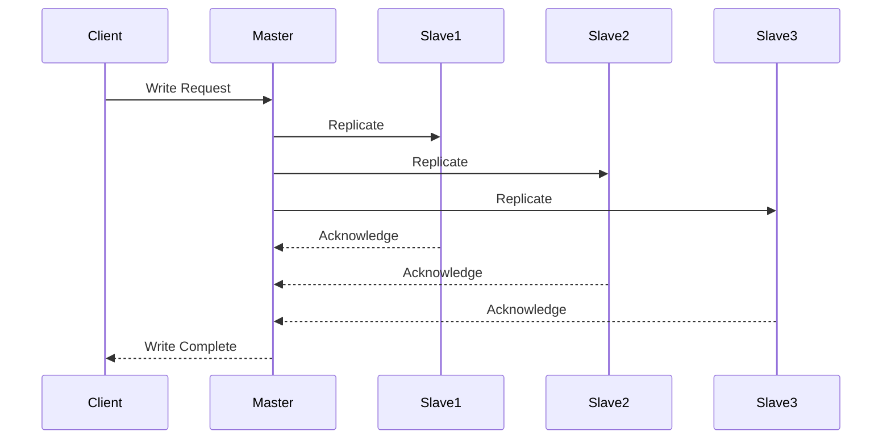
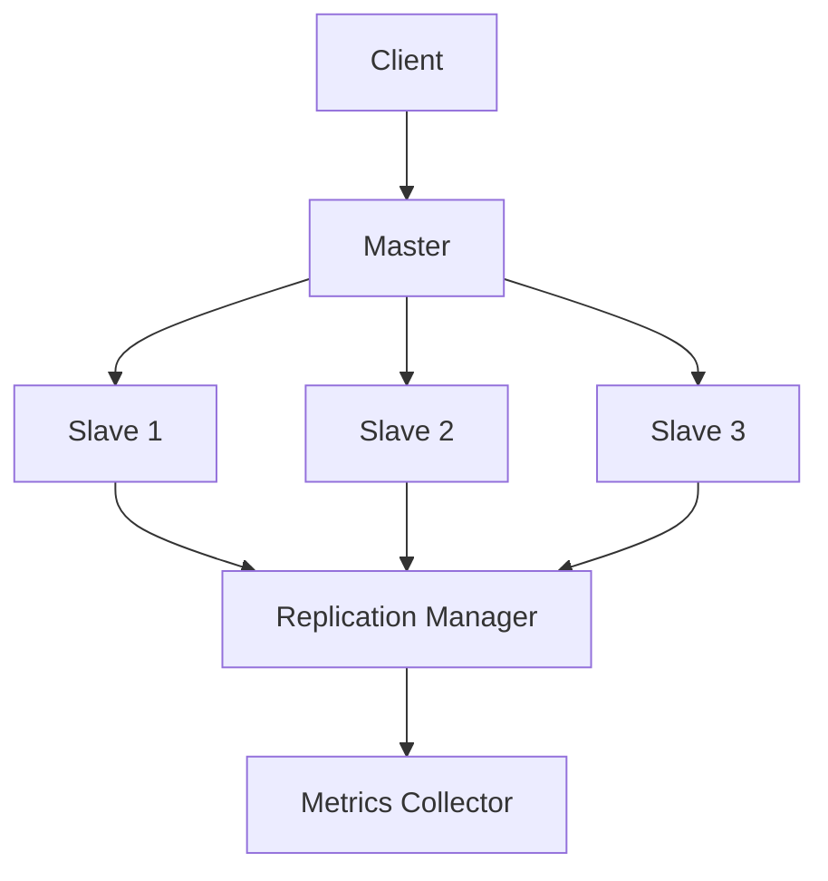

INITIAL CONTEXT FOR LLM - never change the context-----------------------------
-> THIS SECTION IS A GUIDELINE TO THE LLM CONSIDER BEFORE WORKING IN THIS FILE, DO NOT CHANGE THIS

-> GOES OF THE DATA REPLICATION PATTERN:

- This document describes the Data Replication pattern used in the microservices architecture
- It covers data synchronization, consistency, and high availability
- Includes implementation details and configuration examples
- All patterns are implemented and tested in the current architecture
- For LLM-specific guidelines, refer to [LLM Integration Guide](../../../docs/llm/README.md)

-> CONSIDERER BEFORE UPDATING THIS FILE:

- This is a documentation file about the Data Replication pattern
- Never add fictional dates, version numbers, or metrics
- Changes should be incremental and based on verified information
- Add comments for clarification when needed
- Maintain LLM-friendly format

---

# Data Replication Pattern

## Context

- When to use: For ensuring data availability and fault tolerance
- Problem it solves: Provides data redundancy and high availability
- Related patterns: Data Sharding, Event Sourcing, CQRS

## Solution

### Replication Management

- Replica creation
- Replica synchronization
- Replica monitoring
- Replica recovery

Implementation:

```yaml
replication_management:
  creation:
    enabled: true
    strategy: async
    replicas: 3
  synchronization:
    enabled: true
    mode: async
    interval: 1s
  monitoring:
    enabled: true
    metrics: true
    alerts: true
  recovery:
    enabled: true
    strategy: automatic
    timeout: 300s
```

### Consistency Management

- Consistency levels
- Conflict resolution
- Version control
- State tracking

Implementation:

```yaml
consistency_management:
  levels:
    enabled: true
    default: eventual
    options:
      - strong
      - eventual
  conflict_resolution:
    enabled: true
    strategy: last_write_wins
    logging: true
  version_control:
    enabled: true
    type: vector_clock
    storage: redis
  state_tracking:
    enabled: true
    storage: elasticsearch
    retention: 30d
```

### Replication Topology

- Master-slave
- Multi-master
- Ring replication
- Mesh replication

Implementation:

```yaml
replication_topology:
  master_slave:
    enabled: true
    masters: 1
    slaves: 2
  multi_master:
    enabled: false
    nodes: 3
    sync: true
  ring:
    enabled: false
    nodes: 4
    direction: bidirectional
  mesh:
    enabled: false
    nodes: 5
    connections: all
```

### Monitoring and Metrics

- Replication metrics
- Consistency metrics
- Performance metrics
- Health metrics

Implementation:

```yaml
monitoring_metrics:
  replication_metrics:
    enabled: true
    collection: 15s
    storage: prometheus
  consistency_metrics:
    enabled: true
    metrics:
      - lag
      - conflicts
      - resolution_time
  performance_metrics:
    enabled: true
    metrics:
      - throughput
      - latency
      - error_rate
  health_metrics:
    enabled: true
    collection: 60s
    storage: prometheus
```

## Benefits

- High availability
- Fault tolerance
- Improved performance
- Geographic distribution
- Disaster recovery

## Drawbacks

- Storage overhead
- Network overhead
- Consistency challenges
- Complexity
- Maintenance burden

## Examples

### Data Replication Flow



### Data Replication Architecture



## Related Patterns

- Data Sharding: For data distribution
- Event Sourcing: For event storage
- CQRS: For command handling
- Database: For data storage
- Cache: For performance optimization

## Notes

- Configure replication properly
- Monitor replication lag
- Handle conflicts gracefully
- Plan for failover
- Document replication strategy
