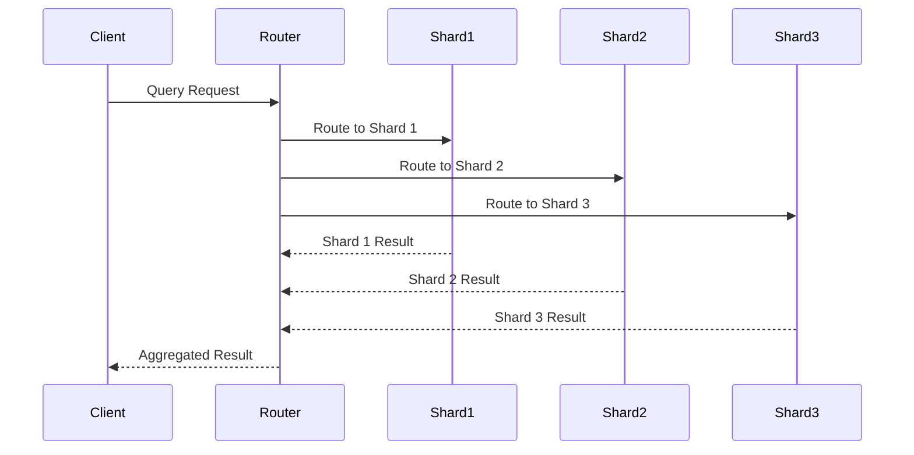
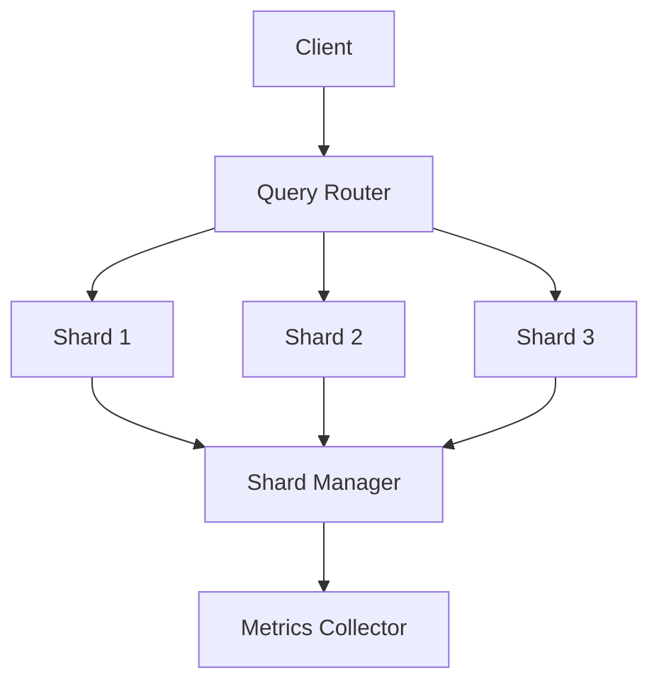

INITIAL CONTEXT FOR LLM - never change the context-----------------------------
-> THIS SECTION IS A GUIDELINE TO THE LLM CONSIDER BEFORE WORKING IN THIS FILE, DO NOT CHANGE THIS

-> GOES OF THE DATA SHARDING PATTERN:

- This document describes the Data Sharding pattern used in the microservices architecture
- It covers data distribution, shard management, and query routing
- Includes implementation details and configuration examples
- All patterns are implemented and tested in the current architecture
- For LLM-specific guidelines, refer to [LLM Integration Guide](../../../docs/llm/README.md)

-> CONSIDERER BEFORE UPDATING THIS FILE:

- This is a documentation file about the Data Sharding pattern
- Never add fictional dates, version numbers, or metrics
- Changes should be incremental and based on verified information
- Add comments for clarification when needed
- Maintain LLM-friendly format

---

# Data Sharding Pattern

## Context

- When to use: For distributing data across multiple databases
- Problem it solves: Enables horizontal scaling and improved performance
- Related patterns: Data Replication, CQRS, Event Sourcing

## Solution

### Shard Management

- Shard creation
- Shard distribution
- Shard balancing
- Shard monitoring

Implementation:

```yaml
shard_management:
  creation:
    enabled: true
    strategy: hash
    shards: 4
  distribution:
    enabled: true
    algorithm: consistent_hash
    replication: 2
  balancing:
    enabled: true
    threshold: 0.8
    interval: 1h
  monitoring:
    enabled: true
    metrics: true
    alerts: true
```

### Query Routing

- Query distribution
- Query optimization
- Query aggregation
- Query caching

Implementation:

```yaml
query_routing:
  distribution:
    enabled: true
    strategy: shard_key
    timeout: 5s
  optimization:
    enabled: true
    cache: true
    index: true
  aggregation:
    enabled: true
    strategy: scatter_gather
    timeout: 10s
  caching:
    enabled: true
    ttl: 300
    strategy: lru
```

### Data Distribution

- Shard key selection
- Data partitioning
- Data migration
- Data rebalancing

Implementation:

```yaml
data_distribution:
  shard_key:
    enabled: true
    type: composite
    fields:
      - user_id
      - timestamp
  partitioning:
    enabled: true
    strategy: range
    boundaries: dynamic
  migration:
    enabled: true
    strategy: online
    batch_size: 1000
  rebalancing:
    enabled: true
    threshold: 0.2
    schedule: daily
```

### Monitoring and Metrics

- Shard metrics
- Query metrics
- Performance metrics
- Health metrics

Implementation:

```yaml
monitoring_metrics:
  shard_metrics:
    enabled: true
    collection: 15s
    storage: prometheus
  query_metrics:
    enabled: true
    metrics:
      - latency
      - throughput
      - error_rate
  performance_metrics:
    enabled: true
    metrics:
      - cpu_usage
      - memory_usage
      - disk_usage
  health_metrics:
    enabled: true
    collection: 60s
    storage: prometheus
```

## Benefits

- Horizontal scaling
- Improved performance
- Better resource utilization
- Fault isolation
- Data locality

## Drawbacks

- Implementation complexity
- Query complexity
- Data migration
- Operational overhead
- Consistency challenges

## Examples

### Data Sharding Flow



### Data Sharding Architecture



## Related Patterns

- Data Replication: For data redundancy
- CQRS: For command handling
- Event Sourcing: For event storage
- Database: For data storage
- Cache: For performance optimization

## Notes

- Choose shard keys carefully
- Monitor shard distribution
- Handle data migration
- Optimize queries
- Document sharding strategy
