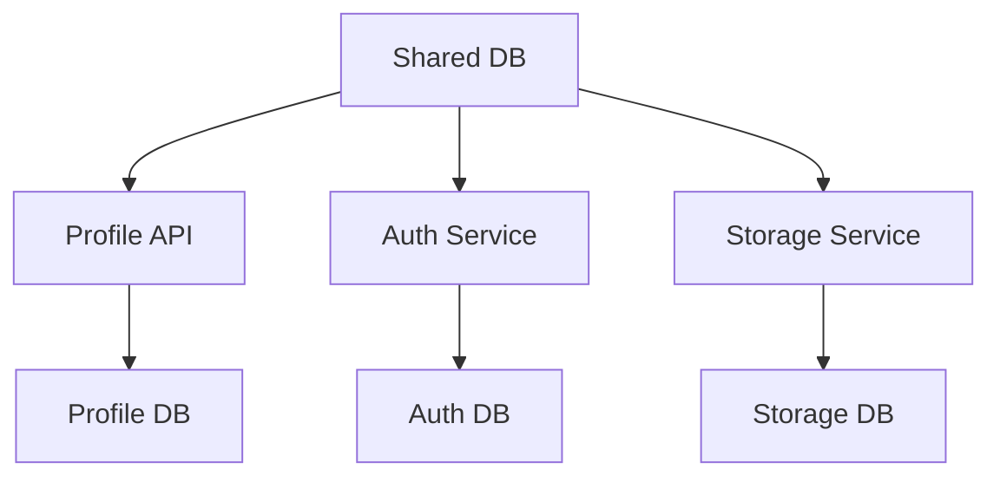
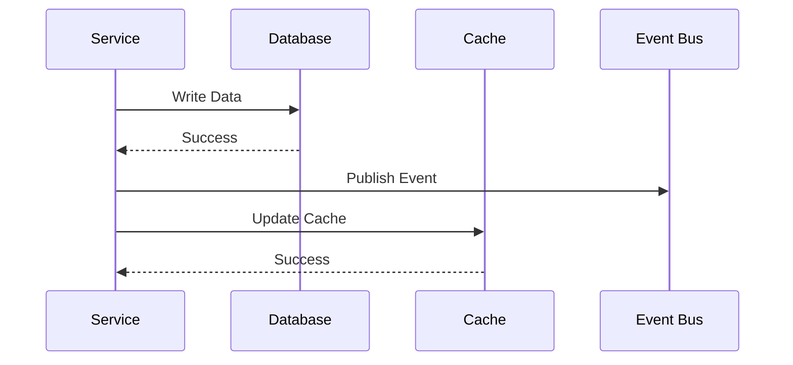

INITIAL CONTEXT FOR LLM - never change the context-----------------------------
-> THIS SECTION IS A GUIDELINE TO THE LLM CONSIDER BEFORE WORKING IN THIS FILE, DO NOT CHANGE THIS

-> GOES OF THE DATABASE PATTERNS:

- This document describes the database patterns used in the microservices architecture
- It covers database per service, shared database, and data consistency patterns
- Includes implementation details and configuration examples
- All patterns are implemented and tested in the current architecture
- For LLM-specific guidelines, refer to [LLM Integration Guide](../../../docs/llm/README.md)

-> CONSIDERER BEFORE UPDATING THIS FILE:

- This is a documentation file about database patterns
- Never add fictional dates, version numbers, or metrics
- Changes should be incremental and based on verified information
- Add comments for clarification when needed
- Maintain LLM-friendly format

---

# Database Patterns

## Context

- When to use: For managing data storage and consistency in microservices
- Problem it solves: Ensures data isolation and consistency across services
- Related patterns: Database per Service, Shared Database, Saga Pattern

## Solution

### Database per Service

- Service isolation
- Data ownership
- Schema management
- Migration strategy

Implementation:

```yaml
database_per_service:
  profile_api:
    type: postgres
    schema: profile
    owner: profile_api
  auth_service:
    type: postgres
    schema: auth
    owner: auth_service
  storage_service:
    type: postgres
    schema: storage
    owner: storage_service
  migration:
    strategy: versioned
    tool: flyway
```

### Shared Database

- Schema separation
- Access control
- Data sharing
- Consistency management

Implementation:

```yaml
shared_database:
  type: postgres
  schemas:
    - profile
    - auth
    - storage
  access_control:
    type: rbac
    roles:
      - profile_reader
      - profile_writer
      - auth_reader
      - auth_writer
  consistency:
    type: strong
    validation: true
```

### Data Consistency

- Transaction management
- Eventual consistency
- Conflict resolution
- Data validation

Implementation:

```yaml
data_consistency:
  transactions:
    type: distributed
    timeout: 30s
  consistency:
    type: eventual
    validation: true
  conflict_resolution:
    strategy: last_write_wins
    versioning: true
  validation:
    type: schema
    rules:
      - required_fields
      - data_types
```

### Data Migration

- Schema evolution
- Data transformation
- Version control
- Rollback strategy

Implementation:

```yaml
data_migration:
  schema:
    tool: flyway
    location: db/migration
  transformation:
    type: script
    language: sql
  versioning:
    strategy: semantic
    compatibility: backward
  rollback:
    enabled: true
    strategy: version
```

## Benefits

- Data isolation
- Service independence
- Scalability
- Performance
- Maintainability

## Drawbacks

- Complexity
- Consistency challenges
- Migration overhead
- Resource usage
- Operational complexity

## Examples

### Database Architecture



### Data Flow



## Related Patterns

- Saga Pattern: For distributed transactions
- Event Sourcing: For data consistency
- CQRS: For read/write separation
- Cache-Aside: For performance
- Sharding: For scalability

## Notes

- Monitor database health
- Handle failures gracefully
- Maintain data consistency
- Test thoroughly
- Document schemas
