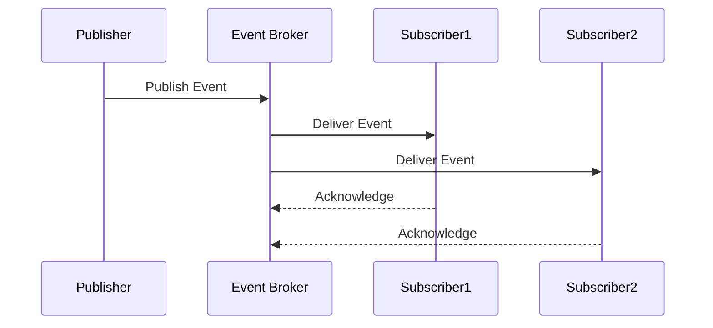
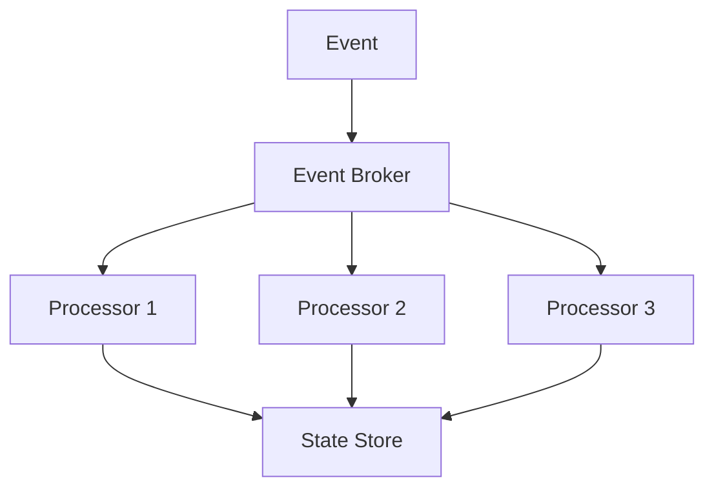

INITIAL CONTEXT FOR LLM - never change the context-----------------------------
-> THIS SECTION IS A GUIDELINE TO THE LLM CONSIDER BEFORE WORKING IN THIS FILE, DO NOT CHANGE THIS

-> GOES OF THE EVENT-DRIVEN PATTERN:

- This document describes the Event-Driven pattern used in the microservices architecture
- It covers event publishing, subscription, and handling
- Includes implementation details and configuration examples
- All patterns are implemented and tested in the current architecture
- For LLM-specific guidelines, refer to [LLM Integration Guide](../../../docs/llm/README.md)

-> CONSIDERER BEFORE UPDATING THIS FILE:

- This is a documentation file about the Event-Driven pattern
- Never add fictional dates, version numbers, or metrics
- Changes should be incremental and based on verified information
- Add comments for clarification when needed
- Maintain LLM-friendly format

---

# Event-Driven Pattern

## Context

- When to use: For implementing loosely coupled, asynchronous communication between services
- Problem it solves: Enables services to communicate without direct dependencies
- Related patterns: Message Queue, Publish-Subscribe, Event Sourcing

## Solution

### Event Publishing

- Event definition
- Message format
- Publishing strategy
- Error handling

Implementation:

```yaml
event_publishing:
  format:
    type: json
    schema: avro
  strategy:
    type: at_least_once
    retry:
      max_attempts: 3
      backoff: exponential
  error_handling:
    dead_letter: true
    max_retries: 3
```

### Event Subscription

- Topic subscription
- Message filtering
- Consumer groups
- Offset management

Implementation:

```yaml
event_subscription:
  topics:
    - profile.created
    - profile.updated
    - profile.deleted
  consumer:
    group: profile-processors
    auto_offset: latest
  filtering:
    type: content_based
    rules:
      - field: event_type
        operator: equals
        value: profile.created
```

### Event Processing

- Message handling
- Error recovery
- State management
- Idempotency

Implementation:

```yaml
event_processing:
  handler:
    type: async
    concurrency: 10
  recovery:
    strategy: retry_with_backoff
    max_attempts: 3
  state:
    storage: redis
    ttl: 24h
  idempotency:
    key: event_id
    storage: redis
```

### Event Store

- Event persistence
- Event replay
- Versioning
- Schema evolution

Implementation:

```yaml
event_store:
  storage:
    type: kafka
    retention: 7d
  replay:
    enabled: true
    batch_size: 1000
  versioning:
    strategy: semantic
    compatibility: backward
  schema:
    registry: true
    validation: true
```

## Benefits

- Loose coupling
- Scalability
- Resilience
- Real-time processing
- Event replay

## Drawbacks

- Eventual consistency
- Message ordering
- Error handling
- Monitoring complexity
- Debugging challenges

## Examples

### Event Flow



### Event Processing



## Related Patterns

- Message Queue: For reliable message delivery
- Publish-Subscribe: For event distribution
- Event Sourcing: For event persistence
- CQRS: For read/write separation
- Saga Pattern: For distributed transactions

## Notes

- Monitor event flow
- Handle failures gracefully
- Maintain event schemas
- Test event processing
- Document event contracts
