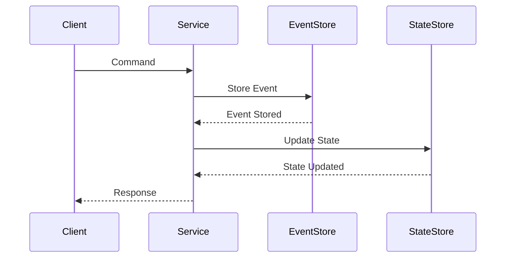
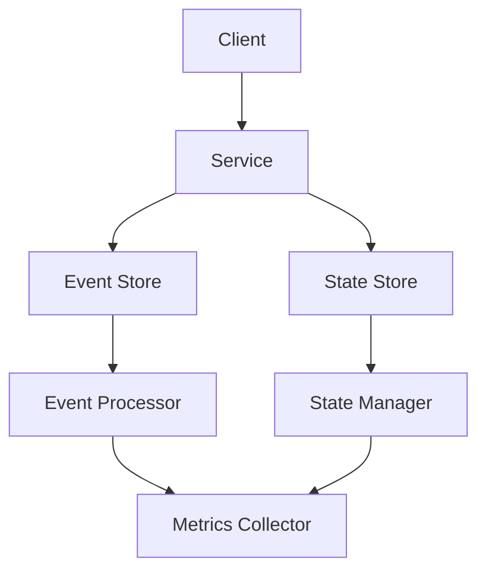

INITIAL CONTEXT FOR LLM - never change the context-----------------------------
-> THIS SECTION IS A GUIDELINE TO THE LLM CONSIDER BEFORE WORKING IN THIS FILE, DO NOT CHANGE THIS

-> GOES OF THE EVENT SOURCING PATTERN:

- This document describes the Event Sourcing pattern used in the microservices architecture
- It covers event storage, event replay, and state reconstruction
- Includes implementation details and configuration examples
- All patterns are implemented and tested in the current architecture
- For LLM-specific guidelines, refer to [LLM Integration Guide](../../../docs/llm/README.md)

-> CONSIDERER BEFORE UPDATING THIS FILE:

- This is a documentation file about the Event Sourcing pattern
- Never add fictional dates, version numbers, or metrics
- Changes should be incremental and based on verified information
- Add comments for clarification when needed
- Maintain LLM-friendly format

---

# Event Sourcing Pattern

## Context

- When to use: For maintaining a complete history of state changes
- Problem it solves: Provides audit trail and state reconstruction
- Related patterns: CQRS, Saga, Message Queue

## Solution

### Event Storage

- Event persistence
- Event versioning
- Event schema
- Event metadata

Implementation:

```yaml
event_storage:
  persistence:
    enabled: true
    storage: eventstore
    partition: 4
  versioning:
    enabled: true
    strategy: semantic
    compatibility: forward
  schema:
    registry: true
    validation: true
    evolution: true
  metadata:
    enabled: true
    fields:
      - timestamp
      - version
      - source
      - correlation_id
```

### Event Processing

- Event publishing
- Event subscription
- Event handling
- Event replay

Implementation:

```yaml
event_processing:
  publishing:
    enabled: true
    broker: kafka
    partition: 4
  subscription:
    enabled: true
    group: event-sourcing
    offset: latest
  handling:
    enabled: true
    workers: 4
    batch_size: 100
  replay:
    enabled: true
    strategy: snapshot
    interval: 1000
```

### State Management

- State reconstruction
- State snapshots
- State validation
- State recovery

Implementation:

```yaml
state_management:
  reconstruction:
    enabled: true
    strategy: event_playback
    batch_size: 1000
  snapshots:
    enabled: true
    interval: 1000
    storage: s3
  validation:
    enabled: true
    checksum: true
    consistency: true
  recovery:
    enabled: true
    strategy: snapshot
    backup: true
```

### Monitoring and Metrics

- Event metrics
- Processing metrics
- Storage metrics
- Performance metrics

Implementation:

```yaml
monitoring_metrics:
  event_metrics:
    enabled: true
    collection: 15s
    storage: prometheus
  processing_metrics:
    enabled: true
    metrics:
      - latency
      - throughput
      - error_rate
  storage_metrics:
    enabled: true
    metrics:
      - size
      - growth
      - retention
  performance_metrics:
    enabled: true
    collection: 60s
    storage: prometheus
```

## Benefits

- Complete audit trail
- State reconstruction
- Temporal queries
- Event replay
- Data consistency

## Drawbacks

- Storage complexity
- Query complexity
- Performance impact
- Learning curve
- Maintenance overhead

## Examples

### Event Sourcing Flow



### Event Sourcing Architecture



## Related Patterns

- CQRS: For command handling
- Saga: For distributed transactions
- Message Queue: For event delivery
- Event Store: For event persistence
- State Store: For state management

## Notes

- Design event schema
- Handle event versioning
- Implement snapshots
- Monitor performance
- Document events
