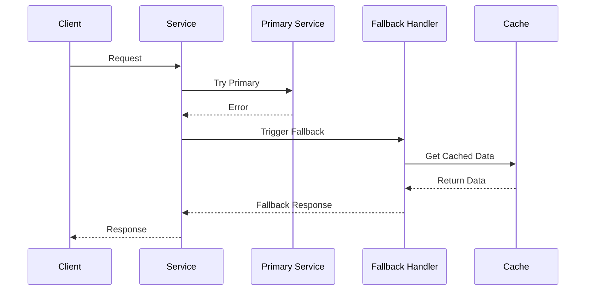
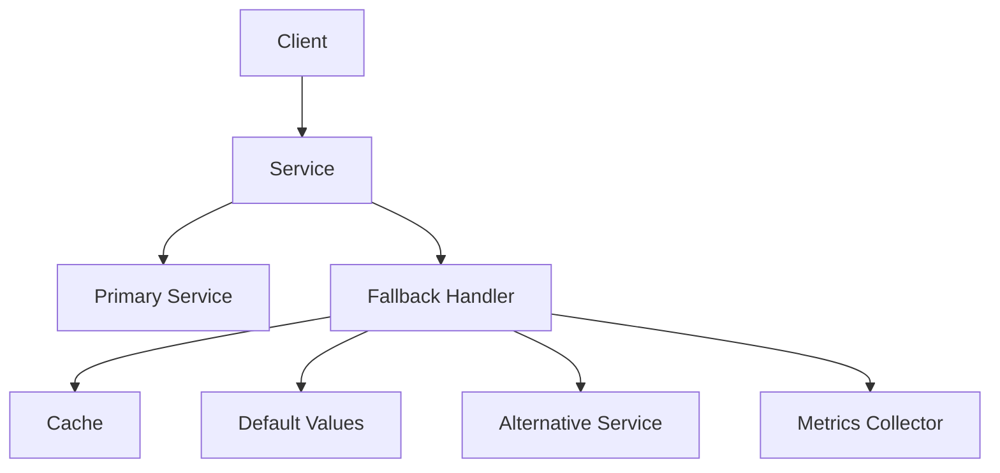

INITIAL CONTEXT FOR LLM - never change the context-----------------------------
-> THIS SECTION IS A GUIDELINE TO THE LLM CONSIDER BEFORE WORKING IN THIS FILE, DO NOT CHANGE THIS

-> GOES OF THE FALLBACK PATTERN:

- This document describes the Fallback pattern used in the microservices architecture
- It covers graceful degradation, alternative responses, and failure handling
- Includes implementation details and configuration examples
- All patterns are implemented and tested in the current architecture
- For LLM-specific guidelines, refer to [LLM Integration Guide](../../../docs/llm/README.md)

-> CONSIDERER BEFORE UPDATING THIS FILE:

- This is a documentation file about the Fallback pattern
- Never add fictional dates, version numbers, or metrics
- Changes should be incremental and based on verified information
- Add comments for clarification when needed
- Maintain LLM-friendly format

---

# Fallback Pattern

## Context

- When to use: For providing alternative behavior when primary operations fail
- Problem it solves: Ensures system availability and graceful degradation
- Related patterns: Circuit Breaker, Retry Pattern, Timeout Pattern

## Solution

### Fallback Strategies

- Cached data
- Default values
- Alternative services
- Degraded functionality

Implementation:

```yaml
fallback_strategies:
  cached_data:
    source: redis
    ttl: 300s
    stale_while_revalidate: true
  default_values:
    profile:
      name: "Guest User"
      avatar: "default.png"
  alternative_services:
    - primary: profile_service
      backup: profile_cache
      priority: 1
    - primary: auth_service
      backup: local_auth
      priority: 2
```

### Failure Detection

- Error types
- Failure thresholds
- Recovery triggers
- Health checks

Implementation:

```yaml
failure_detection:
  error_types:
    - connection_timeout
    - service_unavailable
    - rate_limit_exceeded
  thresholds:
    error_rate: 0.5
    window: 60s
  recovery:
    trigger: health_check
    interval: 30s
  health_check:
    endpoint: /health
    timeout: 5s
```

### Response Handling

- Error responses
- Partial responses
- Stale data
- Custom messages

Implementation:

```yaml
response_handling:
  error_responses:
    format: json
    include_details: true
  partial_responses:
    enabled: true
    min_required: 2
  stale_data:
    max_age: 300s
    warning_header: true
  custom_messages:
    enabled: true
    template: "Service temporarily degraded: {reason}"
```

### Monitoring and Metrics

- Fallback usage
- Success rates
- Response quality
- Recovery times

Implementation:

```yaml
monitoring:
  metrics:
    - fallback_count
    - fallback_success_rate
    - response_quality
    - recovery_time
  alerts:
    - high_fallback_rate
    - degraded_quality
    - slow_recovery
  thresholds:
    fallback_rate: 0.1
    quality_threshold: 0.8
```

## Benefits

- System availability
- Graceful degradation
- Better user experience
- Failure resilience
- Service continuity

## Drawbacks

- Potential data staleness
- Increased complexity
- Testing challenges
- Monitoring overhead
- Configuration management

## Examples

### Fallback Flow



### Fallback Architecture



## Related Patterns

- Circuit Breaker: For failure detection
- Retry Pattern: For error recovery
- Timeout Pattern: For request timeouts
- Cache-Aside: For data caching
- Bulkhead: For resource isolation

## Notes

- Monitor fallback usage
- Maintain fallback data
- Test fallback scenarios
- Document fallback strategies
- Review fallback quality
