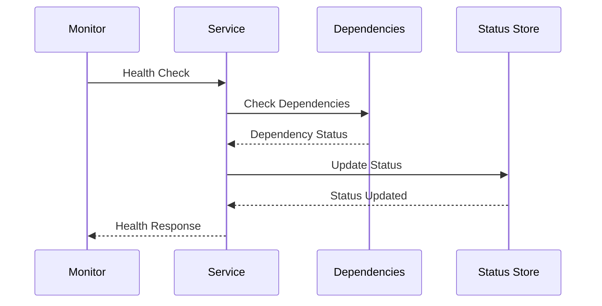
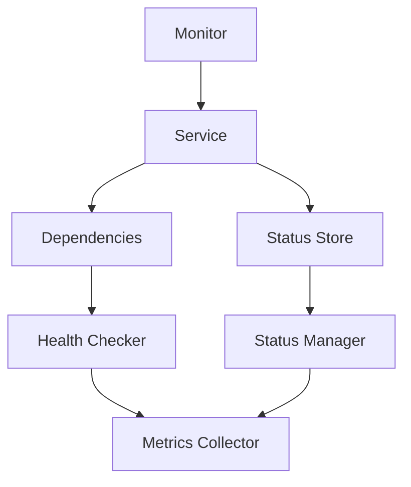

INITIAL CONTEXT FOR LLM - never change the context-----------------------------
-> THIS SECTION IS A GUIDELINE TO THE LLM CONSIDER BEFORE WORKING IN THIS FILE, DO NOT CHANGE THIS

-> GOES OF THE HEALTH CHECK PATTERN:

- This document describes the Health Check pattern used in the microservices architecture
- It covers service health monitoring, dependency checks, and system status reporting
- Includes implementation details and configuration examples
- All patterns are implemented and tested in the current architecture
- For LLM-specific guidelines, refer to [LLM Integration Guide](../../../docs/llm/README.md)

-> CONSIDERER BEFORE UPDATING THIS FILE:

- This is a documentation file about the Health Check pattern
- Never add fictional dates, version numbers, or metrics
- Changes should be incremental and based on verified information
- Add comments for clarification when needed
- Maintain LLM-friendly format

---

# Health Check Pattern

## Context

- When to use: For monitoring service health and detecting system issues
- Problem it solves: Ensures system reliability and early problem detection
- Related patterns: Circuit Breaker, Service Discovery, Monitoring

## Solution

### Health Check Types

- Liveness checks
- Readiness checks
- Dependency checks
- Custom health checks

Implementation:

```yaml
health_check_types:
  liveness:
    enabled: true
    interval: 30s
    timeout: 5s
    path: /health/live
  readiness:
    enabled: true
    interval: 10s
    timeout: 3s
    path: /health/ready
  dependency:
    enabled: true
    checks:
      - database
      - cache
      - message_queue
  custom:
    enabled: true
    checks:
      - disk_space
      - memory_usage
      - thread_count
```

### Health Status Management

- Status reporting
- Status aggregation
- Status propagation
- Status history

Implementation:

```yaml
health_status:
  reporting:
    format: json
    level: detailed
    timestamp: true
  aggregation:
    enabled: true
    strategy: worst_of
    timeout: 10s
  propagation:
    enabled: true
    method: event
    ttl: 60s
  history:
    enabled: true
    storage: elasticsearch
    retention: 30d
```

### Monitoring Integration

- Metrics collection
- Alert configuration
- Dashboard setup
- Logging integration

Implementation:

```yaml
monitoring_integration:
  metrics:
    enabled: true
    collection: 15s
    storage: prometheus
  alerts:
    enabled: true
    channels:
      - email
      - slack
    thresholds:
      - warning: 2
      - critical: 3
  dashboard:
    enabled: true
    provider: grafana
    refresh: 30s
  logging:
    enabled: true
    level: info
    format: json
```

### Recovery Actions

- Automatic recovery
- Manual intervention
- Service restart
- Failover handling

Implementation:

```yaml
recovery_actions:
  automatic:
    enabled: true
    max_attempts: 3
    backoff: exponential
  manual:
    enabled: true
    notification: true
    approval: required
  restart:
    enabled: true
    strategy: graceful
    timeout: 30s
  failover:
    enabled: true
    strategy: active_passive
    sync: true
```

## Benefits

- Early problem detection
- System reliability
- Automated recovery
- Operational visibility
- Proactive maintenance

## Drawbacks

- Additional overhead
- False positives
- Configuration complexity
- Monitoring burden
- Recovery complexity

## Examples

### Health Check Flow



### Health Check Architecture



## Related Patterns

- Circuit Breaker: For failure handling
- Service Discovery: For service registration
- Monitoring: For system observation
- Load Balancer: For traffic distribution
- Service Mesh: For service communication

## Notes

- Configure appropriate intervals
- Handle dependencies properly
- Monitor health metrics
- Implement recovery strategies
- Document health checks
