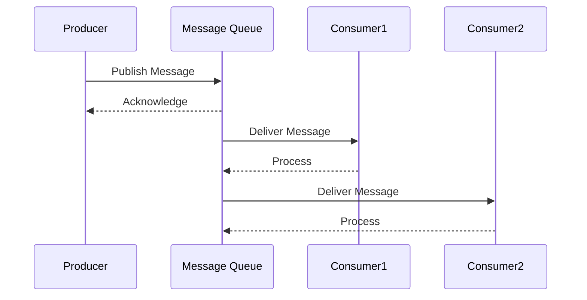
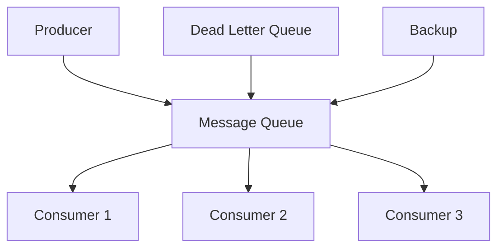

INITIAL CONTEXT FOR LLM - never change the context-----------------------------
-> THIS SECTION IS A GUIDELINE TO THE LLM CONSIDER BEFORE WORKING IN THIS FILE, DO NOT CHANGE THIS

-> GOES OF THE MESSAGE QUEUE PATTERN:

- This document describes the Message Queue pattern used in the microservices architecture
- It covers message publishing, consumption, and queue management
- Includes implementation details and configuration examples
- All patterns are implemented and tested in the current architecture
- For LLM-specific guidelines, refer to [LLM Integration Guide](../../../docs/llm/README.md)

-> CONSIDERER BEFORE UPDATING THIS FILE:

- This is a documentation file about the Message Queue pattern
- Never add fictional dates, version numbers, or metrics
- Changes should be incremental and based on verified information
- Add comments for clarification when needed
- Maintain LLM-friendly format

---

# Message Queue Pattern

## Context

- When to use: For implementing reliable asynchronous communication between services
- Problem it solves: Ensures message delivery and enables service decoupling
- Related patterns: Event-Driven, Publish-Subscribe, Message Broker

## Solution

### Queue Configuration

- Queue types
- Message persistence
- Queue policies
- Resource limits

Implementation:

```yaml
queue_configuration:
  types:
    - standard
    - fifo
    - priority
  persistence:
    enabled: true
    storage: disk
  policies:
    retention: 14d
    max_size: 1GB
  limits:
    max_messages: 1000000
    message_size: 256KB
```

### Message Publishing

- Message format
- Publishing options
- Error handling
- Retry logic

Implementation:

```yaml
message_publishing:
  format:
    type: json
    compression: gzip
  options:
    delivery_mode: persistent
    priority: normal
  error_handling:
    dead_letter: true
    max_retries: 3
  retry:
    strategy: exponential
    max_attempts: 5
```

### Message Consumption

- Consumer configuration
- Message processing
- Acknowledgment
- Error handling

Implementation:

```yaml
message_consumption:
  consumer:
    prefetch: 10
    concurrency: 5
  processing:
    timeout: 30s
    retry: true
  acknowledgment:
    mode: manual
    timeout: 5m
  error_handling:
    dead_letter: true
    max_retries: 3
```

### Queue Management

- Monitoring
- Scaling
- Maintenance
- Backup

Implementation:

```yaml
queue_management:
  monitoring:
    metrics:
      - queue_size
      - message_rate
      - consumer_lag
    alerts:
      - high_latency
      - queue_full
  scaling:
    auto: true
    min_nodes: 3
    max_nodes: 10
  maintenance:
    cleanup: daily
    retention: 7d
  backup:
    frequency: hourly
    retention: 30d
```

## Benefits

- Reliable message delivery
- Service decoupling
- Load balancing
- Message persistence
- Scalability

## Drawbacks

- Message ordering
- Complexity
- Resource usage
- Monitoring overhead
- Maintenance requirements

## Examples

### Message Flow



### Queue Architecture



## Related Patterns

- Event-Driven: For event-based communication
- Publish-Subscribe: For message distribution
- Message Broker: For message routing
- Dead Letter Queue: For error handling
- Message Filtering: For message selection

## Notes

- Monitor queue health
- Handle failures gracefully
- Maintain message schemas
- Test message processing
- Document queue contracts
