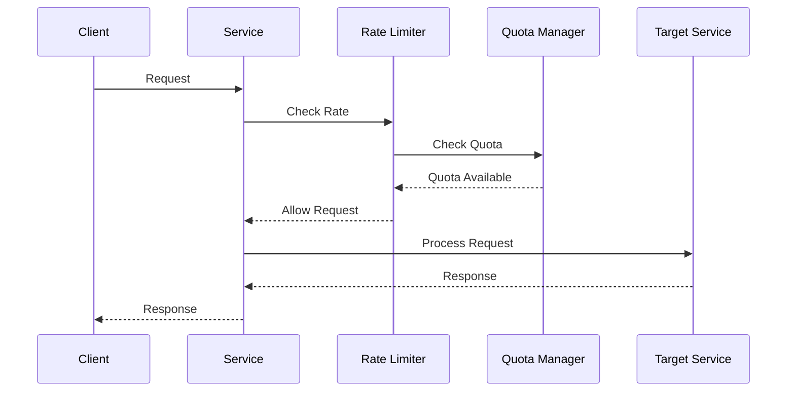
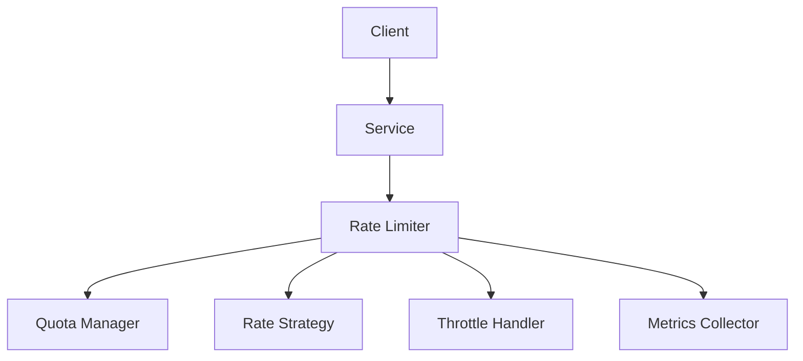

INITIAL CONTEXT FOR LLM - never change the context-----------------------------
-> THIS SECTION IS A GUIDELINE TO THE LLM CONSIDER BEFORE WORKING IN THIS FILE, DO NOT CHANGE THIS

-> GOES OF THE RATE LIMITING PATTERN:

- This document describes the Rate Limiting pattern used in the microservices architecture
- It covers request throttling, quota management, and rate control strategies
- Includes implementation details and configuration examples
- All patterns are implemented and tested in the current architecture
- For LLM-specific guidelines, refer to [LLM Integration Guide](../../../docs/llm/README.md)

-> CONSIDERER BEFORE UPDATING THIS FILE:

- This is a documentation file about the Rate Limiting pattern
- Never add fictional dates, version numbers, or metrics
- Changes should be incremental and based on verified information
- Add comments for clarification when needed
- Maintain LLM-friendly format

---

# Rate Limiting Pattern

## Context

- When to use: For controlling request rates and preventing system overload
- Problem it solves: Protects system resources and ensures fair usage
- Related patterns: Circuit Breaker, Bulkhead, Timeout Pattern

## Solution

### Rate Limiting Strategies

- Fixed window
- Sliding window
- Token bucket
- Leaky bucket

Implementation:

```yaml
rate_limiting_strategies:
  fixed_window:
    window_size: 60s
    max_requests: 100
  sliding_window:
    window_size: 60s
    max_requests: 100
    precision: 1s
  token_bucket:
    capacity: 100
    refill_rate: 10
    refill_interval: 1s
  leaky_bucket:
    capacity: 100
    leak_rate: 10
    leak_interval: 1s
```

### Quota Management

- User quotas
- Service quotas
- API quotas
- Resource quotas

Implementation:

```yaml
quota_management:
  user_quotas:
    default: 1000
    premium: 5000
    enterprise: 10000
  service_quotas:
    profile_service: 100
    auth_service: 50
    storage_service: 200
  api_quotas:
    read: 100
    write: 50
    delete: 20
  resource_quotas:
    cpu: 80%
    memory: 70%
    connections: 1000
```

### Rate Control

- Request throttling
- Burst handling
- Priority levels
- Rate adaptation

Implementation:

```yaml
rate_control:
  throttling:
    enabled: true
    strategy: token_bucket
  burst_handling:
    max_burst: 50
    burst_window: 5s
  priority_levels:
    - level: high
      multiplier: 2.0
    - level: normal
      multiplier: 1.0
    - level: low
      multiplier: 0.5
  adaptation:
    enabled: true
    metrics:
      - response_time
      - error_rate
      - resource_usage
```

### Monitoring and Metrics

- Rate metrics
- Quota usage
- Throttling events
- Performance impact

Implementation:

```yaml
monitoring:
  metrics:
    - request_rate
    - quota_usage
    - throttle_count
    - response_time
  alerts:
    - quota_exceeded
    - high_throttle_rate
    - rate_limit_breach
  thresholds:
    throttle_rate: 0.1
    quota_usage: 0.8
```

## Benefits

- Resource protection
- Fair usage
- System stability
- Cost control
- Service quality

## Drawbacks

- Request rejection
- Increased latency
- Configuration complexity
- Monitoring overhead
- Testing challenges

## Examples

### Rate Limiting Flow



### Rate Limiting Architecture



## Related Patterns

- Circuit Breaker: For failure detection
- Bulkhead: For resource isolation
- Timeout Pattern: For request timeouts
- Fallback Pattern: For graceful degradation
- Retry Pattern: For error recovery

## Notes

- Monitor rate patterns
- Tune rate limits
- Handle throttling gracefully
- Test rate scenarios
- Document rate strategies
