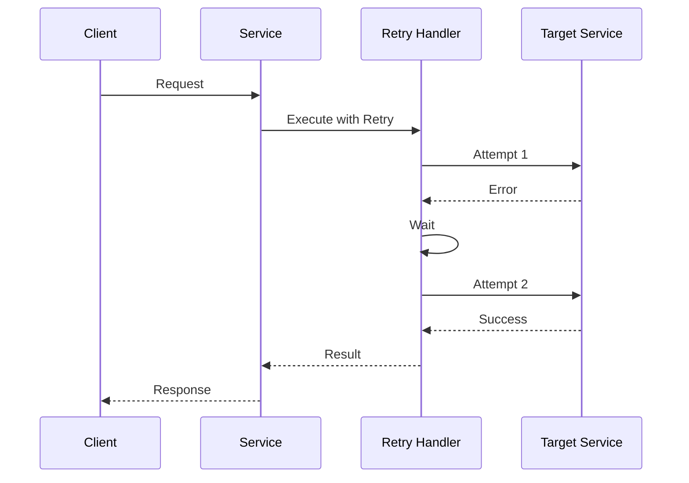
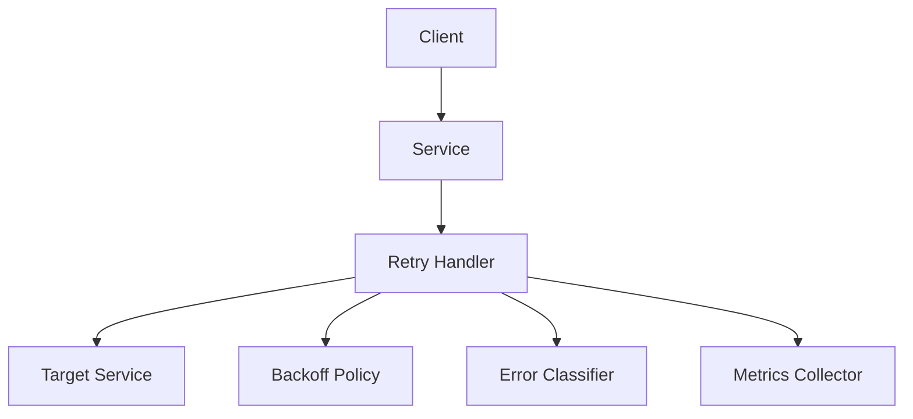

INITIAL CONTEXT FOR LLM - never change the context-----------------------------
-> THIS SECTION IS A GUIDELINE TO THE LLM CONSIDER BEFORE WORKING IN THIS FILE, DO NOT CHANGE THIS

-> GOES OF THE RETRY PATTERN:

- This document describes the Retry pattern used in the microservices architecture
- It covers retry strategies, backoff policies, and error handling
- Includes implementation details and configuration examples
- All patterns are implemented and tested in the current architecture
- For LLM-specific guidelines, refer to [LLM Integration Guide](../../../docs/llm/README.md)

-> CONSIDERER BEFORE UPDATING THIS FILE:

- This is a documentation file about the Retry pattern
- Never add fictional dates, version numbers, or metrics
- Changes should be incremental and based on verified information
- Add comments for clarification when needed
- Maintain LLM-friendly format

---

# Retry Pattern

## Context

- When to use: For handling transient failures in distributed systems
- Problem it solves: Improves system reliability by retrying failed operations
- Related patterns: Circuit Breaker, Bulkhead, Timeout Pattern

## Solution

### Retry Strategies

- Fixed interval
- Exponential backoff
- Jitter
- Maximum attempts

Implementation:

```yaml
retry_strategies:
  fixed:
    interval: 1s
    max_attempts: 3
  exponential:
    initial_interval: 100ms
    multiplier: 2
    max_interval: 10s
    max_attempts: 5
  jitter:
    min_interval: 100ms
    max_interval: 1s
    max_attempts: 3
```

### Error Classification

- Retryable errors
- Non-retryable errors
- Error patterns
- Custom handlers

Implementation:

```yaml
error_classification:
  retryable:
    - connection_timeout
    - service_unavailable
    - rate_limit_exceeded
  non_retryable:
    - invalid_request
    - authentication_failed
    - authorization_failed
  patterns:
    - status_code: 5xx
      retry: true
    - status_code: 4xx
      retry: false
```

### Backoff Policies

- Linear backoff
- Exponential backoff
- Fibonacci backoff
- Custom backoff

Implementation:

```yaml
backoff_policies:
  linear:
    initial_delay: 100ms
    increment: 100ms
    max_delay: 1s
  exponential:
    initial_delay: 100ms
    factor: 2
    max_delay: 10s
  fibonacci:
    initial_delay: 100ms
    max_delay: 5s
```

### Monitoring and Metrics

- Retry attempts
- Success rates
- Error patterns
- Performance impact

Implementation:

```yaml
monitoring:
  metrics:
    - retry_count
    - success_rate
    - error_distribution
    - latency_impact
  alerts:
    - high_retry_rate
    - persistent_failures
    - degraded_performance
```

## Benefits

- Improved reliability
- Better error handling
- Automatic recovery
- System resilience
- Graceful degradation

## Drawbacks

- Increased latency
- Resource consumption
- Complexity
- Testing challenges
- Monitoring overhead

## Examples

### Retry Flow



### Retry Architecture



## Related Patterns

- Circuit Breaker: For failure detection
- Bulkhead: For resource isolation
- Timeout Pattern: For request timeouts
- Fallback Pattern: For graceful degradation
- Rate Limiting: For request throttling

## Notes

- Monitor retry patterns
- Tune backoff policies
- Handle errors appropriately
- Test failure scenarios
- Document retry strategies
