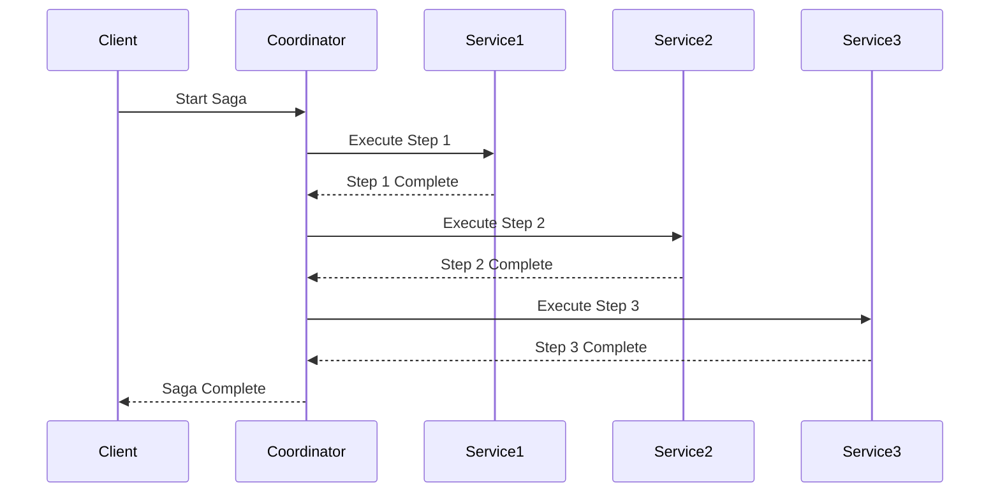
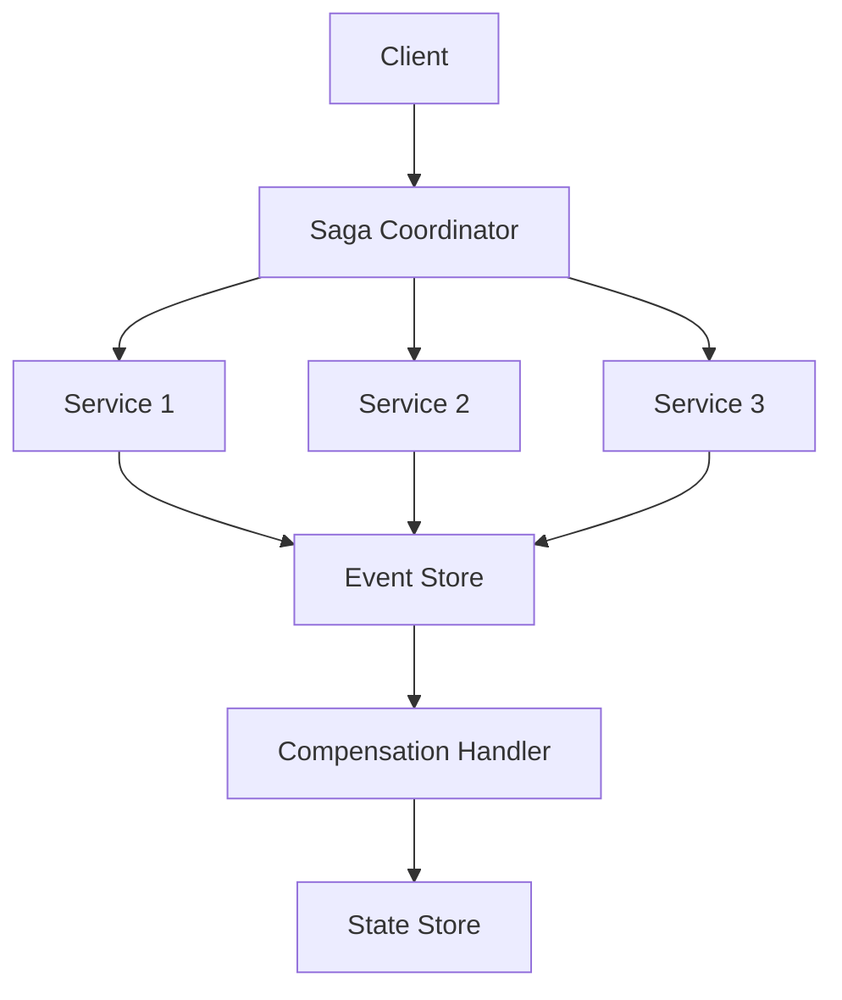

INITIAL CONTEXT FOR LLM - never change the context-----------------------------
-> THIS SECTION IS A GUIDELINE TO THE LLM CONSIDER BEFORE WORKING IN THIS FILE, DO NOT CHANGE THIS

-> GOES OF THE SAGA PATTERN:

- This document describes the Saga pattern used in the microservices architecture
- It covers distributed transactions, compensation, and event-driven workflows
- Includes implementation details and configuration examples
- All patterns are implemented and tested in the current architecture
- For LLM-specific guidelines, refer to [LLM Integration Guide](../../../docs/llm/README.md)

-> CONSIDERER BEFORE UPDATING THIS FILE:

- This is a documentation file about the Saga pattern
- Never add fictional dates, version numbers, or metrics
- Changes should be incremental and based on verified information
- Add comments for clarification when needed
- Maintain LLM-friendly format

---

# Saga Pattern

## Context

- When to use: For managing distributed transactions across multiple services
- Problem it solves: Ensures data consistency in distributed systems
- Related patterns: Event Sourcing, CQRS, Message Queue

## Solution

### Transaction Management

- Saga coordination
- Transaction steps
- Compensation actions
- State management

Implementation:

```yaml
transaction_management:
  coordination:
    type: orchestration
    timeout: 30s
    retry: true
  steps:
    - order_creation
    - payment_processing
    - inventory_update
    - shipping_creation
  compensation:
    enabled: true
    strategy: reverse
    timeout: 60s
  state:
    storage: redis
    ttl: 24h
    backup: true
```

### Event Handling

- Event publishing
- Event subscription
- Event processing
- Event persistence

Implementation:

```yaml
event_handling:
  publishing:
    enabled: true
    broker: kafka
    partition: 4
  subscription:
    enabled: true
    group: saga
    offset: latest
  processing:
    enabled: true
    workers: 4
    batch_size: 100
  persistence:
    enabled: true
    storage: elasticsearch
    retention: 30d
```

### Compensation Logic

- Compensation definition
- Compensation execution
- Compensation monitoring
- Compensation recovery

Implementation:

```yaml
compensation_logic:
  definition:
    type: declarative
    language: yaml
    validation: true
  execution:
    enabled: true
    timeout: 30s
    retry: true
  monitoring:
    enabled: true
    metrics: true
    alerts: true
  recovery:
    enabled: true
    strategy: manual
    notification: true
```

### Monitoring and Metrics

- Transaction metrics
- Compensation metrics
- Error tracking
- Performance monitoring

Implementation:

```yaml
monitoring_metrics:
  transaction:
    enabled: true
    metrics:
      - duration
      - success_rate
      - failure_rate
  compensation:
    enabled: true
    metrics:
      - compensation_rate
      - recovery_rate
  error_tracking:
    enabled: true
    storage: elasticsearch
    retention: 90d
  performance:
    enabled: true
    collection: 15s
    storage: prometheus
```

## Benefits

- Distributed consistency
- Fault tolerance
- Scalability
- Maintainability
- Observability

## Drawbacks

- Implementation complexity
- Debugging difficulty
- Performance impact
- Testing complexity
- Maintenance overhead

## Examples

### Saga Flow



### Saga Architecture



## Related Patterns

- Event Sourcing: For event persistence
- CQRS: For command handling
- Message Queue: For event delivery
- Circuit Breaker: For failure handling
- Retry: For operation retries

## Notes

- Design compensation carefully
- Handle failures gracefully
- Monitor transactions
- Test thoroughly
- Document workflows
