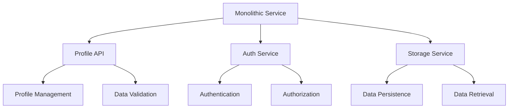
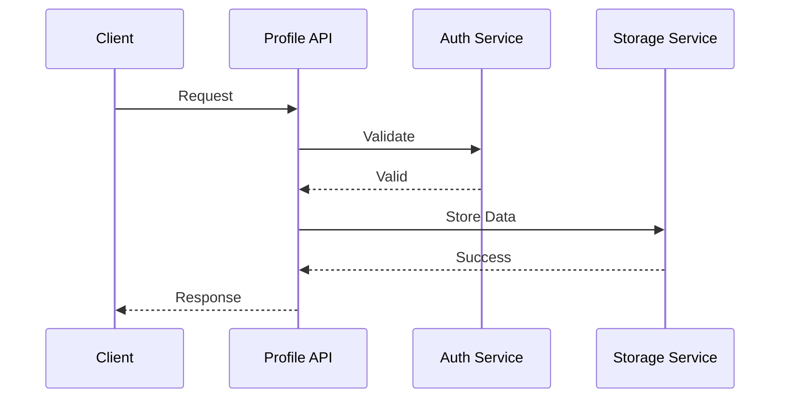

INITIAL CONTEXT FOR LLM - never change the context-----------------------------
-> THIS SECTION IS A GUIDELINE TO THE LLM CONSIDER BEFORE WORKING IN THIS FILE, DO NOT CHANGE THIS

-> GOES OF THE SERVICE DECOMPOSITION PATTERN:

- This document describes how to decompose a monolithic service into microservices
- It covers the principles and strategies for service decomposition
- Includes guidelines for identifying service boundaries
- All patterns are implemented and tested in the current architecture
- For LLM-specific guidelines, refer to [LLM Integration Guide](../../../docs/llm/README.md)

-> CONSIDERER BEFORE UPDATING THIS FILE:

- This is a documentation file about service decomposition patterns
- Never add fictional dates, version numbers, or metrics
- Changes should be incremental and based on verified information
- Add comments for clarification when needed
- Maintain LLM-friendly format

---

# Service Decomposition Pattern

## Context

- When to use: When breaking down a monolithic service into microservices
- Problem it solves: Helps identify service boundaries and organize functionality
- Related patterns: Domain-Driven Design, Bounded Context, Event Sourcing

## Solution

### Domain-Driven Design

- Identify core domains
- Define bounded contexts
- Map domain relationships
- Establish context boundaries

Implementation:

```yaml
domain_driven_design:
  core_domains:
    - profile_management
    - authentication
    - data_storage
  bounded_contexts:
    - profile_api
    - auth_service
    - storage_service
  relationships:
    - profile_api -> auth_service
    - profile_api -> storage_service
```

### Service Boundaries

- Data ownership
- Business capabilities
- Technical capabilities
- Team organization

Implementation:

```yaml
service_boundaries:
  profile_api:
    capabilities:
      - profile_management
      - data_validation
      - request_routing
    data_ownership:
      - profile_metadata
  auth_service:
    capabilities:
      - authentication
      - authorization
      - session_management
    data_ownership:
      - user_credentials
      - sessions
  storage_service:
    capabilities:
      - data_persistence
      - data_retrieval
      - data_consistency
    data_ownership:
      - profile_data
```

### Decomposition Strategy

- Identify seams
- Define interfaces
- Plan data migration
- Establish communication

Implementation:

```yaml
decomposition_strategy:
  phases:
    - identify_seams
    - define_interfaces
    - plan_migration
    - implement_services
  interfaces:
    - rest_api
    - grpc
    - message_queue
  data_migration:
    strategy: dual_write
    validation: consistency_check
```

## Benefits

- Improved scalability
- Better maintainability
- Independent deployment
- Team autonomy
- Technology flexibility

## Drawbacks

- Increased complexity
- Distributed system challenges
- Data consistency
- Operational overhead
- Testing complexity

## Examples

### Service Decomposition



### Data Flow



## Related Patterns

- Domain-Driven Design: For identifying service boundaries
- Event Sourcing: For data consistency
- CQRS: For read/write separation
- API Gateway: For service access
- Service Discovery: For service location

## Notes

- Keep domain models up to date
- Document service boundaries
- Maintain interface contracts
- Test thoroughly
- Monitor service interactions
